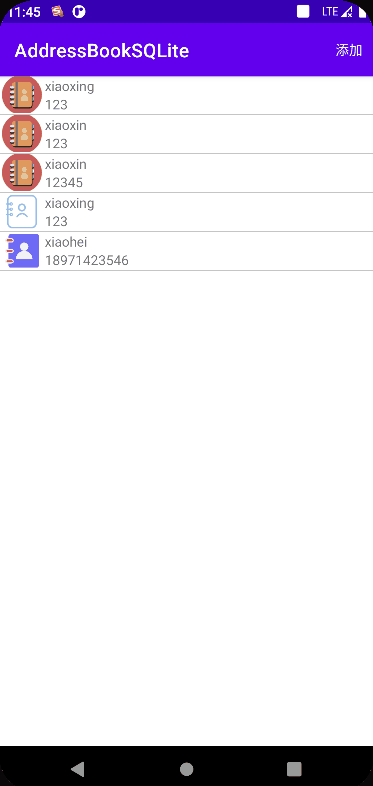

# 基于SQLiteDatabase的通讯录设计与实现

基于SQLDatabase实现的安卓通讯录，主要的功能有：添加联系人，删除联系人，查找联系人，修改联系人。下面，对上述四个模块一一说明。

## 查找联系人
查找联系人即在主界面上显示联系人。


### 布局文件
<u>activity_main.xml</u>
```xml
<?xml version="1.0" encoding="utf-8"?>  
<androidx.constraintlayout.widget.ConstraintLayout xmlns:android="http://schemas.android.com/apk/res/android"  
    xmlns:app="http://schemas.android.com/apk/res-auto"  
    xmlns:tools="http://schemas.android.com/tools"  
    android:layout_width="match_parent"  
    android:layout_height="match_parent"  
    tools:context=".MainActivity">  
  
    <androidx.recyclerview.widget.RecyclerView  
        android:id="@+id/contactRecyclerView"  
        android:layout_width="match_parent"  
        android:layout_height="match_parent"  
        tools:layout_editor_absoluteX="1dp"  
        tools:layout_editor_absoluteY="1dp" />  
  
</androidx.constraintlayout.widget.ConstraintLayout>
```
> 这个布局文件就是简单的一个约束布局，里面有一个recyclerview。那么，在对应的java代码中，一定会有一个为其准备的Adapter，在这个Adapter里面，就一定会有ViewHolder。

<u>MyAdapter.java</u>
```java
package adapter;  
  
import android.content.Context;  
import android.content.Intent;  
import android.util.Log;  
import android.view.ContextMenu;  
import android.view.LayoutInflater;  
import android.view.View;  
import android.view.ViewGroup;  
import android.widget.ImageView;  
import android.widget.TextView;  
import android.widget.Toast;  
  
import androidx.annotation.NonNull;  
import androidx.recyclerview.widget.RecyclerView;  
  
  
import com.xiaoxin.addressbooksqlite.DetailActivity;  
import com.xiaoxin.addressbooksqlite.ModifyActivity;  
import com.xiaoxin.addressbooksqlite.R;  
  
import java.lang.reflect.Array;  
import java.util.Arrays;  
import java.util.List;  
  
import domain.Contact;  
import utils.MySQLiteOpenHelper;  
  
public class MyAdapters extends RecyclerView.Adapter<MyAdapters.MyViewHolder> {  
    private static final String TAG = "MyAdapters";  
    private Context context;            // 上下文对象  
    private List<Contact> contacts;     // 联系人  
    private int selectPosition = -1;    // 选择的联系人的位置  
  
    public MyAdapters(Context context, List<Contact> contacts) {  
        this.context = context;  
        this.contacts = contacts;  
    }  
  
    @NonNull  
    @Override    public MyViewHolder onCreateViewHolder(@NonNull ViewGroup parent, int viewType) {  
        View view = LayoutInflater.from(parent.getContext())  
                                   .inflate(R.layout.item_layout, parent, false);  
        return new MyViewHolder(view);  
    }  
  
    // 绑定数据  
    @Override  
    public void onBindViewHolder(@NonNull MyViewHolder holder, int position) {  
        // 从contact List 中获取指定索引的contact对象  
        Contact contact = contacts.get(position);  
        Log.i(TAG, "onBindViewHolder: " + Arrays.toString(contacts.toArray()));  
        // 设置holder的 id为 id 的 TextView text        holder.getId().setText("" + contact.getId());  
        // 设置holder的 id为 image 的 ImageView src        holder.getImage().setImageResource(contact.getImage());  
        // 设置holder的 id为 name 的 TextView text        holder.getName().setText(contact.getName());  
        // 设置holder的 id为 mobile 的 TextView text        holder.getMobile().setText(contact.getMobile());  
  
        holder.itemView.setOnClickListener(new View.OnClickListener() {  
            @Override  
            public void onClick(View v) {  
                Contact contact = contacts.get(holder.getAdapterPosition());  
                Intent intent = new Intent();  
                intent.setClass(context, DetailActivity.class);  
                intent.putExtra("contact", contact);  
                context.startActivity(intent);  
            }  
        });  
  
        holder.itemView.setOnCreateContextMenuListener((menu, v, menuInfo) -> {  
            menu.add(0, 0, 0, "删除");  
            menu.add(0, 1, 1, "修改");  
            selectPosition = holder.getAdapterPosition();  
        });  
    }  
  
    // 删除Item  
    public void removeItem() {  
        Contact contact = contacts.get(selectPosition);  
        MySQLiteOpenHelper mySQLiteOpenHelper = new MySQLiteOpenHelper(context);  
        boolean b = mySQLiteOpenHelper.deleteById(contact.getId());  
        if (b) {  
            contacts.remove(selectPosition);  
            notifyDataSetChanged();  
        }  
    }  
  
    public void modifyItem() {  
        Contact contact = contacts.get(selectPosition);  
        Intent intent = new Intent();  
        intent.setClass(context, ModifyActivity.class);  
        intent.putExtra("contact", contact);  
        context.startActivity(intent);  
    }  
  
    @Override  
    public int getItemCount() {  
        return contacts == null ? 0 : contacts.size();  
    }  
  
    // 让MyViewHolder持有它的三个子view  
    public class MyViewHolder extends RecyclerView.ViewHolder {  
        private TextView id;  
        private ImageView image;  
        private TextView name;  
        private TextView mobile;  
  
        public MyViewHolder(@NonNull View itemView) {  
            super(itemView);  
  
            id = itemView.findViewById(R.id.id);  
            image = itemView.findViewById(R.id.image);  
            name = itemView.findViewById(R.id.name);  
            mobile = itemView.findViewById(R.id.mobile);  
        }  
  
        public ImageView getImage() {  
            return image;  
        }  
  
        public void setImage(ImageView image) {  
            this.image = image;  
        }  
  
        public TextView getName() {  
            return name;  
        }  
  
        public void setName(TextView name) {  
            this.name = name;  
        }  
  
        public TextView getMobile() {  
            return mobile;  
        }  
  
        public void setMobile(TextView mobile) {  
            this.mobile = mobile;  
        }  
  
        public TextView getId() {  
            return id;  
        }  
  
        public void setId(TextView id) {  
            this.id = id;  
        }  
    }  
}
```
> 这个adapter就是为了上述的recyclerview准备的Adapter，里面有一个自定义的MyViewHolder, 这个视图对应一个布局文件，如下： 


<u>item_layout.xml</u>
```xml
<?xml version="1.0" encoding="utf-8"?>  
<LinearLayout xmlns:android="http://schemas.android.com/apk/res/android"  
    xmlns:tools="http://schemas.android.com/tools"  
    android:layout_width="match_parent"  
    android:layout_height="wrap_content">  
  
    <ImageView  
        android:id="@+id/image"  
        android:layout_width="0dp"  
        android:layout_height="match_parent"  
        android:layout_gravity="left"  
        android:layout_weight="1"  
        android:scaleType="centerCrop"  
        tools:ignore="ImageContrastCheck"  
        tools:srcCompat="@tools:sample/avatars" />  
  
    <LinearLayout  
        android:layout_width="0dp"  
        android:layout_height="wrap_content"  
        android:layout_weight="7"  
        android:orientation="vertical">  
  
        <TextView  
            android:id="@+id/name"  
            android:layout_width="match_parent"  
            android:layout_height="0dp"  
            android:layout_weight="1"  
            android:text="TextView" />  
  
        <TextView  
            android:id="@+id/mobile"  
            android:layout_width="match_parent"  
            android:layout_height="0dp"  
            android:layout_weight="1"  
            android:text="TextView" />  
    </LinearLayout>  
  
    <TextView  
        android:id="@+id/id"  
        android:layout_width="wrap_content"  
        android:layout_height="wrap_content"  
        android:visibility="invisible">  
    </TextView>  
</LinearLayout>
```

<u>MainActivity.java</u>
```java
package com.xiaoxin.addressbooksqlite;  
  
import android.content.Intent;  
import android.content.SharedPreferences;  
import android.os.Bundle;  
import android.util.Log;  
import android.view.Menu;  
import android.view.MenuItem;  
import android.widget.Toast;  
  
import androidx.annotation.NonNull;  
import androidx.appcompat.app.AppCompatActivity;  
import androidx.recyclerview.widget.DividerItemDecoration;  
import androidx.recyclerview.widget.LinearLayoutManager;  
import androidx.recyclerview.widget.RecyclerView;  
  
import java.util.Arrays;  
import java.util.List;  
  
import adapter.MyAdapters;  
import domain.Contact;  
import utils.MySQLiteOpenHelper;  
  
public class MainActivity extends AppCompatActivity {  
  
    private static final String TAG = "xiaoxin";  
    private RecyclerView recyclerView;  
    private List<Contact> contacts;  
    private MySQLiteOpenHelper mySQLiteOpenHelper;  
    MyAdapters myAdapter;  
  
    @Override  
    protected void onCreate(Bundle savedInstanceState) {  
        super.onCreate(savedInstanceState);  
        setContentView(R.layout.activity_main);  
        mySQLiteOpenHelper = new MySQLiteOpenHelper(this);  
        initData();  
        initView();  
    }  
  
    @Override  
    protected void onResume() {  
        super.onResume();  
        mySQLiteOpenHelper = new MySQLiteOpenHelper(this);  
        initView();  
        initData();  
    }  
  
    void initData() {  
        // 从数据库中查找所有联系人  
        contacts = mySQLiteOpenHelper.queryAll();  
        Log.i(TAG, "initData: " + Arrays.toString(contacts.toArray()));  
        Toast.makeText(this, contacts.size() + "", Toast.LENGTH_SHORT).show();  
    }  
  
    void initView() {  
        recyclerView = findViewById(R.id.contactRecyclerView);  
        // 创建线性布局管理器  
        recyclerView.setLayoutManager(new LinearLayoutManager(this));  
        // 设置分割线  
        recyclerView.addItemDecoration(new DividerItemDecoration(this, DividerItemDecoration.VERTICAL));  
        // 创建适配器  
        myAdapter = new MyAdapters(this, contacts);  
        recyclerView.setAdapter(myAdapter);  
    }  
  
    @Override  
    public boolean onCreateOptionsMenu(Menu menu) {  
        getMenuInflater().inflate(R.menu.main_menu, menu);  
        return true;  
    }  
  
    @Override  
    public boolean onContextItemSelected(@NonNull MenuItem item) {  
        int itemId = item.getItemId();  
        Toast.makeText(this, itemId + "", Toast.LENGTH_SHORT).show();  
        switch (itemId) {  
            case 0:  
                myAdapter.removeItem();  
                break;  
            case 1:  
                myAdapter.modifyItem();  
                break;  
        }  
        return super.onContextItemSelected(item);  
    }  
  
    @Override  
    public boolean onOptionsItemSelected(@NonNull MenuItem item) {  
        int itemId = item.getItemId();  
        if (itemId == R.id.action_add) {  
            Intent intent = new Intent();  
            intent.setClass(MainActivity.this, AddActivity.class);  
            startActivity(intent);  
        }  
        return super.onOptionsItemSelected(item);  
    }  
}
```
这个就是主视图对应的逻辑代码，其中：
```java
@Override  
protected void onResume() {  
	super.onResume();  
	mySQLiteOpenHelper = new MySQLiteOpenHelper(this);  
	initView();  
	initData();  
}  
```
为了让我们添加了一个新的联系人后，每次重新回到主页面时，可以重新从数据库中，读取所有的联系人，做到主页面联系人的实时刷新，从数据库中，查找所有联系人的代码如下：
```java
void initData() {  
	// 从数据库中查找所有联系人  
	contacts = mySQLiteOpenHelper.queryAll();  
	Log.i(TAG, "initData: " + Arrays.toString(contacts.toArray()));  
	Toast.makeText(this, contacts.size() + "", Toast.LENGTH_SHORT).show();  
}  
```

```java
void initView() {  
	recyclerView = findViewById(R.id.contactRecyclerView);  
	// 创建线性布局管理器  
	recyclerView.setLayoutManager(new LinearLayoutManager(this));  
	// 设置分割线  
	recyclerView.addItemDecoration(new DividerItemDecoration(this, DividerItemDecoration.VERTICAL));  
	// 创建适配器  
	myAdapter = new MyAdapters(this, contacts);  
	recyclerView.setAdapter(myAdapter);  
}  
```
初始化视图，关联主视图中的recyclerview，并且为rycyclerview设置布局管理器，为recyclerview的item设置布局。为recyclerview设置适配器。
```java
@Override  
public boolean onCreateOptionsMenu(Menu menu) {  
	getMenuInflater().inflate(R.menu.main_menu, menu);  
	return true;  
}  
```
设置选项菜单，选项菜单的menu文件如下：
```xml
<?xml version="1.0" encoding="utf-8"?>  
<menu xmlns:app="http://schemas.android.com/apk/res-auto"  
    xmlns:android="http://schemas.android.com/apk/res/android">  
    <item android:id="@+id/action_add"  
        android:title="添加"  
        app:showAsAction="ifRoom" />  
</menu>
```
绑定选项菜单的选择事件：
```java
@Override  
    public boolean onOptionsItemSelected(@NonNull MenuItem item) {  
        int itemId = item.getItemId();  
        if (itemId == R.id.action_add) {  
            Intent intent = new Intent();  
            intent.setClass(MainActivity.this, AddActivity.class);  
            startActivity(intent);  
        }  
        return super.onOptionsItemSelected(item);  
    }  
}
```

```java
@Override  
public boolean onContextItemSelected(@NonNull MenuItem item) {  
	int itemId = item.getItemId();  
	Toast.makeText(this, itemId + "", Toast.LENGTH_SHORT).show();  
	switch (itemId) {  
		case 0:  
			myAdapter.removeItem();  
			break;  
		case 1:  
			myAdapter.modifyItem();  
			break;  
	}  
	return super.onContextItemSelected(item);  
}  
```
监听上下文菜单的选择事件，并设置对应的事件处理函数。

## 删除联系人 
```java
// 删除Item  
public void removeItem() {  
    Contact contact = contacts.get(selectPosition);  
    MySQLiteOpenHelper mySQLiteOpenHelper = new MySQLiteOpenHelper(context);  
    boolean b = mySQLiteOpenHelper.deleteById(contact.getId());  
    if (b) {  
        contacts.remove(selectPosition);  
        notifyDataSetChanged();  
    }  
}
```

>[!NOTE]
>notifyDataSetChanged方法通过一个外部的方法控制如果适配器的内容改变时需要强制调用getView来刷新每个Item的内容,可以实现动态的刷新列表的功能。

## 添加联系人 

### 布局
<u>add_layout.xml</u>
```xml
<?xml version="1.0" encoding="utf-8"?>  
<LinearLayout  
    xmlns:android="http://schemas.android.com/apk/res/android"  
    android:layout_height="match_parent"  
    android:layout_width="match_parent"  
    android:paddingTop="10dp"  
    android:paddingStart="10dp"  
    android:paddingEnd="10dp"  
    android:orientation="vertical">  
    <EditText  
        android:id="@+id/edit_name"  
        android:layout_width="match_parent"  
        android:layout_height="wrap_content"  
        android:textSize="30sp"  
        android:inputType="text"  
        android:hint="请输入姓名">  
    </EditText>  
  
    <EditText  
        android:id="@+id/edit_mobile"  
        android:layout_width="match_parent"  
        android:layout_height="wrap_content"  
        android:textSize="30sp"  
        android:inputType="text"  
        android:hint="请输入电话号码">  
    </EditText>  
  
    <LinearLayout  
        android:layout_width="match_parent"  
        android:layout_height="80dp">  
        <TextView  
            android:layout_height="match_parent"  
            android:layout_width="0dp"  
            android:layout_weight="1"  
            android:gravity="center"  
            android:textSize="30sp"  
            android:text="请选择头像："/>  
        <Spinner  
            android:id="@+id/spinner"  
            android:layout_height="match_parent"  
            android:layout_width="0dp"  
            android:layout_weight="1" />  
    </LinearLayout>  
  
    <Button  
        android:layout_width="match_parent"  
        android:layout_height="60dp"  
        android:layout_marginTop="20dp"  
        android:layout_gravity="center"  
        android:textSize="30dp"  
        android:text="保存"  
        android:onClick="save"  
        >  
  
    </Button>  
  
  
</LinearLayout>
```
<u>pic_item.xml</u>
```xml
<?xml version="1.0" encoding="utf-8"?>  
<LinearLayout  
    xmlns:android="http://schemas.android.com/apk/res/android"  
    android:layout_width="match_parent"  
    android:layout_height="wrap_content"  
    android:orientation="horizontal" >  
    <ImageView  
        android:id="@+id/avatar"  
        android:layout_width="60dp"  
        android:layout_height="60dp" />  
</LinearLayout>
```
### 后台
<u>AddActivity.java</u>
```java
package com.xiaoxin.addressbooksqlite;  
  
import android.content.Intent;  
import android.content.SharedPreferences;  
import android.os.Bundle;  
import android.view.View;  
import android.widget.AdapterView;  
import android.widget.EditText;  
import android.widget.SimpleAdapter;  
import android.widget.Spinner;  
import android.widget.Toast;  
  
import androidx.annotation.Nullable;  
import androidx.appcompat.app.AppCompatActivity;  
  
import java.util.ArrayList;  
import java.util.HashMap;  
import java.util.List;  
import java.util.Map;  
  
import domain.*;  
import utils.MySQLiteOpenHelper;  
  
public class AddActivity extends AppCompatActivity {  
    Spinner spinner;  
    EditText name_edit;  
    EditText mobile_edit;  
    Integer imageId;  
    MySQLiteOpenHelper mySQLiteOpenHelper;  
  
    @Override  
    protected void onCreate(@Nullable Bundle savedInstanceState) {  
        super.onCreate(savedInstanceState);  
        setContentView(R.layout.add_layout);  
        initView();  
        setAdapter();  
        setListener();  
    }  
  
    void initView() {  
        spinner = findViewById(R.id.spinner);  
        name_edit = findViewById(R.id.edit_name);  
        mobile_edit = findViewById(R.id.edit_mobile);  
        mySQLiteOpenHelper = new MySQLiteOpenHelper(this);  
    }  
  
    void setAdapter() {  
        SimpleAdapter simpleAdapter = new SimpleAdapter(this,  
                                                        getData(),  
                                                        R.layout.pic_item,  
                                                        new String[]{"image"},  
                                                        new int[]{R.id.avatar});  
        spinner.setAdapter(simpleAdapter);  
    }  
  
    void setListener() {  
        spinner.setOnItemSelectedListener(new AdapterView.OnItemSelectedListener() {  
            @Override  
            public void onItemSelected(AdapterView<?> adapterView, View view, int i, long l) {  
                Map<String, Object> itemAtPosition = (Map<String, Object>) adapterView.getItemAtPosition(i);  
                imageId = (Integer) itemAtPosition.get("image");  
                Toast.makeText(AddActivity.this, itemAtPosition.get("image") + "", Toast.LENGTH_SHORT).show();  
            }  
  
            @Override  
            public void onNothingSelected(AdapterView<?> adapterView) {  
  
            }  
        });  
    }  
  
  
    List<Map<String, Object>> getData() {  
        List<Map<String, Object>> list = new ArrayList<>();  
  
        Map<String, Object> red = new HashMap<>();  
        red.put("image", R.drawable.contact_red);  
        list.add(red);  
  
        Map<String, Object> blue = new HashMap<>();  
        blue.put("image", R.drawable.contact_blue);  
        list.add(blue);  
  
        Map<String, Object> purple = new HashMap<>();  
        purple.put("image", R.drawable.contact_purple);  
        list.add(purple);  
  
        return list;  
    }  
  
    public void save(View v) {  
        // 获取姓名  
        String name = name_edit.getText().toString();  
        // 获取电话号码  
        String mobile = mobile_edit.getText().toString();  
        // 新添加的联系人  
        Contact contact = new Contact(imageId, name, mobile);  
  
        // 将联系人添加到数据库  
        long rowId = mySQLiteOpenHelper.insertContact(contact);  
        if (rowId != -1) {  
            Toast.makeText(this, "添加数据成功！", Toast.LENGTH_SHORT).show();  
        } else {  
            Toast.makeText(this, "添加数据失败！", Toast.LENGTH_SHORT).show();  
        }  
  
        Intent intent = new Intent();  
        intent.setClass(AddActivity.this, MainActivity.class);  
        startActivity(intent);  
    }  
  
  
}package com.xiaoxin.addressbooksqlite;  
  
import android.content.Intent;  
import android.content.SharedPreferences;  
import android.os.Bundle;  
import android.view.View;  
import android.widget.AdapterView;  
import android.widget.EditText;  
import android.widget.SimpleAdapter;  
import android.widget.Spinner;  
import android.widget.Toast;  
  
import androidx.annotation.Nullable;  
import androidx.appcompat.app.AppCompatActivity;  
  
import java.util.ArrayList;  
import java.util.HashMap;  
import java.util.List;  
import java.util.Map;  
  
import domain.*;  
import utils.MySQLiteOpenHelper;  
  
public class AddActivity extends AppCompatActivity {  
    Spinner spinner;  
    EditText name_edit;  
    EditText mobile_edit;  
    Integer imageId;  
    MySQLiteOpenHelper mySQLiteOpenHelper;  
  
    @Override  
    protected void onCreate(@Nullable Bundle savedInstanceState) {  
        super.onCreate(savedInstanceState);  
        setContentView(R.layout.add_layout);  
        initView();  
        setAdapter();  
        setListener();  
    }  
  
    void initView() {  
        spinner = findViewById(R.id.spinner);  
        name_edit = findViewById(R.id.edit_name);  
        mobile_edit = findViewById(R.id.edit_mobile);  
        mySQLiteOpenHelper = new MySQLiteOpenHelper(this);  
    }  
  
    void setAdapter() {  
        SimpleAdapter simpleAdapter = new SimpleAdapter(this,  
                                                        getData(),  
                                                        R.layout.pic_item,  
                                                        new String[]{"image"},  
                                                        new int[]{R.id.avatar});  
        spinner.setAdapter(simpleAdapter);  
    }  
  
    void setListener() {  
        spinner.setOnItemSelectedListener(new AdapterView.OnItemSelectedListener() {  
            @Override  
            public void onItemSelected(AdapterView<?> adapterView, View view, int i, long l) {  
                Map<String, Object> itemAtPosition = (Map<String, Object>) adapterView.getItemAtPosition(i);  
                imageId = (Integer) itemAtPosition.get("image");  
                Toast.makeText(AddActivity.this, itemAtPosition.get("image") + "", Toast.LENGTH_SHORT).show();  
            }  
  
            @Override  
            public void onNothingSelected(AdapterView<?> adapterView) {  
  
            }  
        });  
    }  
  
  
    List<Map<String, Object>> getData() {  
        List<Map<String, Object>> list = new ArrayList<>();  
  
        Map<String, Object> red = new HashMap<>();  
        red.put("image", R.drawable.contact_red);  
        list.add(red);  
  
        Map<String, Object> blue = new HashMap<>();  
        blue.put("image", R.drawable.contact_blue);  
        list.add(blue);  
  
        Map<String, Object> purple = new HashMap<>();  
        purple.put("image", R.drawable.contact_purple);  
        list.add(purple);  
  
        return list;  
    }  
  
    public void save(View v) {  
        // 获取姓名  
        String name = name_edit.getText().toString();  
        // 获取电话号码  
        String mobile = mobile_edit.getText().toString();  
        // 新添加的联系人  
        Contact contact = new Contact(imageId, name, mobile);  
  
        // 将联系人添加到数据库  
        long rowId = mySQLiteOpenHelper.insertContact(contact);  
        if (rowId != -1) {  
            Toast.makeText(this, "添加数据成功！", Toast.LENGTH_SHORT).show();  
        } else {  
            Toast.makeText(this, "添加数据失败！", Toast.LENGTH_SHORT).show();  
        }  
  
        Intent intent = new Intent();  
        intent.setClass(AddActivity.this, MainActivity.class);  
        startActivity(intent);  
    }  
  
  
}
```

## 修改联系人

### 布局
```xml
<?xml version="1.0" encoding="utf-8"?>  
<LinearLayout  
    xmlns:android="http://schemas.android.com/apk/res/android"  
    android:layout_height="match_parent"  
    android:layout_width="match_parent"  
    android:paddingTop="10dp"  
    android:paddingStart="10dp"  
    android:paddingEnd="10dp"  
    android:orientation="vertical">  
    <EditText  
        android:id="@+id/edit_name"  
        android:layout_width="match_parent"  
        android:layout_height="wrap_content"  
        android:textSize="30sp"  
        android:inputType="text"  
        android:hint="请输入姓名">  
    </EditText>  
  
    <EditText  
        android:id="@+id/edit_mobile"  
        android:layout_width="match_parent"  
        android:layout_height="wrap_content"  
        android:textSize="30sp"  
        android:inputType="text"  
        android:hint="请输入电话号码">  
    </EditText>  
  
    <LinearLayout  
        android:layout_width="match_parent"  
        android:layout_height="80dp">  
        <TextView  
            android:layout_height="match_parent"  
            android:layout_width="0dp"  
            android:layout_weight="1"  
            android:gravity="center"  
            android:textSize="30sp"  
            android:text="请选择头像："/>  
        <Spinner  
            android:id="@+id/spinner"  
            android:layout_height="match_parent"  
            android:layout_width="0dp"  
            android:layout_weight="1" />  
    </LinearLayout>  
  
    <Button  
        android:layout_width="match_parent"  
        android:layout_height="60dp"  
        android:layout_marginTop="20dp"  
        android:layout_gravity="center"  
        android:textSize="30dp"  
        android:text="保存"  
        android:onClick="save"  
        >  
  
    </Button>  
  
  
</LinearLayout>
```
### 后台
```java
package com.xiaoxin.addressbooksqlite;  
  
import android.content.Intent;  
import android.os.Bundle;  
import android.view.View;  
import android.widget.EditText;  
import android.widget.SimpleAdapter;  
import android.widget.Spinner;  
import android.widget.Toast;  
  
import androidx.annotation.Nullable;  
import androidx.appcompat.app.AppCompatActivity;  
  
import java.util.ArrayList;  
import java.util.HashMap;  
import java.util.List;  
import java.util.Map;  
import java.util.Set;  
  
import domain.Contact;  
import utils.MySQLiteOpenHelper;  
  
public class ModifyActivity extends AppCompatActivity {  
    private Spinner spinner;  
    private EditText name_edit;  
    private EditText mobile_edit;  
    private Integer imageId;  
    private MySQLiteOpenHelper mySQLiteOpenHelper;  
    Map<Integer, Integer> map = new HashMap<>();  
    private Contact intentContact;  
  
    @Override  
    protected void onCreate(@Nullable Bundle savedInstanceState) {  
        super.onCreate(savedInstanceState);  
        setContentView(R.layout.modify_layout);  
        initView();  
        getDataFromIntent();  
        setAdapter();  
    }  
  
    void setAdapter() {  
        SimpleAdapter simpleAdapter = new SimpleAdapter(this,  
                getData(),  
                R.layout.pic_item,  
                new String[]{"image"},  
                new int[]{R.id.avatar});  
        spinner.setAdapter(simpleAdapter);  
        Integer i = map.get(imageId);  
        if (i != null) {  
            spinner.setSelection(i, true);  
        }  
    }  
  
    List<Map<String, Object>> getData() {  
        List<Map<String, Object>> list = new ArrayList<>();  
  
        Map<String, Object> red = new HashMap<>();  
        red.put("image", R.drawable.contact_red);  
        list.add(red);  
  
        Map<String, Object> blue = new HashMap<>();  
        blue.put("image", R.drawable.contact_blue);  
        list.add(blue);  
  
        Map<String, Object> purple = new HashMap<>();  
        purple.put("image", R.drawable.contact_purple);  
        list.add(purple);  
  
        return list;  
    }  
  
    void getDataFromIntent() {  
        Intent intent = getIntent();  
        intentContact = (Contact) intent.getSerializableExtra("contact");  
        imageId = intentContact.getImage();  
        name_edit.setText(intentContact.getName());  
        mobile_edit.setText(intentContact.getMobile());  
    }  
  
    void initView() {  
        spinner = findViewById(R.id.spinner);  
        name_edit = findViewById(R.id.edit_name);  
        mobile_edit = findViewById(R.id.edit_mobile);  
        mySQLiteOpenHelper = new MySQLiteOpenHelper(this);  
        map.put(R.drawable.contact_red, 0);  
        map.put(R.drawable.contact_blue, 1);  
        map.put(R.drawable.contact_purple, 2);  
    }  
  
    public void save(View v) {  
        // 获取姓名  
        String name = name_edit.getText().toString();  
        // 获取电话号码  
        String mobile = mobile_edit.getText().toString();  
        // 新添加的联系人  
        long id = spinner.getSelectedItemId();  
        Set<Integer> imageIds = map.keySet();  
        int image = -1;  
        for (Integer i : imageIds) {  
            Integer iValue = map.get(i);  
            if (iValue == id) {  
                image = i;  
                break;  
            }  
        }  
  
        Contact contact = new Contact(intentContact.getId(), image, name, mobile);  
        // 修改联系人  
  
        boolean b = mySQLiteOpenHelper.updateById(contact);  
        if (b) {  
            Toast.makeText(this, "修改数据成功！", Toast.LENGTH_SHORT).show();  
        } else {  
            Toast.makeText(this, "修改数据失败！", Toast.LENGTH_SHORT).show();  
        }  
  
        Intent intent = new Intent();  
        intent.setClass(ModifyActivity.this, MainActivity.class);  
        startActivity(intent);  
    }  
  
}
```
>[!NOTE]
>修改时，要注意实现数据的回显

## 数据库工具类
<u>MySQLiteOpenHelper.java</u>
```java
package utils;  
  
import android.annotation.SuppressLint;  
import android.content.ContentValues;  
import android.content.Context;  
import android.database.Cursor;  
import android.database.sqlite.SQLiteDatabase;  
import android.database.sqlite.SQLiteOpenHelper;  
  
import androidx.annotation.Nullable;  
  
import java.util.ArrayList;  
import java.util.List;  
  
import domain.Contact;  
  
public class MySQLiteOpenHelper extends SQLiteOpenHelper {  
    private static final String DB_NAME = "db_address_book.db";  
    private static final String TABLE_NAME = "tb_contact";  
    /* 创建数据库 */    private static final String CREATE_TABLE_SQL =  
            "CREATE TABLE " + TABLE_NAME +  
            "( id integer PRIMARY KEY AUTOINCREMENT," +  
            "image int," +  
            "name text," +  
            "mobile text)";  
  
    public MySQLiteOpenHelper(@Nullable Context context) {  
        super(context, DB_NAME, null, 1);  
    }  
  
  
    @Override  
    public void onCreate(SQLiteDatabase sqLiteDatabase) {  
        sqLiteDatabase.execSQL(CREATE_TABLE_SQL);  
    }  
  
    @Override  
    public void onUpgrade(SQLiteDatabase sqLiteDatabase, int i, int i1) {  
  
    }  
  
    /**  
     * 插入Contact  
     * @param contact  
     * @return  
     */  
    public long insertContact(Contact contact) {  
        long rowId = -1;  
        SQLiteDatabase writableDatabase = getWritableDatabase();  
        ContentValues values = new ContentValues();  
        values.put("image", contact.getImage());  
        values.put("name", contact.getName());  
        values.put("mobile", contact.getMobile());  
        rowId = writableDatabase.insert(TABLE_NAME, null, values);  
        return rowId;  
    }  
  
    /**  
     * 查询所有Contact  
      * @return  
     */  
    @SuppressLint("Range")  
    public List<Contact> queryAll() {  
        List<Contact> contactList = new ArrayList<>();  
        SQLiteDatabase writableDatabase = getWritableDatabase();  
        Cursor cursor = writableDatabase.query(TABLE_NAME, null, null, null, null, null, null);  
        if (cursor != null) {  
            while (cursor.moveToNext()) {  
                int id = cursor.getInt(cursor.getColumnIndex("id"));  
                int image = cursor.getInt(cursor.getColumnIndex("image"));  
                String name = cursor.getString(cursor.getColumnIndex("name"));  
                String mobile = cursor.getString(cursor.getColumnIndex("mobile"));  
                contactList.add(new Contact(id, image, name, mobile));  
            }  
            cursor.close();  
        }  
        return contactList;  
    }  
  
    /**  
     * 通过id查找Contact  
     * @param id  
     * @return  
     */  
    @SuppressLint("Range")  
    public Contact queryById(int id) {  
        List<Contact> contactList = new ArrayList<>();  
        SQLiteDatabase writableDatabase = getWritableDatabase();  
        Cursor cursor = writableDatabase.query(TABLE_NAME, null, "id=?", new String[]{Integer.toString(id)}, null, null, null);  
        if (cursor != null) {  
            while (cursor.moveToNext()) {  
                int image = cursor.getInt(cursor.getColumnIndex("image"));  
                String name = cursor.getString(cursor.getColumnIndex("name"));  
                String mobile = cursor.getString(cursor.getColumnIndex("mobile"));  
                contactList.add(new Contact(id, image, name, mobile));  
            }  
            cursor.close();  
        }  
        return contactList.get(0);  
    }  
  
    /**  
     * 通过id删除Contact  
     * @param id  
     * @return  
     */  
    public boolean deleteById(int id) {  
        SQLiteDatabase writableDatabase = getWritableDatabase();  
        return writableDatabase.delete(TABLE_NAME, "id=?", new String[] {Integer.toString(id)}) > 0;  
    }  
  
    /**  
     * 通过id更新  
     * @param contact  
     * @return  
     */  
    public boolean updateById(Contact contact) {  
        SQLiteDatabase writableDatabase = getWritableDatabase();  
        ContentValues contentValues = new ContentValues();  
        contentValues.put("image", contact.getImage());  
        contentValues.put("name", contact.getName());  
        contentValues.put("mobile", contact.getMobile());  
        return writableDatabase.update(TABLE_NAME, contentValues, "id=?", new String[] {Integer.toString(contact.getId())}) > 0;  
    }  
}
```
## JavaBean
<u>Contact.java</u>
```java
package domain;  
  
import java.io.Serializable;  
  
public class Contact implements Serializable {  
    int id;  
    int image;  
    String name;  
    String mobile;  
  
    public Contact() {  
    }  
  
    public Contact(int image, String name, String mobile) {  
        this.image = image;  
        this.name = name;  
        this.mobile = mobile;  
    }  
  
    public Contact(int id, int image, String name, String mobile) {  
        this.id = id;  
        this.image = image;  
        this.name = name;  
        this.mobile = mobile;  
    }  
  
    public int getImage() {  
        return image;  
    }  
  
    public void setImage(int image) {  
        this.image = image;  
    }  
  
    public String getName() {  
        return name;  
    }  
  
    public void setName(String name) {  
        this.name = name;  
    }  
  
    public String getMobile() {  
        return mobile;  
    }  
  
    public void setMobile(String mobile) {  
        this.mobile = mobile;  
    }  
  
    public int getId() {  
        return id;  
    }  
  
    public void setId(int id) {  
        this.id = id;  
    }  
  
    @Override  
    public String toString() {  
        return "Contact{" +  
                "id=" + id +  
                ", image=" + image +  
                ", name='" + name + '\'' +  
                ", mobile='" + mobile + '\'' +  
                '}';  
    }  
}
```
## 效果展示


## 参考
[(116条消息) notifyDataSetChanged_qiqi_686的博客-CSDN博客](https://blog.csdn.net/zzq123686/article/details/52474675)

