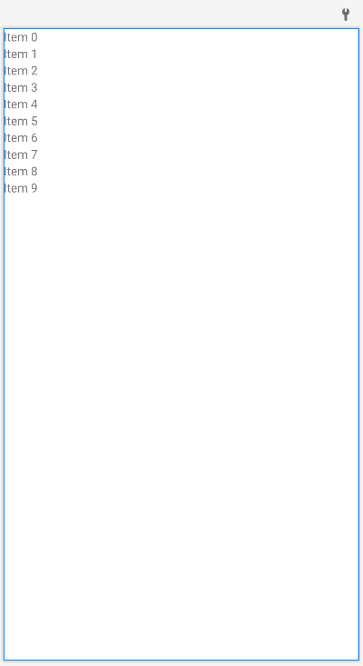
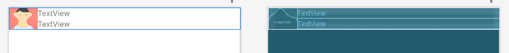

# 通讯录设计与实现-SharedPreferences

说明：本实验的数据存储方式选择的是：<span style="background-color: #ffff00;">SharedPreferences</span>

## 联系人展示

### 布局

#### RecyclerView

`activity_main.xml`

```xml
<?xml version="1.0" encoding="utf-8"?>
<androidx.constraintlayout.widget.ConstraintLayout xmlns:android="http://schemas.android.com/apk/res/android"
    xmlns:app="http://schemas.android.com/apk/res-auto"
    xmlns:tools="http://schemas.android.com/tools"
    android:layout_width="match_parent"
    android:layout_height="match_parent"
    tools:context=".MainActivity">

    <androidx.recyclerview.widget.RecyclerView
        android:id="@+id/contactRecyclerView"
        android:layout_width="match_parent"
        android:layout_height="match_parent"
        tools:layout_editor_absoluteX="1dp"
        tools:layout_editor_absoluteY="1dp" />

</androidx.constraintlayout.widget.ConstraintLayout>
```



#### RecyclerView item

`item_layout.xml`

```xml
<?xml version="1.0" encoding="utf-8"?>
<LinearLayout xmlns:android="http://schemas.android.com/apk/res/android"
    xmlns:tools="http://schemas.android.com/tools"
    android:layout_width="match_parent"
    android:layout_height="wrap_content">

    <ImageView
        android:id="@+id/image"
        android:layout_width="0dp"
        android:layout_height="match_parent"
        android:layout_gravity="left"
        android:layout_weight="1"
        android:scaleType="centerCrop"
        tools:ignore="ImageContrastCheck"
        tools:srcCompat="@tools:sample/avatars" />

    <LinearLayout
        android:layout_width="0dp"
        android:layout_height="wrap_content"
        android:layout_weight="7"
        android:orientation="vertical">

        <TextView
            android:id="@+id/name"
            android:layout_width="match_parent"
            android:layout_height="0dp"
            android:layout_weight="1"
            android:text="TextView" />

        <TextView
            android:id="@+id/mobile"
            android:layout_width="match_parent"
            android:layout_height="0dp"
            android:layout_weight="1"
            android:text="TextView" />
    </LinearLayout>
</LinearLayout>
```



### 代码

#### 定义私有变量，关联view元素

```java
private RecyclerView recyclerView;
private List<Contact> contacts;
```

#### 使用 RecyclerView 创建动态列表

RecyclerView 可以让您轻松高效地显示大量数据。您提供数据并定义每个列表项的外观，而 RecyclerView 库会根据需要动态创建元素。

顾名思义，RecyclerView 会回收这些单个的元素。当列表项滚动出屏幕时，RecyclerView 不会销毁其视图。相反，RecyclerView 会对屏幕上滚动的新列表项重用该视图。这种重用可以显著提高性能，改善应用响应能力并降低功耗。

**注意**：RecyclerView 除了是类的名称，也是库的名称。在本页中，采用 `code font` 字体的 `RecyclerView` 始终表示 RecyclerView 库中的类。

##### 关键类

将多个不同的类搭配使用，可构建动态列表。

- **[`RecyclerView`](https://developer.android.google.cn/reference/androidx/recyclerview/widget/RecyclerView?hl=zh-cn)** 是包含与您的数据对应的视图的 [`ViewGroup`](https://developer.android.google.cn/reference/android/view/ViewGroup?hl=zh-cn)。它本身就是视图，因此，将 `RecyclerView` 添加到布局中的方式与添加任何其他界面元素相同。
- 列表中的每个独立元素都由一个 ViewHolder 对象进行定义。创建 ViewHolder 时，它并没有任何关联的数据。创建 ViewHolder 后，`RecyclerView` 会将其绑定到其数据。您可以通过扩展 [`RecyclerView.ViewHolder`](https://developer.android.google.cn/reference/androidx/recyclerview/widget/RecyclerView.ViewHolder?hl=zh-cn) 来定义 ViewHolder。
- `RecyclerView` 会请求这些视图，并通过在 Adapter 中调用方法，将视图绑定到其数据。您可以通过扩展 [`RecyclerView.Adapter`](https://developer.android.google.cn/reference/androidx/recyclerview/widget/RecyclerView.Adapter?hl=zh-cn) 来定义 Adapter。
- 布局管理器负责排列列表中的各个元素。您可以使用 RecyclerView 库提供的某个布局管理器，也可以定义自己的布局管理器。布局管理器均基于库的 [`LayoutManager`](https://developer.android.google.cn/reference/androidx/recyclerview/widget/RecyclerView.LayoutManager?hl=zh-cn) 抽象类。

您可以在 [RecyclerView 示例应用 (Kotlin)](https://github.com/android/views-widgets-samples/tree/main/RecyclerViewKotlin/) 或 [RecyclerView 示例应用 (Java)](https://github.com/android/views-widgets-samples/tree/main/RecyclerView/) 中查看各部分如何组合在一起。

##### 实现 RecyclerView 的步骤

如果您打算使用 RecyclerView，那么您需要完成几项工作。下面几部分对这些工作进行了详细介绍。

- 首先，确定列表或网格的外观。一般来说，您可以使用 RecyclerView 库的某个标准布局管理器。
  
  ```java
  void initView() {
          recyclerView = findViewById(R.id.contactRecyclerView);
          // 创建线性布局管理器
          recyclerView.setLayoutManager(new LinearLayoutManager(this));
          // 设置分割线
          recyclerView.addItemDecoration(new DividerItemDecoration(this, DividerItemDecoration.VERTICAL));
          // 创建适配器
          MyAdapters myAdapter = new MyAdapters(this, contacts);
          recyclerView.setAdapter(myAdapter);
      }
  ```

- 设计列表中每个元素的外观和行为。根据此设计，扩展 `ViewHolder` 类。您的 `ViewHolder` 版本提供了列表项的所有功能。您的 ViewHolder 是 `View` 的封装容器，且该视图由 `RecyclerView` 管理。
  
  ```java
  // 让MyViewHolder持有它的三个子view
  public class MyViewHolder extends RecyclerView.ViewHolder {
      private ImageView image;
      private TextView name;
      private TextView mobile;
  
      public MyViewHolder(@NonNull View itemView) {
          super(itemView);
  
          image = itemView.findViewById(R.id.image);
          name = itemView.findViewById(R.id.name);
          mobile = itemView.findViewById(R.id.mobile);
      }
  
      public ImageView getImage() {
          return image;
      }
  
      public void setImage(ImageView image) {
          this.image = image;
      }
  
      public TextView getName() {
          return name;
      }
  
      public void setName(TextView name) {
          this.name = name;
      }
  
      public TextView getMobile() {
          return mobile;
      }
  
      public void setMobile(TextView mobile) {
          this.mobile = mobile;
      }
  }
  ```

- 定义用于将您的数据与 `ViewHolder` 视图相关联的 `Adapter`。
  
  ```java
  @Data
  public class MyAdapters extends RecyclerView.Adapter<MyAdapters.MyViewHolder> {
      private Context context;            // 上下文对象
      private List<Contact> contacts;     // 联系人
      private int selectPosition = -1;    // 选择的联系人的位置
  
      public MyAdapters(Context context, List<Contact> contacts) {
          this.context = context;
          this.contacts = contacts;
      }
  
      @NonNull
      @Override
      public MyAdapters.MyViewHolder onCreateViewHolder(@NonNull ViewGroup parent, int viewType) {
          View view = LayoutInflater.from(parent.getContext())
                                     .inflate(R.layout.item_layout, parent, false);
          return new MyViewHolder(view);
      }
  
      // 绑定数据
      @Override
      public void onBindViewHolder(@NonNull MyAdapters.MyViewHolder holder, int position) {
          // 从contact List 中获取指定索引的contact对象
          Contact contact = contacts.get(position);
          // 设置holder的 id为 image 的 ImageView src
          holder.getImage().setImageResource(contact.getImage());
          // 设置holder的 id为 name 的 TextView text
          holder.getName().setText(contact.getName());
          // 设置holder的 id为 mobile 的 TextView text
          holder.getMobile().setText(contact.getMobile());
      }
  
      @Override
      public int getItemCount() {
          return contacts == null ? 0 : contacts.size();
      }
  
      // 让MyViewHolder持有它的三个子view
      public class MyViewHolder extends RecyclerView.ViewHolder {
          private ImageView image;
          private TextView name;
          private TextView mobile;
  
          public MyViewHolder(@NonNull View itemView) {
              super(itemView);
  
              image = itemView.findViewById(R.id.image);
              name = itemView.findViewById(R.id.name);
              mobile = itemView.findViewById(R.id.mobile);
          }
  
          public ImageView getImage() {
              return image;
          }
  
          public void setImage(ImageView image) {
              this.image = image;
          }
  
          public TextView getName() {
              return name;
          }
  
          public void setName(TextView name) {
              this.name = name;
          }
  
          public TextView getMobile() {
              return mobile;
          }
  
          public void setMobile(TextView mobile) {
              this.mobile = mobile;
          }
      }
  }
  ```

此外，您还可以使用[高级自定义选项](https://developer.android.google.cn/guide/topics/ui/layout/recyclerview-custom?hl=zh-cn)根据自己的具体需求定制 RecyclerView。

##### 规划布局

RecyclerView 中的列表项由 [`LayoutManager`](https://developer.android.google.cn/reference/androidx/recyclerview/widget/RecyclerView.LayoutManager?hl=zh-cn) 类负责排列。RecyclerView 库提供了三种布局管理器，用于处理最常见的布局情况：

- [`LinearLayoutManager`](https://developer.android.google.cn/reference/androidx/recyclerview/widget/LinearLayoutManager?hl=zh-cn) 将各个项排列在一维列表中。

- `GridLayoutManager`
  
  将所有项排列在二维网格中：

- 如果网格垂直排列，`GridLayoutManager` 会尽量使每行中所有元素的宽度和高度相同，但不同的行可以有不同的高度。

- 如果网格水平排列，`GridLayoutManager` 会尽量使每列中所有元素的宽度和高度相同，但不同的列可以有不同的宽度。

- [`StaggeredGridLayoutManager`](https://developer.android.google.cn/reference/androidx/recyclerview/widget/StaggeredGridLayoutManager?hl=zh-cn) 与 `GridLayoutManager` 类似，但不要求同一行中的列表项具有相同的高度（垂直网格有此要求）或同一列中的列表项具有相同的宽度（水平网格有此要求）。其结果是，同一行或同一列中的列表项可能会错落不齐。

您还需要设计各个列表项的布局。在设计 ViewHolder 时，您需要使用此布局，如下一部分所述。

##### 实现 Adapter 和 ViewHolder

确定布局后，您需要实现 `Adapter` 和 `ViewHolder`。这两个类配合使用，共同定义数据的显示方式。`ViewHolder` 是包含列表中各列表项的布局的 `View` 的封装容器。`Adapter` 会根据需要创建 `ViewHolder` 对象，还会为这些视图设置数据。将视图与其数据相关联的过程称为“绑定”。

定义 Adapter 时，您需要替换三个关键方法：

- [`onCreateViewHolder()`](https://developer.android.google.cn/reference/androidx/recyclerview/widget/RecyclerView.Adapter?hl=zh-cn#onCreateViewHolder(android.view.ViewGroup, int))：每当 `RecyclerView` 需要创建新的 `ViewHolder` 时，它都会调用此方法。此方法会创建并初始化 `ViewHolder` 及其关联的 `View`，但不会填充视图的内容，因为 `ViewHolder` 此时尚未绑定到具体数据。
- [`onBindViewHolder()`](https://developer.android.google.cn/reference/androidx/recyclerview/widget/RecyclerView.Adapter?hl=zh-cn#onBindViewHolder(VH, int))：`RecyclerView` 调用此方法将 `ViewHolder` 与数据相关联。此方法会提取适当的数据，并使用该数据填充 ViewHolder 的布局。例如，如果 `RecyclerView` 显示的是一个名称列表，该方法可能会在列表中查找适当的名称，并填充 ViewHolder 的 [`TextView`](https://developer.android.google.cn/reference/android/widget/TextView?hl=zh-cn) widget。
- [`getItemCount()`](https://developer.android.google.cn/reference/androidx/recyclerview/widget/RecyclerView.Adapter?hl=zh-cn#getItemCount())：RecyclerView 调用此方法来获取数据集的大小。例如，在通讯簿应用中，这可能是地址总数。RecyclerView 使用此方法来确定什么时候没有更多的列表项可以显示。

下面是一个典型的简单 Adapter 示例，该 Adapter 包含一个显示数据列表的嵌套 `ViewHolder`。在本例中，RecyclerView 显示了一个简单的文本元素列表。系统会向 Adapter 传递一个字符串数组，该数组包含了 `ViewHolder` 元素的文本。

##### 完整代码

`MyAdapters.java`

```java
package adapter;

import android.content.Context;
import android.view.LayoutInflater;
import android.view.View;
import android.view.ViewGroup;
import android.widget.ImageView;
import android.widget.TextView;

import androidx.annotation.NonNull;
import androidx.recyclerview.widget.RecyclerView;

import com.xiaoxin.addressbook.R;

import java.util.List;

import domain.Contact;
import lombok.Data;

@Data
public class MyAdapters extends RecyclerView.Adapter<MyAdapters.MyViewHolder> {
    private Context context;            // 上下文对象
    private List<Contact> contacts;     // 联系人
    private int selectPosition = -1;    // 选择的联系人的位置

    public MyAdapters(Context context, List<Contact> contacts) {
        this.context = context;
        this.contacts = contacts;
    }

    @NonNull
    @Override
    public MyAdapters.MyViewHolder onCreateViewHolder(@NonNull ViewGroup parent, int viewType) {
        View view = LayoutInflater.from(parent.getContext())
                                   .inflate(R.layout.item_layout, parent, false);
        return new MyViewHolder(view);
    }

    // 绑定数据
    @Override
    public void onBindViewHolder(@NonNull MyAdapters.MyViewHolder holder, int position) {
        // 从contact List 中获取指定索引的contact对象
        Contact contact = contacts.get(position);
        // 设置holder的 id为 image 的 ImageView src
        holder.getImage().setImageResource(contact.getImage());
        // 设置holder的 id为 name 的 TextView text
        holder.getName().setText(contact.getName());
        // 设置holder的 id为 mobile 的 TextView text
        holder.getMobile().setText(contact.getMobile());
    }

    @Override
    public int getItemCount() {
        return contacts == null ? 0 : contacts.size();
    }

    // 让MyViewHolder持有它的三个子view
    public class MyViewHolder extends RecyclerView.ViewHolder {
        private ImageView image;
        private TextView name;
        private TextView mobile;

        public MyViewHolder(@NonNull View itemView) {
            super(itemView);

            image = itemView.findViewById(R.id.image);
            name = itemView.findViewById(R.id.name);
            mobile = itemView.findViewById(R.id.mobile);
        }

        public ImageView getImage() {
            return image;
        }

        public void setImage(ImageView image) {
            this.image = image;
        }

        public TextView getName() {
            return name;
        }

        public void setName(TextView name) {
            this.name = name;
        }

        public TextView getMobile() {
            return mobile;
        }

        public void setMobile(TextView mobile) {
            this.mobile = mobile;
        }
    }
}
```

`MainActivity`

```java
void initView() {
    recyclerView = findViewById(R.id.contactRecyclerView);
    // 创建线性布局管理器
    recyclerView.setLayoutManager(new LinearLayoutManager(this));
    // 设置分割线
    recyclerView.addItemDecoration(new DividerItemDecoration(this, DividerItemDecoration.VERTICAL));
    // 创建适配器
    MyAdapters myAdapter = new MyAdapters(this, contacts);
    recyclerView.setAdapter(myAdapter);
}
```

#### OptionsMenu

```java
@Override
public boolean onCreateOptionsMenu(Menu menu) {
    getMenuInflater().inflate(R.menu.main_menu, menu);
    return true;
}
```

```java
    @Override
    public boolean onOptionsItemSelected(@NonNull MenuItem item) {
        int itemId = item.getItemId();
        if (itemId == R.id.action_add) {
            Intent intent = new Intent();
            intent.setClass(MainActivity.this, AddActivity.class);
            startActivity(intent);
        }
        return super.onOptionsItemSelected(item);
    }
}
```


#### 从SharedPreferences中读取数据

```java
void initData() {
    SharedPreferences contactsShare = getSharedPreferences("contacts", MODE_PRIVATE);
    String contactListStr = contactsShare.getString("contactListStr", null);
    if (contactListStr != null) {
        contacts = new ArrayList<>();
        List<Contact> contactList = new ArrayList<>();
        Gson gson = new Gson();
        Type type = new TypeToken<List<Contact>>() {}.getType();
        contacts = gson.fromJson(contactListStr, type);
    }
}
```

#### 完整代码

`MainActivity.java`

```java
package com.xiaoxin.addressbook;

import androidx.annotation.NonNull;
import androidx.appcompat.app.ActionBar;
import androidx.appcompat.app.AppCompatActivity;
import androidx.recyclerview.widget.DividerItemDecoration;
import androidx.recyclerview.widget.LinearLayoutManager;
import androidx.recyclerview.widget.RecyclerView;

import android.content.Intent;
import android.content.SharedPreferences;
import android.os.Bundle;
import android.view.Menu;
import android.view.MenuItem;

import com.google.gson.Gson;
import com.google.gson.reflect.TypeToken;

import java.lang.reflect.Type;
import java.util.ArrayList;
import java.util.List;

import adapter.MyAdapters;
import domain.Contact;

public class MainActivity extends AppCompatActivity {

    private RecyclerView recyclerView;
    private List<Contact> contacts;

    @Override
    protected void onCreate(Bundle savedInstanceState) {
        super.onCreate(savedInstanceState);
        setContentView(R.layout.activity_main);
        initData();
        initView();
    }

    void initData() {
        SharedPreferences contactsShare = getSharedPreferences("contacts", MODE_PRIVATE);
        String contactListStr = contactsShare.getString("contactListStr", null);
        if (contactListStr != null) {
            contacts = new ArrayList<>();
            List<Contact> contactList = new ArrayList<>();
            Gson gson = new Gson();
            Type type = new TypeToken<List<Contact>>() {}.getType();
            contacts = gson.fromJson(contactListStr, type);
        }
    }

    void initView() {
        recyclerView = findViewById(R.id.contactRecyclerView);
        // 创建线性布局管理器
        recyclerView.setLayoutManager(new LinearLayoutManager(this));
        // 设置分割线
        recyclerView.addItemDecoration(new DividerItemDecoration(this, DividerItemDecoration.VERTICAL));
        // 创建适配器
        MyAdapters myAdapter = new MyAdapters(this, contacts);
        recyclerView.setAdapter(myAdapter);
    }

    @Override
    public boolean onCreateOptionsMenu(Menu menu) {
        getMenuInflater().inflate(R.menu.main_menu, menu);
        return true;
    }

    @Override
    public boolean onOptionsItemSelected(@NonNull MenuItem item) {
        int itemId = item.getItemId();
        if (itemId == R.id.action_add) {
            Intent intent = new Intent();
            intent.setClass(MainActivity.this, AddActivity.class);
            startActivity(intent);
        }
        return super.onOptionsItemSelected(item);
    }
}
```

## 添加联系人

### 布局

`add_layout.xml`

```xml
<?xml version="1.0" encoding="utf-8"?>
<LinearLayout
    xmlns:android="http://schemas.android.com/apk/res/android"
    android:layout_height="match_parent"
    android:layout_width="match_parent"
    android:paddingTop="10dp"
    android:paddingStart="10dp"
    android:paddingEnd="10dp"
    android:orientation="vertical">
    <EditText
        android:id="@+id/edit_name"
        android:layout_width="match_parent"
        android:layout_height="wrap_content"
        android:textSize="30sp"
        android:inputType="text"
        android:hint="请输入姓名">
    </EditText>

    <EditText
        android:id="@+id/edit_mobile"
        android:layout_width="match_parent"
        android:layout_height="wrap_content"
        android:textSize="30sp"
        android:inputType="text"
        android:hint="请输入电话号码">
    </EditText>

    <LinearLayout
        android:layout_width="match_parent"
        android:layout_height="80dp">
        <TextView
            android:layout_height="match_parent"
            android:layout_width="0dp"
            android:layout_weight="1"
            android:gravity="center"
            android:textSize="30sp"
            android:text="请选择头像："/>
        <Spinner
            android:id="@+id/spinner"
            android:layout_height="match_parent"
            android:layout_width="0dp"
            android:layout_weight="1" />
    </LinearLayout>

    <Button
        android:layout_width="match_parent"
        android:layout_height="60dp"
        android:layout_marginTop="20dp"
        android:layout_gravity="center"
        android:textSize="30dp"
        android:text="保存"
        android:onClick="save"
        >

    </Button>


</LinearLayout>
```

`pic_item.xml`

```xml
<?xml version="1.0" encoding="utf-8"?>
<LinearLayout
    xmlns:android="http://schemas.android.com/apk/res/android"
    android:layout_width="match_parent"
    android:layout_height="wrap_content"
    android:orientation="horizontal" >
    <ImageView
        android:id="@+id/avatar"
        android:layout_width="60dp"
        android:layout_height="60dp" />
</LinearLayout>
```

### 代码

#### 初始化视图

```java
void initView() {
    spinner = findViewById(R.id.spinner);
    name_edit = findViewById(R.id.edit_name);
    mobile_edit = findViewById(R.id.edit_mobile);
}
```

#### 向spinner的adapter填充数据

```java
List<Map<String, Object>> getData() {
    List<Map<String, Object>> list = new ArrayList<>();

    Map<String, Object> red = new HashMap<>();
    red.put("image", R.drawable.contact_red);
    list.add(red);

    Map<String, Object> blue = new HashMap<>();
    blue.put("image", R.drawable.contact_blue);
    list.add(blue);

    Map<String, Object> purple = new HashMap<>();
    purple.put("image", R.drawable.contact_purple);
    list.add(purple);

    return list;
}
```

#### 给spinner设置适配器

```java
void setAdapter() {
    SimpleAdapter simpleAdapter = new SimpleAdapter(this,
                                                    getData(),
                                                    R.layout.pic_item,
                                                    new String[]{"image"},
                                                    new int[]{R.id.avatar});
    spinner.setAdapter(simpleAdapter);
}
```

#### 监听spinner选择事件

```java
 void setListener() {
     spinner.setOnItemSelectedListener(new AdapterView.OnItemSelectedListener() {
         @Override
         public void onItemSelected(AdapterView<?> adapterView, View view, int i, long l) {
             Map<String, Object> itemAtPosition = (Map<String, Object>) adapterView.getItemAtPosition(i);
             imageId = (Integer) itemAtPosition.get("image");
             Toast.makeText(AddActivity.this, itemAtPosition.get("image") + "", Toast.LENGTH_SHORT).show();
         }

         @Override
         public void onNothingSelected(AdapterView<?> adapterView) {

         }
     });
 }
```

#### 将联系人数据转化为json字符串并通过sharedPreference持久化

```java
   public void save(View v) {
        // 获取姓名
        String name = name_edit.getText().toString();
        // 获取电话号码
        String mobile = mobile_edit.getText().toString();
        // 新添加的联系人
        Contact contact = new Contact(imageId, name, mobile);

        SharedPreferences contactsShare = getSharedPreferences("contacts", MODE_PRIVATE);
        SharedPreferences.Editor edit = contactsShare.edit();
        String contactListStr = contactsShare.getString("contactListStr", null);
        List<Contact> contactList = new ArrayList<>();
        Gson gson = new Gson();
        Type type = new TypeToken<List<Contact>>() {}.getType();
        if (contactListStr != null) {
            contactList = gson.fromJson(contactListStr, type);
        }
        contactList.add(contact);
        contactListStr = gson.toJson(contactList);
        edit.putString("contactListStr", contactListStr);
        edit.apply();

        Intent intent = new Intent();
        intent.setClass(AddActivity.this, MainActivity.class);
        startActivity(intent);
    }
```

#### 完整代码

```java
package com.xiaoxin.addressbook;

import android.content.Intent;
import android.content.SharedPreferences;
import android.os.Bundle;
import android.view.View;
import android.widget.AdapterView;
import android.widget.EditText;
import android.widget.SimpleAdapter;
import android.widget.Spinner;
import android.widget.Toast;

import androidx.annotation.Nullable;
import androidx.appcompat.app.AppCompatActivity;
import com.google.gson.Gson;
import com.google.gson.reflect.TypeToken;

import java.lang.reflect.Type;
import java.util.ArrayList;
import java.util.HashMap;
import java.util.List;
import java.util.Map;

import domain.Contact;

public class AddActivity extends AppCompatActivity {
    Spinner spinner;
    EditText name_edit;
    EditText mobile_edit;
    Integer imageId;

    @Override
    protected void onCreate(@Nullable Bundle savedInstanceState) {
        super.onCreate(savedInstanceState);
        setContentView(R.layout.add_layout);
        initView();
        setAdapter();
        setListener();
    }

    void initView() {
        spinner = findViewById(R.id.spinner);
        name_edit = findViewById(R.id.edit_name);
        mobile_edit = findViewById(R.id.edit_mobile);
    }

    void setAdapter() {
        SimpleAdapter simpleAdapter = new SimpleAdapter(this,
                                                        getData(),
                                                        R.layout.pic_item,
                                                        new String[]{"image"},
                                                        new int[]{R.id.avatar});
        spinner.setAdapter(simpleAdapter);
    }

    void setListener() {
        spinner.setOnItemSelectedListener(new AdapterView.OnItemSelectedListener() {
            @Override
            public void onItemSelected(AdapterView<?> adapterView, View view, int i, long l) {
                Map<String, Object> itemAtPosition = (Map<String, Object>) adapterView.getItemAtPosition(i);
                imageId = (Integer) itemAtPosition.get("image");
                Toast.makeText(AddActivity.this, itemAtPosition.get("image") + "", Toast.LENGTH_SHORT).show();
            }

            @Override
            public void onNothingSelected(AdapterView<?> adapterView) {

            }
        });
    }


    List<Map<String, Object>> getData() {
        List<Map<String, Object>> list = new ArrayList<>();

        Map<String, Object> red = new HashMap<>();
        red.put("image", R.drawable.contact_red);
        list.add(red);

        Map<String, Object> blue = new HashMap<>();
        blue.put("image", R.drawable.contact_blue);
        list.add(blue);

        Map<String, Object> purple = new HashMap<>();
        purple.put("image", R.drawable.contact_purple);
        list.add(purple);

        return list;
    }

    public void save(View v) {
        // 获取姓名
        String name = name_edit.getText().toString();
        // 获取电话号码
        String mobile = mobile_edit.getText().toString();
        // 新添加的联系人
        Contact contact = new Contact(imageId, name, mobile);

        SharedPreferences contactsShare = getSharedPreferences("contacts", MODE_PRIVATE);
        SharedPreferences.Editor edit = contactsShare.edit();
        String contactListStr = contactsShare.getString("contactListStr", null);
        List<Contact> contactList = new ArrayList<>();
        Gson gson = new Gson();
        Type type = new TypeToken<List<Contact>>() {}.getType();
        if (contactListStr != null) {
            contactList = gson.fromJson(contactListStr, type);
        }
        contactList.add(contact);
        contactListStr = gson.toJson(contactList);
        edit.putString("contactListStr", contactListStr);
        edit.apply();

        Intent intent = new Intent();
        intent.setClass(AddActivity.this, MainActivity.class);
        startActivity(intent);
    }


}
```

## 效果展示


## 参考

android中的spinner显示为图片列表：https://blog.csdn.net/cool_easy/article/details/9943799

Android官方下拉选择控件Spinner：https://blog.csdn.net/yechaoa/article/details/72329082

使用 RecyclerView 创建动态列表：https://developer.android.google.cn/guide/topics/ui/layout/recyclerview?hl=zh-cn#java