# 第一章 计算机网络体系结构

## 计算机网络的概念

计算机网络：是一个将分散的，具有独立功能的计算机系统，通过通信设备与线路链接起来，由功能完善的软件实现资源共享和信息传递的系统。
简而言之：计算机网络就是好一些互联的、自治的计算系统的集合。

## 计算机网络的功能

1. 数据通信

2. 资源共享 

3. 分布式处理 

    如：hadoop

4. 提高可靠性

5. 负载均衡

## 计算机网络的发展

**第一阶段**
美国国防部高级研究计划局（APPA）设计一个分散的指挥系统。
希望实现不同网络互联。1983年阿帕网接受TCP/IP选定Internet为主要的计算机通信系统。

网络把许多计算机连接到一起，而互联网则把许多网络连接在一起，<mark style="background: #FF5582A6;">因特网</mark>是世界上最大的互联网。
网络：把计算机连接起来。
互联网：把网络连接起来。
internet：相互链接的网络的网络。
Internet：专有名词：“因特网”。

**第二阶段——三级结构**

**第三阶段——多层次ISP结构**

IXP：极大的提高了信息传递和资源共享的速度。

## 计算机的组成

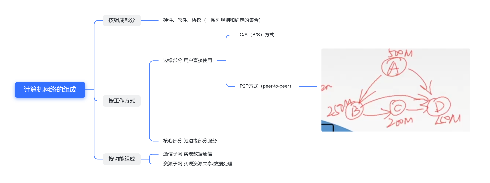

**端系统中的通信**强调的是两个端系统中进程之间的通信。

## 计算机网络的分类

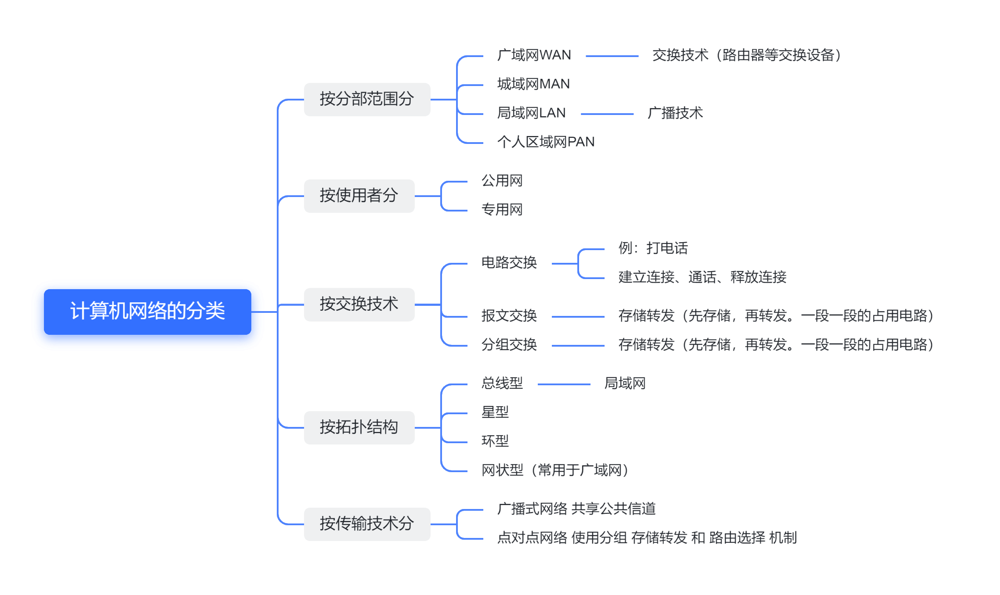

注意：若中央处理器之间的**距离非常近**（如**仅1m的数量**或甚至更小），一般称为**多处理器系统**，而不称为计算机网络。

**报文交换网络**也称为**存储-转发**网络。

现在的主流网络基本上都可视为**分组交换**网络。

## 标准化工作及相关组织

要实现不同厂商的软硬件之间的互通，必须指定统一的标准。

因特网的所有标准都以RFC(Requst For Comments)的形式在因特网上发布，但并非每个RFC都是因特网标准，RFC要上升为因特网的正式标准需经过以下4个阶段。
1. 因特网草案（Internet Draft）。这个阶段还不是RFC文档。
2. 建议标准（Proposed Standard）。这个阶段开始就成为RFC文档。
3. 草案标准（Draft Standard）。
4. 因特网标准（Internet Standard）。

RFC（Request For Comments）—— 因特网标准的形式。 

从2011年开始，第三个阶段取消了。

**标准化工作的相关组织**

- 国际标准化组织ISO     OSI模型、HDLC协议
- 国际电信联盟ITU         指定通信规则
- 电子和电子工程师协会IEEE    学术机构、IEEE802系列标准、5G
- Internet工程任务组IETF    负责因特网相关标准的制定 RFC XXXX

## 性能指标

**速率**
速率即数据率或称数据传输率或比特率。

在计算机网络中，带宽表示网络的通信线路所能传送数据的能力，是数字信道所能传送的“最高数据传输速率”的同义词，单位是比特/秒（b/s）。

比特 1/0 位

连接在计算机网络上的**主机**在数字信道上传送数据**位数的速率**。

单位是b/s，kb/s，Mb/s，Gb/s，Tb/s。

| 速率                                             | 存储容量 1Byte(字节)=8bit(比特) |
| ------------------------------------------------ | ------------------------------- |
| 千 1kb/s=103 b/s                               | 1KB=210B=1024B=1024 * 8b        |
| 兆 1Mb/s=103 kb/s=106 b/s                    | 1MB=210 KB=1024B              |
| 吉 1Gb/s=103Mb/s=106kb/s=109b/s            | 1GB=210MB = 1024MB            |
| 太 1Tb/s=103Gb/s=106Mb/s=109kb/s=1012b/s | 1TB=210GB=1024GB              |

**带宽**
(1) “带宽”原本指某个信号具有的频带宽度，即最高频率和最低频率之差，单位是赫兹（Hz）。

(2) 某计算机网络中，带宽用来表示网络的通信线路传送数据的能力，通常指的单位时间从网络中的某一点到另一点所能通过的“最高数据率”。单位是“比特每秒”，b/s，kb/s，Mb/s，Gb/s。

网络设备所支持的最高速率。

**吞吐量**

表示在单位时间内通过某个网络(或信道、接口)的数据量。单位b/s，kb/s，Mb/s等。
吞吐量受网络的带宽或网络的额定速率的限制。

**时延**

指数据（报文/分组/比特流）从网络（或链路）的一端传送到另一端所需的时间。也叫延迟或迟延。单位是s.

在向路由器输入和输出的时候，都有排队时延。

高速链路指的是的发送速率的提高，而并不会影响电磁波的传送速率。

**时延带宽积**

又称为以比特为单位的链路长度。

$时延带宽积=传播时延\times带宽$
     bit                     s               b/s

**往返时延RTT**

从发送方发送数据开始，到发送方接收到接收方的确认（接收方收到数据后立即发送确认），总共经历的时延。

RTT越大，在收到确认之前，可以发送的数据越多。

不包括发送时延。

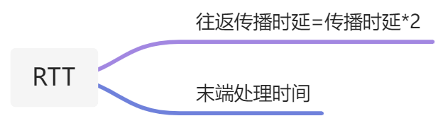

末端处理时间：从接收端收到信号到发送确认信息的时间。

**利用率**

## 课后习题

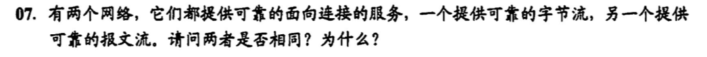

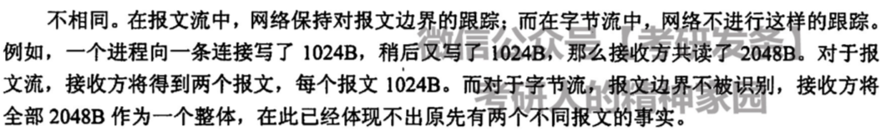

## 计算机网络分层结构

**为什么要分层？**

两个系统实体间的通信是一个很复杂的过程，为了降低协议设计和调试过程的复杂性，也为了便于对网络进行研究、实现和维护，促进标准化工作，通常对计算机网络的体系结构以分层的方式进行建模。

**怎么分层？**

上层使用下层的服务。

分层的基本原则
1. 各层之间相互独立，每层只实现一种相对独立的功能。
2. 每层之间界面自然清晰，易于理解，相互交流尽可能少。
3. 结构上可分割开。每层都采用最合适的技术来实现。
4. 保持下层对上层的独立性，上层单向使用下层提供的服务。
5. 这个分层应该能够促进标准化工作。

**注意**：在一层内完成的全部功能并非都称为服务，只有那些能够被高一层实体“看得见”的功能才能称为服务。

**有应答服务和无应答服务**：

​		有应答服务是指接收方在受到数据后向发送方给出肯定的应答，该应答由传输系统内部自动实现，而不是由用户实现。所发送的应答既可以是肯定应答，也可以是否定应答，通常在接收到的数据有错误时发送否定应答。例如，文件传输就是一种有应答服务。

​		无应答服务是指接收方收到数据后不自动给出应答。若需要应答，则由高层实现。例如。对于WWW服务，客户端收到服务器发送的页面文件后不给出应答。

服务是单向的，服务是垂直方向的，协议是水平方向的gai。

概念总结
- 网络体系结构是从功能上描述计算机网络结构
- 计算机网络体系结构，简称体系结构，是分层结构
- 每层遵循某个/些网路协议以及完成本层的功能。
- 计算网络体系结构是计算机网络的各层服务及其协议的集合。
- 第n层向n+1层提供服务时，此服务不仅包含第n层本身的功能，还包含由下层服务提供的功能。
- 仅仅在相邻层间有接口，且所提供服务的具体实现细节对上一层完全屏蔽。
- 体系结构是抽象的，而实现是指能运行的一些硬件和软件。

**计算机网络分层结构**

**ISO/OSI参考模型——怎么来？**

为了解决计算机网络的大问题$\to$分层结构（按功能）

IBM公司——SNA
DEC公司——DNA
美国国防部——TCP/IP

目的：支持异构网络互联互通。
国际标准化组织（ISO）于1984年提出开放系统互连（OSI）参考模型。
但是！理论成功，市场失败。

失败原因
1. OSI专家缺乏实际经验
2. 实现复杂，运行效率低
3. 标准制定周期长，无法及时进入市场。
4. 层次划分不是很合理，不同层次有功能的重复。

ISO/OSI参考模型

**ISO/OSI参考模型解释通信过程**

附加信息：差错检测，下一步要往哪里传，数据包的优先级。

					打包                                                                                                                                                拆包                   

数据链路层：不仅加了首部还加了尾部

**应用层**

连上网才能使用的程序，记事本就不是。

典型的应用层服务：
- 文件传输（FTP）
- 电子邮件（SMTP） 
- 万维网（HTTP）

**表示层**

**会话层**

会话之间是彼此独立而不影响的。
例如：传送一部小说，中通失败，可以会到校验点从新传输。

**传输层**

上面四层的**端到端的通信**，下面三层是**点到点的通信**。
下面三层，从一个点，到另一个点。

**可靠传输**基于确认机制。

流量控制，控制发送端发送的速度。

**网络层**

**数据链路层**

介质访问子层来控制对信道的访问。

**物理层**

半双工：双方两个人都可以发送，但是同一时间只能有一方在说话。
双工：两个人双向同时在说话。

==注意==，传输信息所所利用的一些媒体，如双绞线、光缆、无线信道等，并不在物理层协议之内而在物理层协议下面。因此，有人把物理媒体当做第0层。

**总结**	

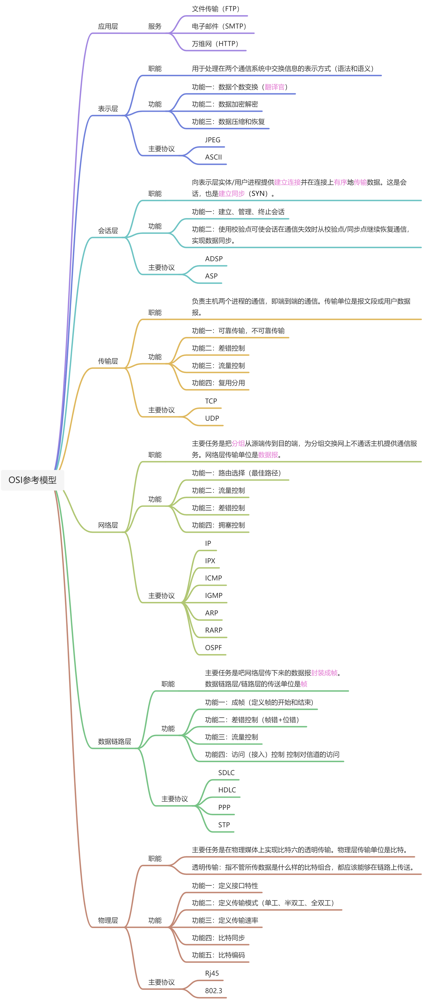

## OSI参考模型与TCP/IP参考模型

先出现的是TCP/IP协议栈，然后对TCP/IP协议栈进行了一个分层，才出现了TCP/IP参考模型。

**网络层**将数据报拆层一个个的分组，并进行路由的选择。

**传输层**会进行一些端到端，或者进程与进程之间的通信。

**网络层**的**IP协议**是面向无连接的。

**传输层**是为了**实现可靠传输**而存在的，为了实现可靠的传输，都要实现一个连接。

TCP/IP模型在网络层比较看重IP协议，因此他在网络层是无连接的。

数据报过长的时候，可以对他进行一个切分，分成分组。

## 题目总结

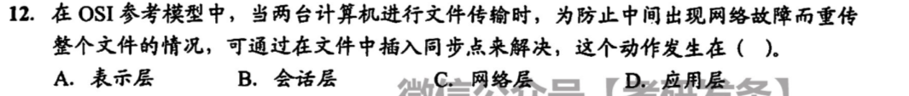

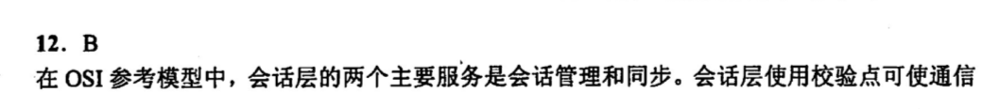

---

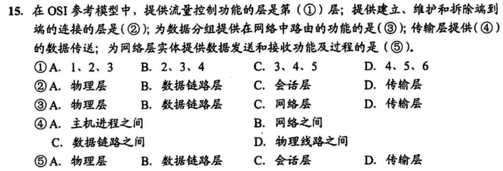

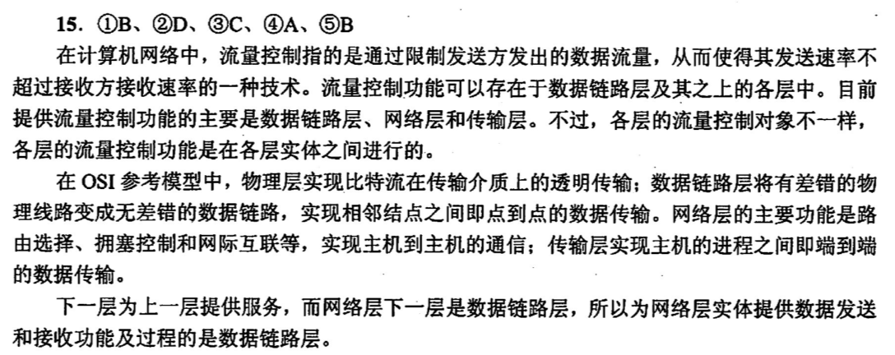

---

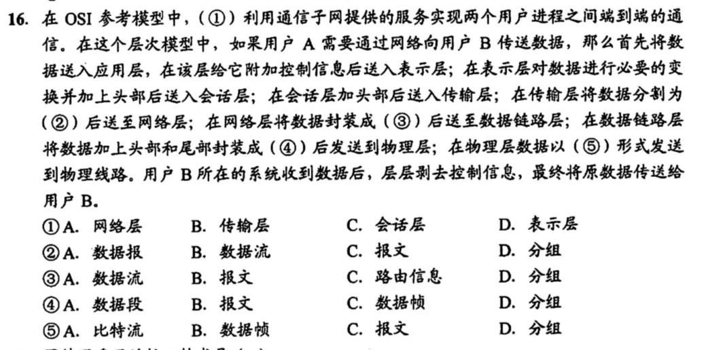

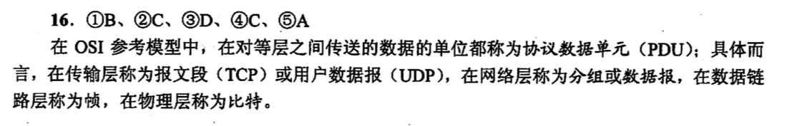

---

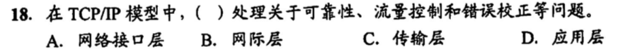

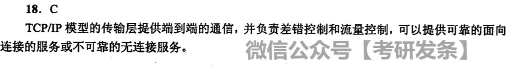

---

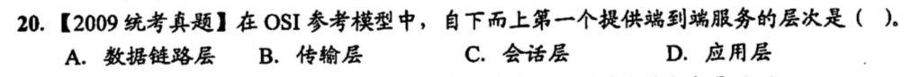

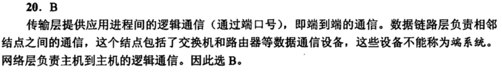

---

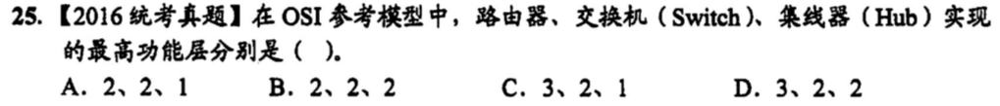

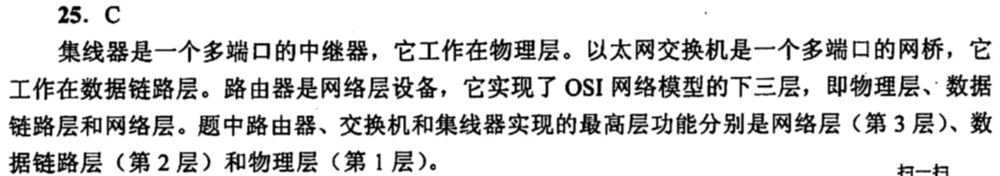

---

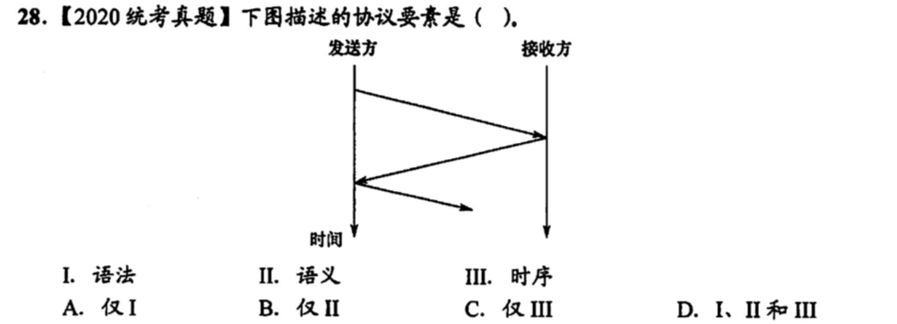

---

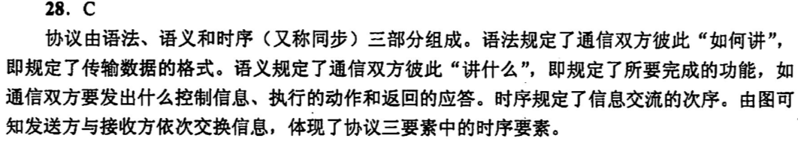

---

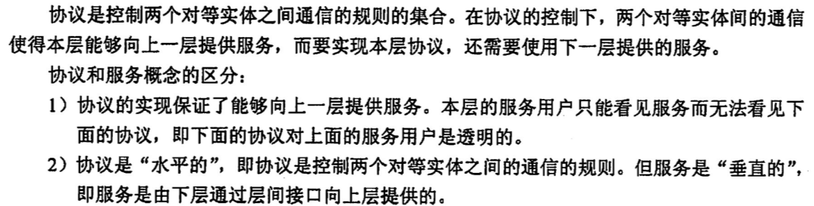
