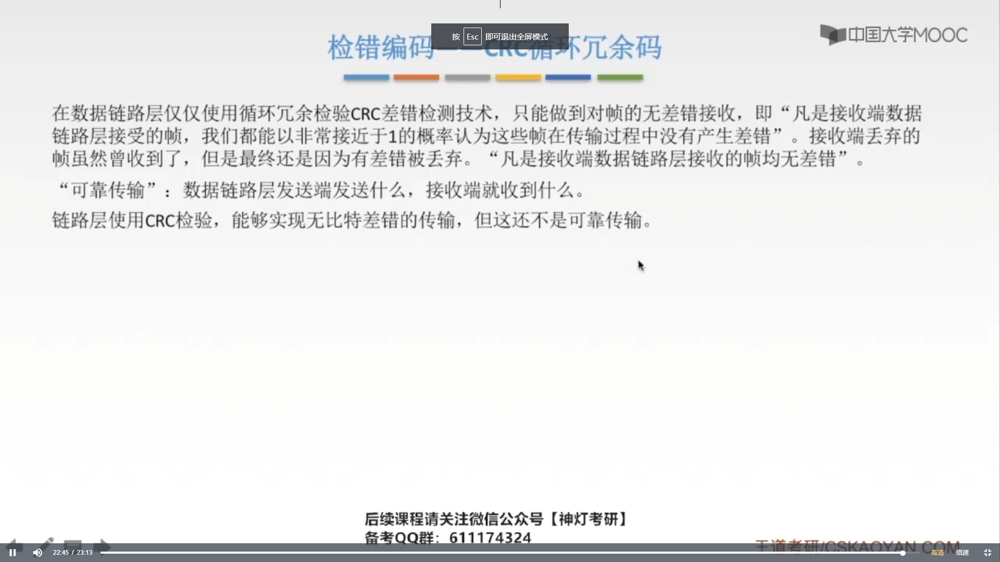
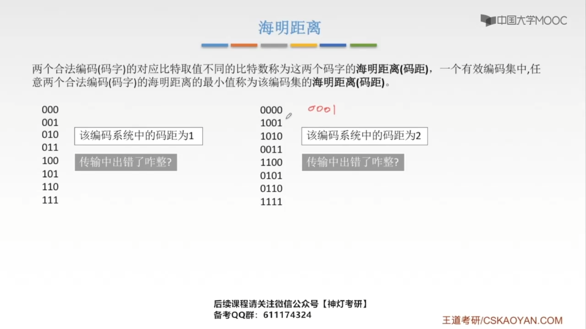
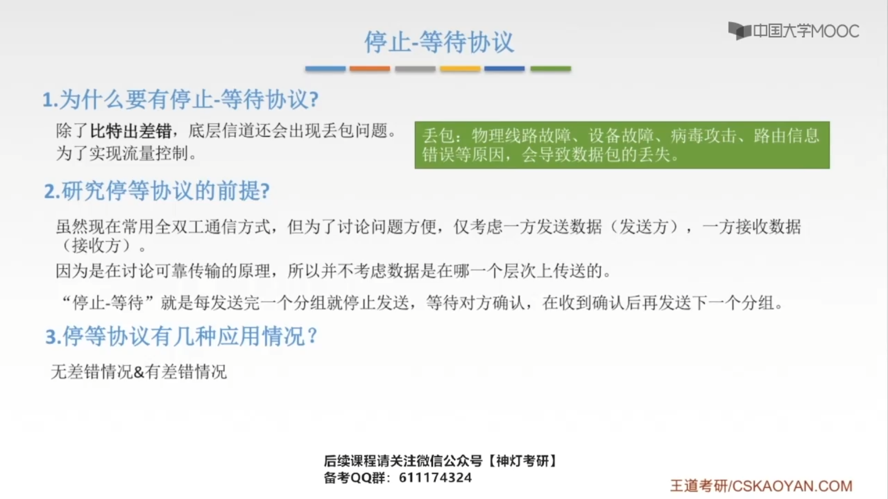
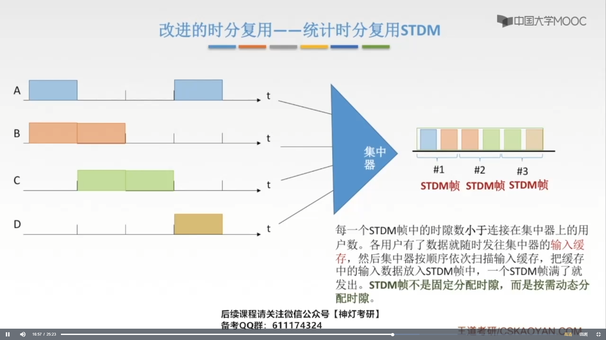
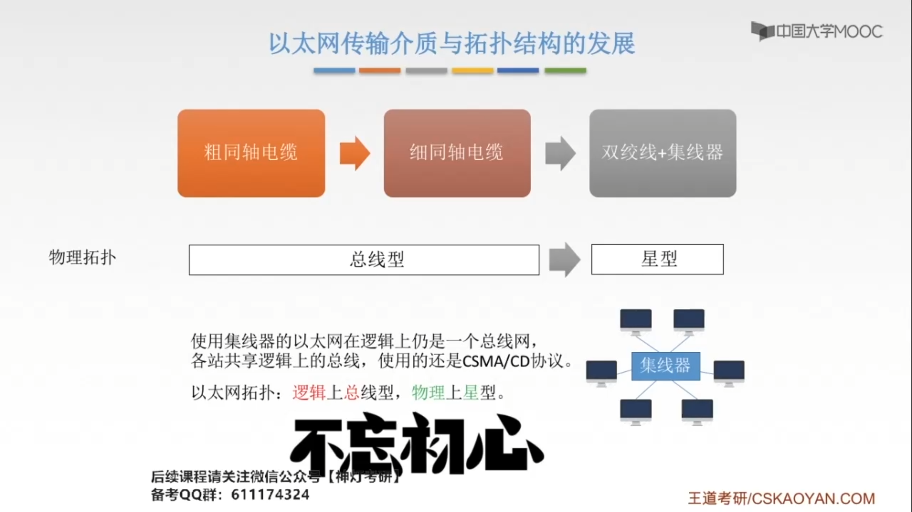
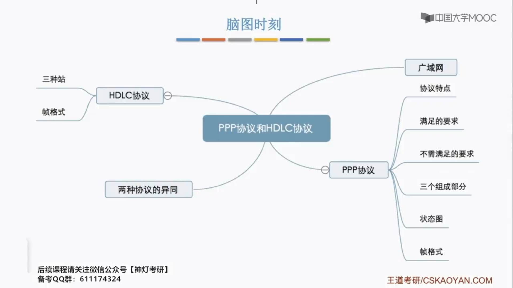

# 第三章-数据链路层

## 3.1 功能概述

自下而上封装，自上而下解封装。

可以想象成在同一层自左向右水平发送。

**链路管理**：数据链路层连接的建立、维持和释放过程称为**链路管理**，它主要用于面向连接的服务。在多个站点共享同一信道的情况下（如局域网中）如何要求**通信站点间的分配**和**管理信道**也属于数据链路层管理管理的范畴。

**透明传输**就是不管所传数据是什么样的比特组合，都应该能在链路上传送。

## 3.2 封装成帧&透明传输

### 3.2.1 分装成帧

组帧是在发送端做的事

以太网帧格式：

#### 3.2.1.1  字符记数法

#### 3.2.1.2 字符（节）填充法

#### 3.2.1.3  零比特填充法

#### 3.2.1.4 违规编码法

## 3.3 差错控制

**注意**：对于链路层的差错控制，我们是在任何一个结点的链路层都能实现的，每一个结点和它下一个相连的结点就构成了发送方和接收方的关系。

### 3.3.1 检错编码

####  3.3.1.1 奇偶校验码

#### 3.3.1.2 CRC冗余校验码

 

### 3.3.2 纠错编码——海明码

如果这个编码习系统的码距为d，就可以检测出d-1位的比特错。要检测出d位错，码距就需要为d+1。

如果要检测出d位错，码距需要为d+1；如果需要纠正d位错，需要的码距为2d+1。

#### 3.3.2.1 确认校验码位数r

#### 3.3.2.2 确认校验码位置

#### 3.3.2.3 添上校验码

#### 3.3.2.4 检错并纠错

## 3.4 流量控制和可靠传输机制

### 3.4.1 流量控制、可靠传输和滑动窗口机制

在链路层的滑动窗口协议当中，这个窗口的大小在传输过程当中是固定的。

### 3.4.2 停止-等待协议

在计算机网络发展的前期，通信链路质量不是很好，所以链路层就要担负起可靠传输的职责，因此链路层就会使用停止-等待协议、后退N帧协议、选择重传协议等等，随着现在技术的发展我们通信链路的质量越来越好，出现差错的可能性就不像以前那么大，那么链路层就能抛弃掉可靠传输的职责，把这个责任交给传输层来实现。而链路层，主要负责差错的控制，这样就会使得我们数据在链路上进行传递的过程中，速度更快，所用的时间更少，延迟也就更小。

传输层发送的数据称为分组，而在链路层传输的时候，我们就会把这个数据称作一个数据帧。

 

**原理**：”停止-等待“就是每发送完一个分组就停止发送，等待对方确认，收到确认后在发送下一个分组。

上图中：

- `ACK 0`表示对0帧的确认
- 第一个==0帧==和第二个==0帧==表示的并不是一个帧，是两个不同的帧使用的同一个编号。
- 每发送1个数据帧就停止并等待，因此用1bit来编号就够了。 

1. 超时重传是自动的，只要超过这个世间，发送方，就会自动再去重新发送一个帧。
2. 发送完一个帧后，必须保存它的副本。
3. 数据帧和确认帧必须编号。

**注意**：如果接受方发现接收到的数据帧出错了，就会把这个数据帧丢弃掉，而接受方在经过一个超时重传时间后，每收到确认帧，那么就会把上一次发送的帧，重新发送一遍。

 

### 3.4.3 后退N帧协议（GBN）

每个在发送中的数据帧都要有一个确定的序号。

在收到多个帧后，接收方不用一个个的确认，它可以一起确认，比如，接收方发发送==ACK 3==表示==帧0，帧1，帧2，帧3==它都收到了。

 

> 收到3号帧的确认，表示0~3号帧，全部都正确接收了。

> 解：
>
> 甲传输1000个帧的时延：$1000 \times 1000byte * 8bit \div 100Mb/s = 8 \times 10^{-2}s = 80ms$ 
>
> 甲收到第一个帧的确认帧所需时间：$2 \times 50ms + 1000 \times 8bit \div 100Mb/s = 0.08ms + 100ms = 100.08ms$ 
>
> 最大平均数据传输率：$1000 * 1000byte \times 8bit \div 100.8ms \approx 80Mb/s$        

### 3.4.4 选择重传协议（Selective Repeat）

## 3.5 介质访问控制

### 3.5.1 信道划分介质访问控制

### 3.5.2 ALOHA协议

​	

### 3.5.3 CSMA协议

|          | 1-坚持CSMA   | 非坚持CSMA                     | p-坚持CSMA                                   |
| -------- | ------------ | ------------------------------ | -------------------------------------------- |
| 信道空闲 | 马上发       | 马上发                         | p概率马上发 1-p概率等到下一个时隙再发送 |
| 信道忙   | 继续持续监听 | 放弃监听，等一个随机时间再监听 | 持续监听，直到信道空闲再以p概率发送          |

### 3.5.4 CSMA/CD协议

以太网为了达到最短帧长，对于一个比较短的帧，它会对其进行一个填充。

### 3.5.5 CSMA/CA协议

CSMA/CA$\to$无线局域网

CSMA/CD$\to$总线式以太网

CSMA/CA协议的重传有上限，但是上限具体是多少，不做具体要求，知道有这回事即可。

### 3.5.6 轮询访问介质访问控制

#### 3.5.6.1 轮询协议

#### 3.5.6.2 令牌传递协议

 ### 3.5.7 总结

### 3.5.8 习题

## 3.6 局域网

### 3.6.1 局域网的基本概念和体系结构

以太网是一种逻辑上的总线型拓扑结构。

令牌环网：逻辑上的拓扑结构是==环型==的，物理上的拓扑结构是==星型==的，逻辑拓扑和物理拓扑不一定是一样的，物理拓扑受现实的制约，而逻辑拓扑受通信思想的制约。

按介质访问控制的方法来分类：

FFDDI：光纤分布式数据接口，光纤的造价不低，使用很少。

**WIFI**：WIFI是无线局域网的一种<mark style="background-color:skyblue">应用</mark>，无线局域网的覆盖范围可以比WIFI更大。

| 网络       | 标准        |
| ---------- | ----------- |
| 以太网[^1] | IEEE 802.3  |
| 令牌环网   | IEEE 802.5  |
| FDDI网     | IEEE 802.8  |
| 无线局域网 | IEEE 802.11 |

[^1]: 以太网也称为802.3局域网

​	

所有和物理层传输媒体有关的内容，都会放到MAC子层中，MAC子层和物理层相关，LLC子层为网络层进行服务

### 3.6.2 以太网

目的地址：分为单播地址，广播地址和多播地址。

类型：指明上面的网络层使用的是什么==协议==，一般把收到的MAC帧上交给上一层的这个协议。

MTU：最大数据传输单元

46是怎么算出来的？答：以太网中最小帧长是64Byte，$64Byte - 6Byte - 6Byte - 2Byte = 46Byte$

FCS：CRC的4Byte检验序列。

### 3.6.3 无线局域网

AP指无线接入点，也就是基站。

几个基本的服务集结合，就组成了扩展的服务集。

WIFI的名字：服务集标识符，每一个对应的都是一个基站，即一个无线接入点。

### 3.6.4 VLAN基本概念与基本原理

trunk端口

## 3.7 广域网

**结点交换机**只能在==单个网络==中转发分组

**路由器**可以在==多个网络==之间转发分组

广域网是只有结点交换机吗？在广域网中可以有交换机，集线器，路由器。

**局域网**中通常采用==多点接入技术==，而广域网中通常采用==点对点==。

**广域网**强调资源的共享，而在**局域网**中比较强调数据传输。

PPP协议只支持全双工链路。

异步线路中的逐个字节，逐个字符来发送的，而同步线路是逐个比特来发送的。

如果采用正常相应方式和异步响应方式，地址位填充的都是从站的地址。如果是异步平衡方式，我们填充的就是一个对应站，应答站，也就是对方的地址。

控制C帧的类型：“无奸细”

## 3.8 数据链路层设备

好处：

1. 跨域的通信
2. 扩大了以太网覆盖的地理范围

坏处：

1. 发生冲突的概率会变大，实际的通信效率也会降低

   集线器会从所有的端口转发出去

转发表并不是一层不变的，它会几分钟更新一次，每次更新，它就会把原来的记录全部删除，然后再通过自学习，完善转发表。

## 3.9 总结

