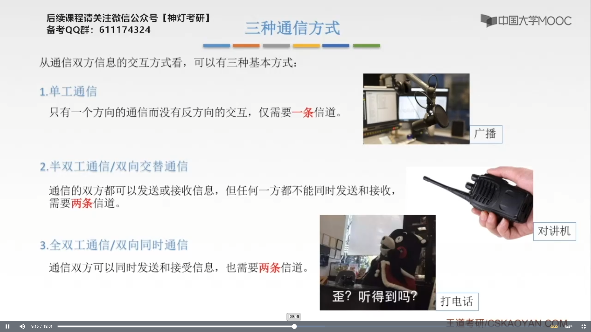
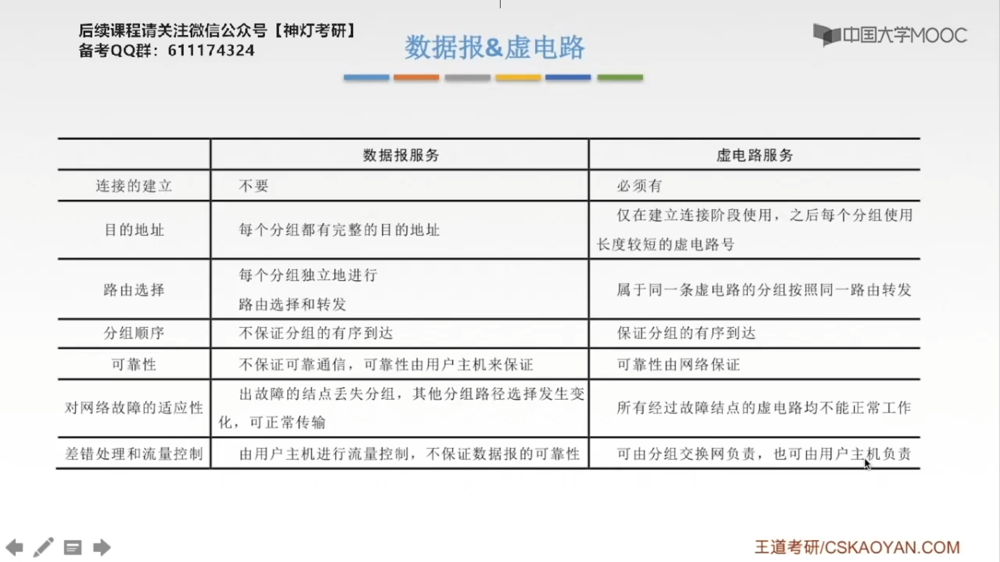

# 第二章 物理层

## 2.1 基本概念

**传输媒体**：传输媒体就是传输介质，包括==导向型==和==非导向型==。传输媒体，或者说传输介质，也有人说是网络体系结构中的第0层。==传输媒体不属于物理层==。

在描述==功能特性==时，不会出现特定的数字。在描述电气特性时，会出现具体的数组，比如电压的范围。

### 2.1.1 典型的数据通信模型

使用调制解调器将数字型号调制成模拟信号。

**为什么要将数字信号调制成模型信号？**

因为在公用电话网里有很多条模型信道，模拟信道就是可以传递模拟信号，但是不能传数字信号的信道。所以我们要把数字信号转化成模型信号，才能传送过去，在另一边，要经过一个逆过程，也就是把模型信号转化成数字信号，形成了计算机所能理解的数据的形式。接下来，计算机内部的一些操作，将01010的序列，转化为我们人类所能理解的文字的形式。

### 2.1.2 数据信道相关术语

==信号==在信道上的==存在形式取决于信道==。

==信道是有方向的==，如果我给你发送数据，我往你的方向上就有一个信道，如果你往我的方向发送数据，我往你的方向就有一个信道。同样的，你的==发送信道==就是我的==接收信道==。

无线信道就我看不见，模不着的==非导向型信道==；有线信道就是看得见，摸得着的，比如网线，光纤，同轴电缆他们里面的传输媒介，就成为有线信道。

### 2.1.3 设计数据通信系统要考虑的三个问题

#### 2.1.3.1 三种通信方式

#### 2.1.3.2 串行传输&并行传输

#### 2.1.3.3 同步传输&异步传输

异步传输的一个常见的例子就是在键盘上输入。

### 2.1.4 码元

2进制码元 $\Rightarrow$ 0、1两种状态 $\Rightarrow$ 1bit信息

4进制码元 $\Rightarrow$ 00、01、10、11四种状态 $\Rightarrow$ 2bit信息

16进制码元 $\Rightarrow$ 0000、0001、0010、0011、0100 ... 十六种状态 $\Rightarrow$ 4bit信息 

### 2.1.5 速率&波特

假如码元传输速率是2Baud（波特），一个码元携带的是2个bit的信息量，在这个系统中，信息传输速率为：$2Baud \times 2bit = 4bit/s$

码元和比特是两个不同的概念，码元传输速率也称为**调制速率**、**波形速率**或**符号数率**。但码元传输速率与信息传输速率在数量上又有一定的关系。若一个码元携带n比特的信息量，则M波特率的码元传输速率所对应的信息传输速率为 Mn 比特/秒。

#### 1.1.5.1 思考题1 

> 解：
>
> 四进制码元：
>
> ​	码元传输率：$8000码元 \div 4s = 2000Baud/s$
>
> ​	信息传输速率：$2000Baud \times 2 = 4000bit/s$
>
> 十六进制码元：
>
> ​	码元传输率：$7200码元 \div 6s = 1200Baud/s$ 
>
> ​	信息传输率：  $1200Baud \times 4 = 4800bit/s$
>
> 答：第二个通信系统传输速率快

#### 1.1.5.2 思考题2

> 解：
>
> ​	$\text{信息传输速率} = \text{码元传输速率} \times \text{每个码元能够传输的比特数}$
>
> ​	传输速率：$1600B \times log_28 = 4800bit/s$

> 解：
>
> 每两个二进制位表示一个4进制位，因此，转化为4进制数信号时，数据传输速率为：$2400bit/s \div 2 = 1200Baud$

### 2.1.6 带宽

### 2.1.7 奈氏准则和香农定理 

#### 2.1.7.1 失真

**影响失真的因素**

1. 码元传输速率，码元传输越快，失真越严重。
2. 信号传递距离，距离越远，衰减就越久，干扰也就越久，对信号的影响也很大。
3. 噪声干扰：噪声干扰越多，我们的信号就越容易失真。
4. 传输媒体质量：传输媒体的质量越差，失真越严重。

1、2、3正相关，4负相关

信号的传输速率越快，码元的传输速率也就越快。

**码间串扰**：码元的传输速率太快，导致码元在接收端的时候距离过近，码元之间的界限就不清楚。

#### 2.1.7.2 奈氏准则

**低通**：低于最高频率的，可以通过，低通其实就是带宽受限的意思。 

**奈氏准则**限制的是==码元==的传输速率，而**香农定理**限制的是==最大比特传输速率==。

####　2.1.7.3 香农定理

假如题设给的条件两个公式都能用，就要都算一下，取最小值。

### 2.1.8 编码与调制

#### 1.1.8.1 基带信号和宽带信号

 

####　1.1.8.2 数字数据编码为数字信号

####　1.1.8.3 数字信号调制为模型信号

#### 1.1.8.4 模拟信号编码为数组信号

采样和量化的实质就是分割和转换。

#### 1.1.8.5 模拟数据调制为模拟信号

### 2.1.9 数据交换方式

#### 2.1.9.1 电路交换

电路交换比较适用于大量的数据传输，而且是实时性比较强的交互式会话类通信。

#### 2.1.9.2 报文交换

#### 2.1.9.3 分组交换

##### 2.1.9.3.1 数据报方式

##### 2.1.9.3.2 虚电路方式

### 2.1.10 习题

 

---

---

## 2.2 物理层传输介质

传输媒体只是机械无脑的传输信号，而物理层可以根据电压区分出这个数据是多少

### 2.2.1 导向性传输介质——1.双绞线

### 2.2.2 导向型传输介质——2.同轴电缆

### 2.2.3 导向型传输介质——3.光纤

## 2.3 物理层设备

### 2.3.1 中继器

**5-4-3规则**：

- 在10M网络中，只能有最多不超过5个网段
- 在5个网段中，只能有最多不超过4个的物理层设备
- 只有3个段能连接计算机

### 2.3.2 集线器

集线器可以增加信号传输的距离。

集线器是一个大的冲突域，它==是不能分隔冲突域==的。
