# 第四章-网络层

## 4.1 网络层的功能

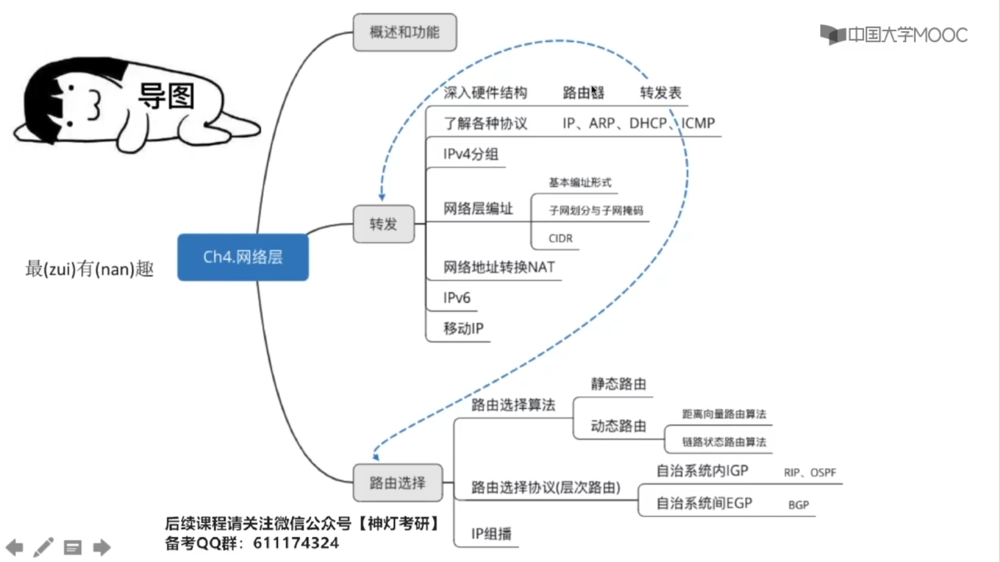

### 4.1.1 网络层功能概述

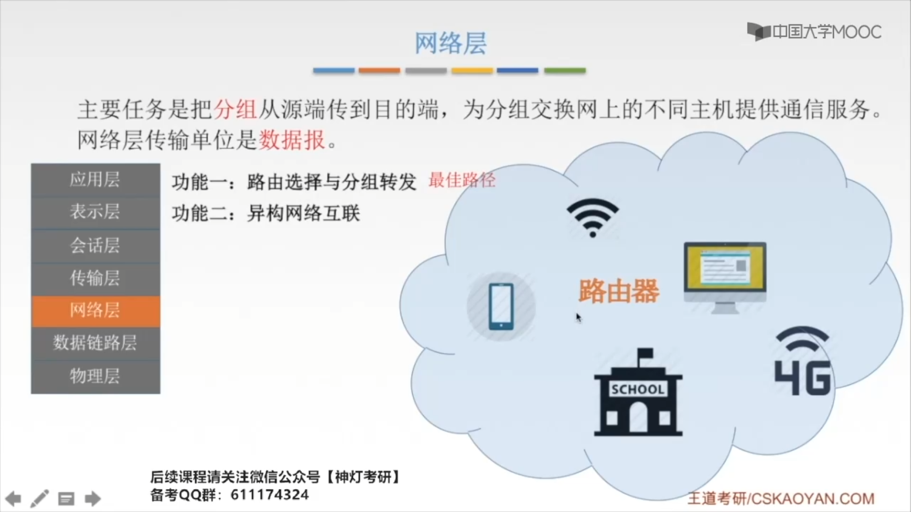

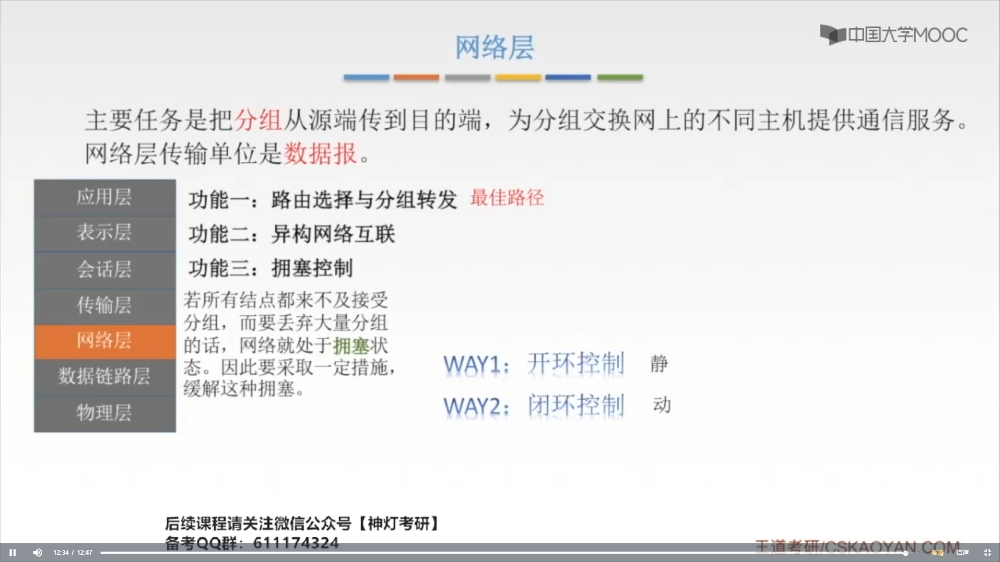

### 4.1.2 SDN的基本概念

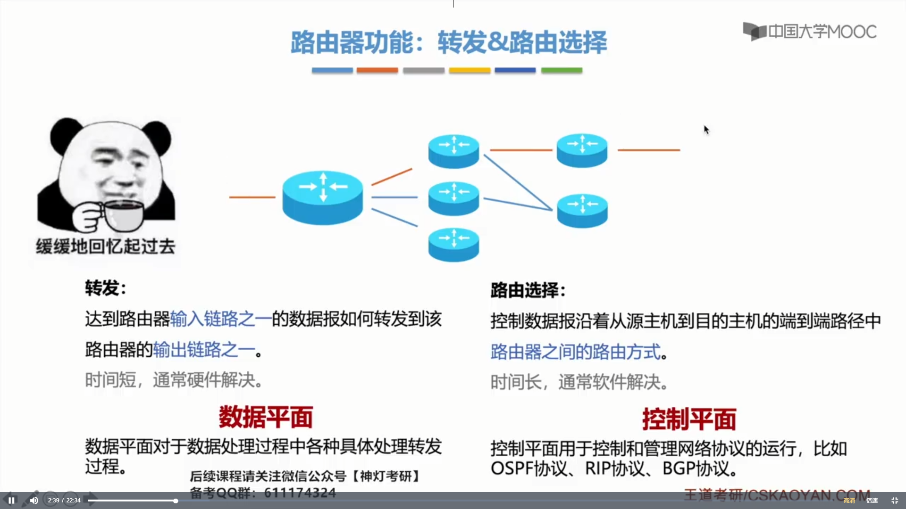

数据平面对应转发的过程，控制平面对应一个路由选择的过程。

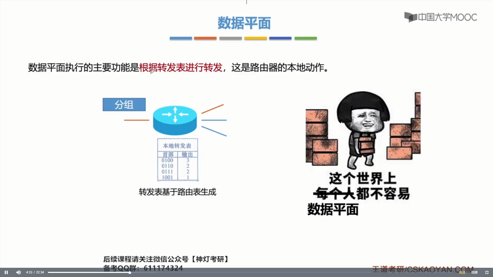

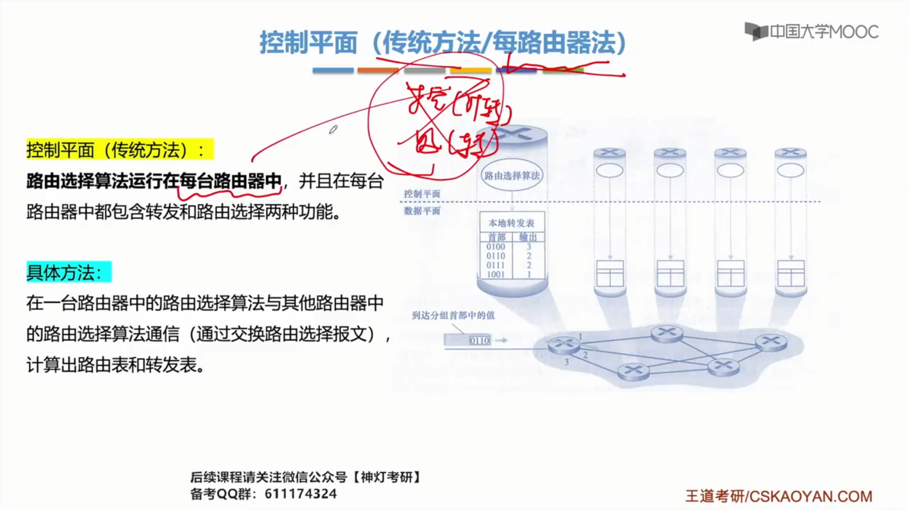

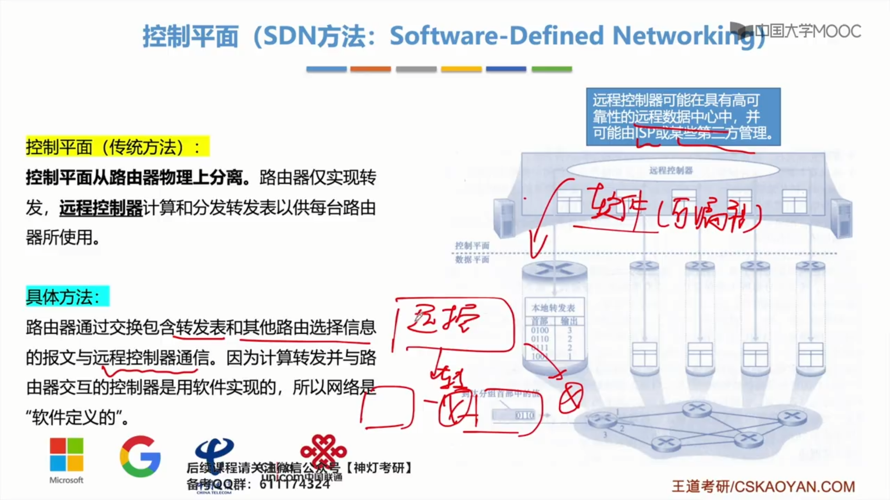

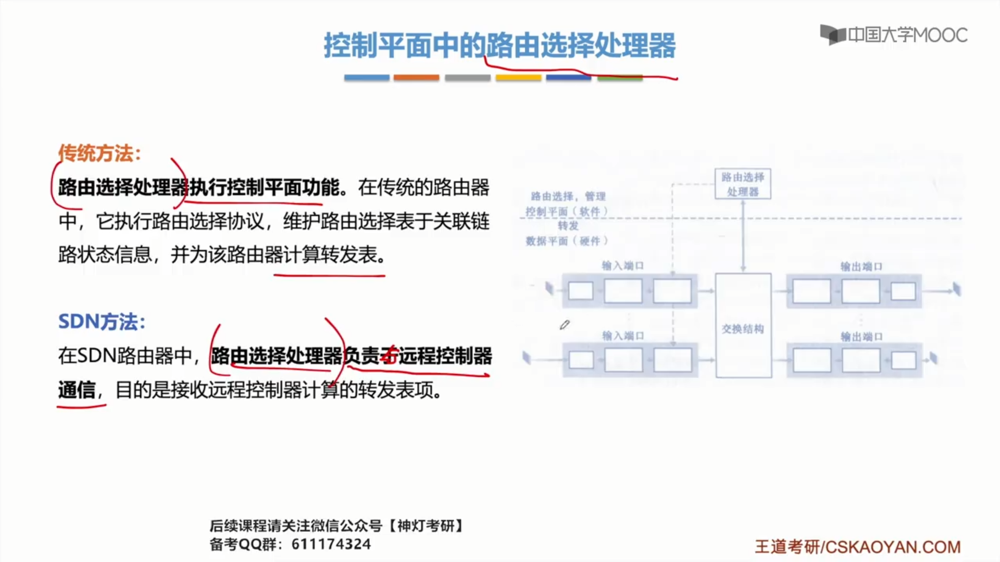

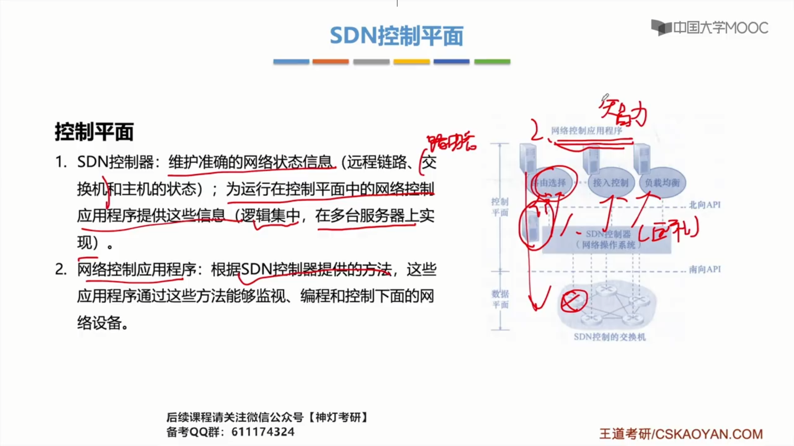

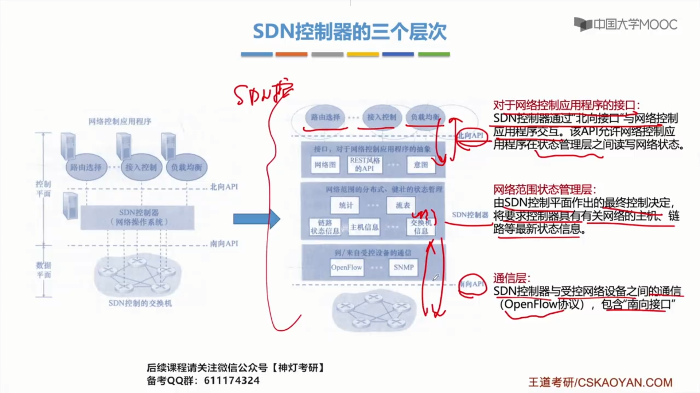

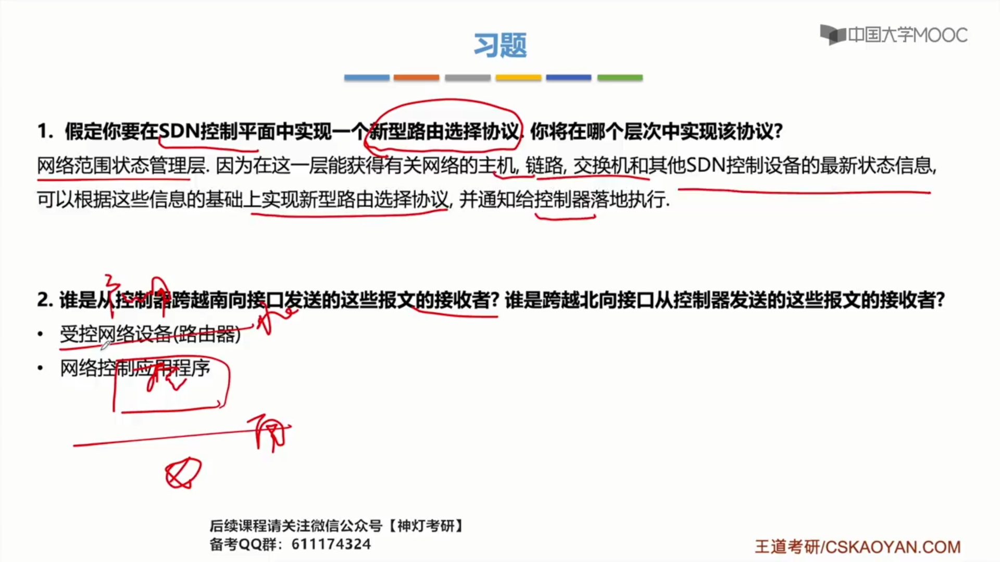

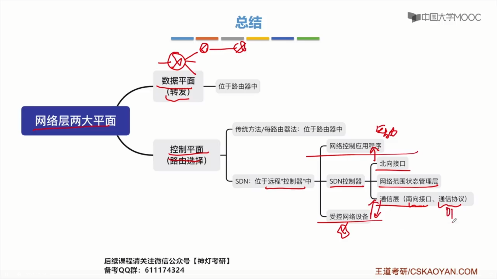

## 4.2 路由算法

### 4.2.1 路由算法与路由协议概述

链路费用：路径的代价，路由器的跳数。

### 4.2.2 RIP协议与距离向量算法

- RIP适用于较小的网络

- OSPF适用于较大的网络

通过交换信息来填满路由表

> RIP是应用层的协议，使用UDP传送数据。

一个RIP报文，最多传送25个路由信息，如超过，必须再用一个RIP报文传送。

好消息传得快，坏消息传得慢（慢收敛）。

### 4.2.3 OSPF协议与链路状态算法

 

OSPF协议中，五个重要类型的分组

- HELLO问候分组
- DD数据库描述分组
- LSR链路状态请求分组
- LSU链路状态更新分组
- LSAck链路状态确认分组

- 区域内部路由器
- 区域边界路由器
- 主干路由器
- 自治系统边界路由器

> OSPF直接使用IP数据报传送。
>
> OSPF是网络层的协议。

### 4.5.3 BGP协议

BGP支持CIDR：BGP中的目的网络是用CIDR的技术，是用网络前缀的形式表示的。

OSPF也是链路状态变化的时候交换信息。

## 4.3 IPv4

### 4.3.1 IP数据报格式

ARP协议要为IP协议服务，IP协议要为ICMP和IGMP服务

> 数据报每经过一个路由器， 路由器都要重新计算下首部检验和。

- 固定部分大小都相同，都为20Byte，可变部分可有可无，大多数情况下，都是没有这个可变部分的。

- 填充的意义是整个首部长度填充为四字节的整数倍，这样，首部长度才可以对应的表示出来（首部长度一定是四字节的整数倍）。

- 区分服务：设置数据表的优先级。
- 总长度：16位，单位为1Byte，所以最大可以表示（216-1）Byte（65535Byte），但是永远不可能达到这么大，如果总长度过大就要将IP数据报进行分片，以达到==最大传输单元（MTU）==的要求。
- 设置生存时间的原因，防止无法交付的数据报，无限制的在网络中兜圈子。

### 4.3.2 IP数据报分片

### 4.3.3 IPv4地址

IP地址方便寻址，数据通信，资源共享。

> 网桥不能分隔广播域，用网桥连接起来的网段，仍然是一个局域网。
>
> 路由器可以隔离广播域，路由器不同的接口，可以连接不同的网络。

图中有六个实际上的网络的。

网络号`128.0  192.0.0`都是不指派的。

 

### 4.3.4 网络地址转换NAT

端口号可以唯一标识主机内的某一进程，==同一主机内不同的进程端口号是不同的，不同主机内不同的进程的端口号可以是相同的==。

Intranet（专用网络地址）-->Internet（公用网络地址）

普通路由器仅工作在网络层，而NAT路由器转发数据时需要查看和转换传输层的端口。	

### 4.3.5 子网划分和子网掩码

### 4.3.6 无分类编码CIDR

- 子网号不能全为1或全为0

- 子网中主机号全0或全1的地址都不能被指派

最长前缀匹配：选择前缀最长的，前缀越长，地址块越小，路由越具体。

> 选择所有匹配成功中，网络前缀最长的。

### 4.3.7 ARP协议

FCS：帧检验序列

ARP高速缓存内部所存储的，都是这一局域网络内的IP地址与MAC地址的映射。

交换机没有MAC地址。

PPP协议：目的MAC地址为==全1==。

### 4.3.8 DHCP协议

租用期

### 4.3.9 ICMP协议

## 4.4 IPv6

## 4.5 路由协议

见4.2路由算法

## 4.6 IP组播

 

**小细节**：组播路由器发送的探寻是可以发送给这个==组播组==的全部主机的，但是，返回/响应的速度以及所到达路由器的时间是不一样的。

如果这个组播组中有一台主机先响应了，那其他主机就会通过监听知道有一个代表已经先我们一步，告诉主播路由器，我们还有一个组播组在这，其他的主主机就不需要发送一个响应了，这样可以抑制一些不必要的通信量。

## 4.7 移动IP

## 4.8 网络层设备

默认路由通常都是局域网中的一个默认路由器，发给这个路由器，它再看看自己的转发表，或者它再交给别的路由器，再帮忙看一下转发表中能不能把把这个分组发送出去。

## 4.9 第四章总结

