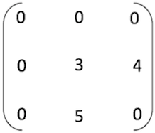

# 三元组顺序表，稀疏矩阵的三元组表示法

[三元组顺序表](http://data.biancheng.net/view/184.html)，用于稀疏矩阵的存储，因此经常被称为系数矩阵的三元组表示，它们是一个意思。

稀疏矩阵，即包含大量值为 0 的矩阵，此类矩阵的一种存储方法是将矩阵中所有非 0 元素所在的位置（行标和列标）和元素值存储在[顺序表](http://data.biancheng.net/view/158.html)（[数组](http://data.biancheng.net/view/181.html)）中，通过存储由所有非 0 元素的三元组构成的顺序表，以及该稀疏矩阵的行数和列数，即可完成对整个稀疏矩阵的存储，这就是稀疏矩阵使用三元组表示的实现思想。


因此，每个非零元素需要使用结构体进行自定义：

```cpp
// 三元组结构体
typedef struct {
    int i, j; // 行标，列标
    int data; // 元素值
} tripe;
```

稀疏矩阵的存储，一方面要存储矩阵中所有非 0 元素的三元组，同时还要记录该稀疏矩阵的行数、列数以及矩阵中非 0 元素的个数，因此表示矩阵的结构也需要使用结构体实现：

```cpp
#define number 100
//矩阵的结构表示
typedef struct {
    triple data[number];//存储该矩阵中所有非0元素的三元组
    int n,m,num;//n和m分别记录矩阵的行数和列数，num记录矩阵中所有的非0元素的个数
}TSMatrix;
```

例如，有[图](http://data.biancheng.net/view/200.html) 1 所示的稀疏矩阵：



对于该稀疏矩阵来说，即将（2，2，3）、（2，3，4）、（3，2，5）存储进 data 数组，并且存储稀疏矩阵的行数 3 和列数 3 ，以及非 0 元素的个数 3 存储起来，即可实现队此矩阵的存储。