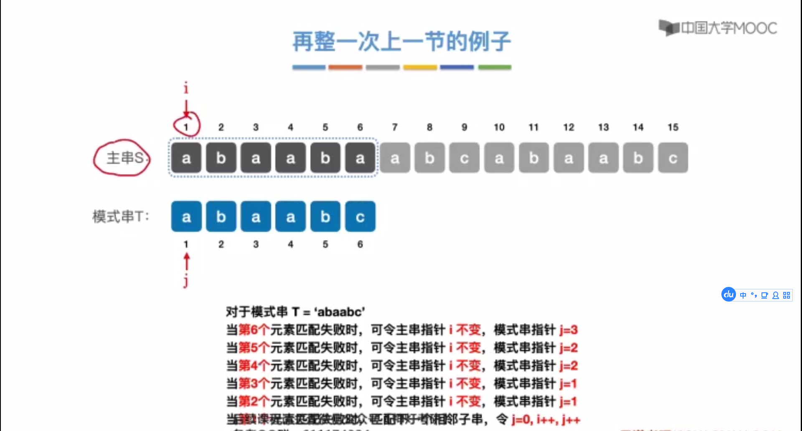

# 串

## 串的定义


> 字符在主串中的位置：从==1==开始计算
>
> 子串在主串中的位置：从==1==开始计算


## 相关操作


**StrAssign(&T, chars)：赋值操作。把串T赋值为chars**

**StrCopy(&T, S)：复制操作。由串S复制得到串T**

**StrEmpty(S)：判空操作。若S为空串，则返回TRUE，否则返回FALSE。**

**StrLength(S)：求串长，返回串S的元素个数。**

**ClearString(&S)：清空操作。将S清为空串。**

**DestroyString(&S)：销毁串。将串S销毁（回收存储空间）。**

**Concat(&T, S1, S2)：串链接。用T返回由S1和S2联结而成的新串**

**SubString(&Sub,S, pos, len)：求子串。用Sub返回串S的第pos个字符起长度为len的子串。**

**Index(S, T)：定位操作。若主串S中存在和串T占相同的子串，则返回它在主串S中第一次出现的位置；否则函数值为0。**

**StrCompare(S, T)：比较操作。若S>T，则返回值>0；若S=T，则返回值=0；若S<T, 则返回值<0。**


##　字符集编码


```plain
ASCII 每个字符占一个字节
UTF8  中文字符占三个字节
```

## 扩展：乱码问题


## 串的顺序存储


```cpp
#define MAX_LEN 255
typedef struct {
    char ch[MAX_LEN];
    int length;
} SString;

typedef struct {
    char *ch;
    int length;
} HString;
```


## 串的链式存储


## 基本操作的实现


**数据结构**

```cpp
#define MAX_LEN 255
typedef struct {
    char ch[MAX_LEN];
    int length;
} SString;

typedef struct {
    char *ch;
    int length;
} HString;
```


**StrAssign(&T, chars)：赋值操作。把串T赋值为chars**

```cpp
void StrAssign(SString &T, SString chars)
{
    if (chars.length == 0)
        T.length = 0;
    else
    {
        T.length = chars.length;
        for (int i = 0; i < chars.length; i++)
        {
            T.ch[i] = chars.ch[i];
        }
    }
}
```


**StrCopy(&T, S)：复制操作。由串S复制得到串T**

与 **StrAssign(&T, chars)** 类似


**StrEmpty(S)：判空操作。若S为空串，则返回TRUE，否则返回FALSE。**

```cpp
bool StrEmpty(SString S) {
    return S.length == 0 ? true: false;
}
```


**StrLength(S)：求串长，返回串S的元素个数。**

```cpp
int StrLength(SString S) {
    return S.length; 
}
```


**ClearString(&S)：清空操作。将S清为空串。**

```cpp
void ClearString(SString &S) {
    S.length = 0;
}
```


**Concat(&T, S1, S2)：串链接。用T返回由S1和S2联结而成的新串**

```cpp
bool concat(SString &T, SString S1, SString S2) {
    if (S1.length + S2.length > MAX_LEN) {
        T.length = 0;
        return false;
    }
    for (int i = 0; i < S1.length; i++) {
        T.ch[i] = S1.ch[i];
    }
    for (int j = 0; j < S2.length; j++) {
        T.ch[j + S1.length] = S2.ch[j];
    }
    T.length = S1.length + S2.length;
    return true;
}
```


**SubString(&Sub,S, pos, len)：求子串。用Sub返回串S的第pos个字符起长度为len的子串。**


```cpp
bool SubString(SString &Sub, SString S, int pos, int len) {
    if (pos + len - 1 > S.length) 
        return false;
    for (int i = pos; i < pos + len; i++) 
        Sub.ch[i - pos + 1] = S.ch[i];
    Sub.length = len;
    return true;
}
```


**Index(S, T)：定位操作。若主串S中存在和串T占相同的子串，则返回它在主串S中第一次出现的位置；否则函数值为0。**


```cpp
int Index(SString S, SString T) {
    int n = S.length, m = T.length;
    int i = 1;
    SString sub;
    while (i <= n - m + 1) {
        SubString(sub, S, i, m);
        if (StrCompare(sub, T) != 0) 
            i++;
        else 
            return i;
    }
    return 0;
}
```


**StrCompare(S, T)：比较操作。若S>T，则返回值>0；若S=T，则返回值=0；若S<T, 则返回值<0。**


```cpp
int StrCompare(SString S, SString T) {
    for (int i = 1; i < S.length && i < T.length; i++) {
        if (S.ch[i] != T.ch[i]) 
            return S.ch[i] - T.ch[i];
    }
    return S.length - T.length;
}
```


## 朴素模式匹配算法


```cpp
// 朴素模式匹配
int Index(SString S, SString T) {
    int i = 1, j = 1;
    while (i <= S.length && j <= T.length) {
        if (S.ch[i] != T.ch[j]) {
            i = i - j + 2;
            j = 1;
        } else {
            i++;
            j++;
        }
    }
    if (j > T.length) return i - T.length;
    else return 0;     
}
```


##  朴素模式匹配算法优化思路





```cpp
int Index_KMP(SString S, SString T, int next[]) {
    int i, j; 
    while (i < S.length && j < T.length) {
        if (j == 0 || S.ch[i] == T.ch[i]) {
            ++i;
            ++j;
        }
        else 
            j = next[j];
    }
    if (j > T.length) {
        return i - T.length;
    } else {
        return 0;
    }
}
```


```plain
KMP算法：最坏时间复杂度 O(m + n) 
其中，求next数组的时间复杂度O(m)
模式匹配过程最坏时间复杂度O(n)
```

<u>获取next数组</u>

```cpp
void get_next(SString T, int next[]) {
    int i = 1, j = 0;
    next[1] = 0;
    while (i < T.length) {
        if (j == 0 || T.ch[i] == T.ch[j]) {
            i++;
            j++;
            next[i] = j; // 若pi = pj, 则next[i] = next[j] + 1
        }
        else 
            j = next[j]; // 否则令j = next[j]，继续循环
    }
}
```


## 求模式串的next数组（手算练习）


|  序号   |  1   |  2   |  3   |  4   |  5   |  6   |
| :-----: | :--: | :--: | :--: | :--: | :--: | :--: |
| 模式串  |  a   |  b   |  a   |  b   |  a   |  a   |
| next[j] |  0   |  1   |  1   |  2   |  3   |  4   |

```plain
3:
	i
a b ? ? ? ?
    a b a b a a
	j
	
4:	  
	  i	
a b a ? ? ?
    a b a b a a
	  j

5:
		i
a b a b ? ?
    a b a b a a
		j
		
6:
		  i
a b a b a ?
    a b a b a a
		  j
```


|  序号   |  1   |  2   |  3   |  4   |  5   |
| :-----: | :--: | :--: | :--: | :--: | :--: |
| 模式串  |  a   |  a   |  a   |  a   |  b   |
| next[j] |  0   |  1   |  2   |  3   |  4   |

```plain
3:
	i
a a ? ? ?
  a a a a b
	j
	
4:
	  i
a a a ? ?
  a a a a b
	  j

5:
		i
a a a a ?
  a a a a b
		j
  
```


## next数组的优化思路


|    序号    |  1   |  2   |  3   |  4   |  5   |
| :--------: | :--: | :--: | :--: | :--: | :--: |
|   模式串   |  a   |  a   |  a   |  a   |  b   |
|  next[j]   |  0   |  1   |  2   |  3   |  4   |
| nextval[j] |  0   |  0   |  0   |  0   |  4   |


```cpp
#include <bits/stdc++.h>
#include "String.h"
using namespace std;

void get_nextval(SString T, int nextval[]) {
    int i = 1, j = 0;
    nextval[1] = 0;
    while (T.ch[i] < T.length) {
        if (j == 0 || T.ch[i] == T.ch[j]) {
            i++;
            j++;
            if (T.ch[i] != T.ch[j]) nextval[i] = j;
            else nextval[i] = nextval[j]; 
        }
        else 
            j = nextval[j];
    }
}
```
