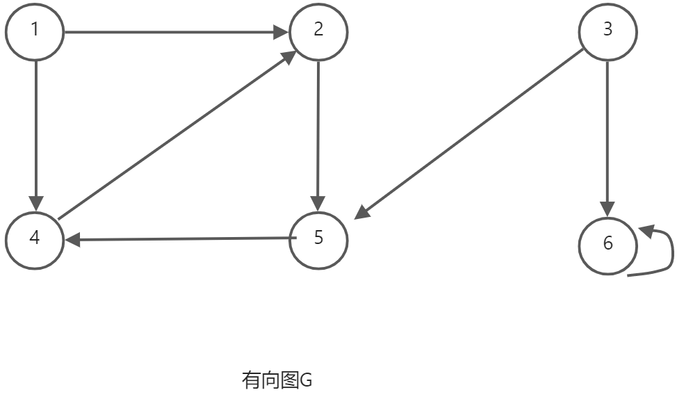

# 图

## 图的基本概念


>[!Note]
>无向图的连通只要每个顶点连通即可 有向图的连通需要任意两个顶点都强连通


Tip

生成子图：包含原图所有顶点的子图


>[!Warning]
>树是一个连通图 但是有向树并不是一个强连通图

## 图的存储


### 邻接矩阵


```cpp
define MaxVertexNum 100        // 顶点数目的最大值

typedef char VertexType;        // 顶点的数据类型      

typedef int EdgeType;           // 带权图中边上权值的数据类型

/*
    邻接矩阵
*/

typedef struct {                    
    VertexType Vex[MaxVertexNum];                 // 顶点表
    EdgeType  Edge[MaxVertexNum][MaxVertexNum];  // 领接矩阵，边表
    int vexnum, arcnum;                     // 图的当前顶点数和边数/弧数
} MGraph;
```

### 邻接表


```cpp
/*

    邻接表

*/

typedef struct ArcNode {
    int adjvex;                     // 边/弧指向哪个顶点
    struct ArcNode *next;           // 指向下一条弧的指针
    // InfoType info;               // 边权值
} ArcNode;  

typedef struct VNode {                      
    VertexType data;                // 顶点表结点
    ArcNode *first;                 // 顶点信息
} VNode, AdjList[MaxVertexNum];     // 指向第一条依附该顶点的弧的指针

typedef struct {
    AdjList vertices;               // 邻接表
    int  vexnum, arcnum;            // 图的顶点数和弧数  
} ALGraph;                          // ALGraph是以邻接表存储的图类型
```

### 十字链表


### 邻接多重表


## 图的基本操作

这些基本操作在考试中可以之间调用接口

### `Adjacent(G, x, y)`：判断图G是否存在边<x, y>或(x, y)


### `InsertVertex(G, x)`：在图中插入顶点x


### `Neighbors(G, x)`： 列出图中与x邻接的边


### `DeleteVertex(G, x)`：从图中删除顶点x


### `AddEdge(G, x, y)`: 若无向边(x, y)或有向边<x, y>不存在，则向图中添加该边。


### `FirstNeighbor(G, x)`：求图G中顶点x的第一个邻接点，若有则返回顶点号，若x没有邻接点或图中不存在x，则返回-1。


### `NextNeighbor(G, x, y)`：假设图G中顶点y是顶点x的一个邻接点，返回除y之外顶点x的下一个邻接点的顶点号，若y是x的最后一个邻接点，则返回-1


## 课后习题


```cpp
void ALGraphToMGraph(ALGraph &a, MGraph &m) {
    // 将邻接表中顶点的数目和边的数目赋值给邻接表
    m.vexnum = a.vexnum;
    m.arcnum = a.arcnum;
    // 将邻接表中的顶点赋给邻接矩阵
    for (int i = 0; i < a.vexnum; i++)
        m.Vex[i] = a.vertices[i].data;

    // 初始化
    ArcNode* p = NULL;
    for (int i = 0; i < MaxVertexNum; i++) {
        fill(m.Edge[i], m.Edge[i] + MaxVertexNum, 0);
    }

    // 将邻接表中的边结点，转化为邻接矩阵中的 “1”
    for (int i = 0; i < a.vexnum; i++) {
        p = a.vertices[i].first;
        while (p != NULL) {
            m.Edge[i][p->adjvex] = 1;
            p = p->next;
        }
    }
}
```

## 广度优先遍历



**

```cpp
/**
 * @brief 访问图中的结点
 * 
 * @param G 图的结构体
 * @param v 被访问的结点对应的下标
 */
void visit(MGraph G ,int v) {
    cout << G.Vex[v] << " ";
}

// 找到第一个邻接的结点
int FirstNeighbor(MGraph G, int x) {
    int j = 0;
    while (G.Edge[x][j] != 1 && j < G.vexnum) j++;
    if (j < G.vexnum) return j;
    else return -1;
}

// 找到y之后与x邻接的下一个顶点
int NextNeighbor(MGraph G, int x, int y) {
    int res = -2;
    int k = y + 1;
    while (G.Edge[x][k] != 1 && k < G.vexnum) k++;
    if (k < G.vexnum) res = k;
    else res = -1;
    return res;
}

bool visited[MaxVertexNum];  // 访问标记数组

queue<VertexType> Q;

void BFSTraverse(MGraph G) {
    for (int i = 0; i < G.vexnum; i++) 
        visited[i] = false;
    Q = queue<VertexType>();
    for (int i = 0; i < G.vexnum; i++) 
        if (!visited[i])
            BFS(G, i);
}

/**
 * @brief 广度优先遍历
 * 
 * @param G 图的结构体
 * @param v 广度优先遍历的起点
 */
void BFS(MGraph G, int v) {
    visit(G, v);
    visited[v] = true;
    Q.push(v);
    while (!Q.empty()) {
        v = Q.front();
        Q.pop();
        for (int w = FirstNeighbor(G, v); w >= 0; w = NextNeighbor(G, v, w)) {
            if (!visited[w]) {  // 检测v所有邻接点
                visit(G , w);
                visited[w] = true;
                Q.push(w);
            }
        }
    }
}
```

### BFS算法求解单源最短路径问题

```cpp
void BFS_MIN_Distance(MGraph G, int u, int* d) {
    for (int i = 0; i < G.vexnum; i++) 
        d[i] = MaxWeight;
    queue<int> Q;
    bool visited[G.vexnum] = {false};
    visited[u] = true;
    d[u] = 0;
    Q.push(u);
    while (!Q.empty()) {
        u = Q.front();
        Q.pop();
        for (int w = FirstNeighbor(G, u); w > 0; w = NextNeighbor(G, u, w)) {
            if (!visited[w]) {
                visited[w] = true;
                d[w] = d[u] + 1;  
                Q.push(w);              
            }
        }
    }   
}
```

## 深度优先遍历

### 树的深度优先遍历


**代码**

**递归**

```cpp
bool isVisited[MaxVertexNum]; // 访问标记数组

void DFSTraverse(MGraph G) {  // 对图G进行深度优先遍历
    for (int v = 0; v < G.vexnum; v++)
        isVisited[v] = false;   // 初始化已访问标记数据
    for (int v = 0; v < G.vexnum; v++)  // 本代码是从v = 0开始遍历
        if (!isVisited[v]) 
            DFS(G, v);
}

void DFS(MGraph G, int v) { // 从顶点v出发，深度优先遍历图G
    visit(G, v);            // 访问顶点v
    isVisited[v] = true;
    for (int w = FirstNeighbor(G, v); w >= 0; w = NextNeighbor(G, v, w)) 
        if (!isVisited[w]) 
            DFS(G, w);
}
```

**非递归**

```cpp
void DFS2(ALGraph G, int v) {
    stack<int> S;
    S.push(v);
    isVisited[v] = true;
    while (!S.empty()) {
        v = S.top();
        visit(G, v);
        S.pop();
        for (int w = FirstNeighbor(G, v); w >= 0; w = NextNeighbor(G, v, w)) {
            if (!isVisited[w]) {
                S.push(w);
                isVisited[w] = true;
            }
        }
    } 
}
```

### 复杂度分析


```plain
从3号顶点出发：
3 4 7 6 2 1 5 8 
```


```plain
从1号顶点出发：
1 2 6 3 4 7 8 5
```


```plain
从2号顶点出发：
2 6 7 8 4 3 1 5 
```


```plain
从3号顶点出发： 
3 6 2 1 5 7 8 4  
```


### 深度优先生成树


### 图的遍历与图的连通性


## 课后习题 


```cpp
bool IsTree(ALGraph G, int v) {
    bool visited[G.vexnum] = { false };
    queue<int> Q;
    visited[v] = true;
    Q.push(v);
    while (!Q.empty()) {
        v = Q.front();
        Q.pop();
        for (int w = FirstNeighbor(G, v); w >= 0; w = NextNeighbor(G, v, w)) {
            if (visited[w]) return false;
            else {
                visited[w] = true;
                Q.push(w);
            }
        }
    }
    return true;
}

bool IsRelTree(ALGraph G) {
    for (int i = 0; i < G.vexnum; i++) {
        if (!IsTree(G, i)) return false;
    }
    return true;
}
```


```cpp
void DFS2(ALGraph G, int v) {
    stack<int> S;
    S.push(v);
    isVisited[v] = true;
    while (!S.empty()) {
        v = S.top();
        visit(G, v);
        S.pop();
        for (int w = FirstNeighbor(G, v); w >= 0; w = NextNeighbor(G, v, w)) {
            if (!isVisited[w]) {
                S.push(w);
                isVisited[w] = true;
            }
        }
    } 
}
```


```cpp
/**
 * @brief 基于深度优先遍历判断是否有由顶点i到顶点j的路径
 * 
 * @param G 
 * @param i 
 * @param j 
 * @return true 
 * @return false 
 */
bool HasPath_DFS(ALGraph G, int i, int j) {
    bool visited[G.vexnum] = { false };
    stack<int> S;
    S.push(i);
    visited[i] = true;
    while (!S.empty()) {
        i = S.top();
        if (i == j) return true;
        S.pop();
        for (int k = FirstNeighbor(G, i); k >= 0; k = NextNeighbor(G, i, k)) {
            if (!visited[k]) {
                S.push(k);
                visited[k] = true;
            }
        }
    }
    return false;
}

/**
 * @brief 基于广度优先遍历判断是否有由顶点i到顶点j的路径
 * 
 * @param G 
 * @param i 
 * @return true 
 * @return false 
 */
bool HasPath_BFS(ALGraph G, int i, int j) {
    bool visited[G.vexnum] = { false };
    queue<int> Q;
    visited[i] = true;
    Q.push(i);
    while (!Q.empty()) {
        i = Q.front();
        Q.pop();
        for (int k = FirstNeighbor(G, i); k >= 0; k = NextNeighbor(G, i, k)) {
            if (!visited[k]) {
                if (k == j) return true;
                visited[k] = true;
                Q.push(k);
            }
        }
    }
    return false;
}
```


## 图的应用

### 最小生成树


```plain
Prim算法：
从P城开始：
P城-->学校
P城-->矿场
矿场-->渔村
P城-->农场
农场-->电站

从农村开始：
农场-->电站
农场-->P城
P城-->学校
P城-->矿场
矿场-->渔村
```


```plain
Kruskal算法： 
P城--学校
矿场--渔村
农场--电站
P城--矿场
P城--农场
```


>[!TIP]
>可以参考《算法导论》
### 最短路径


### Dljkstra算法


final[5]

| V0 | V1 | V2 | V3 | V4 |
|:--:|:--:|:--:|:--:|:--:|
| √  | √  | √  | √  | √  |  

dist[5]

| 0 | 8  | 9 | 7 | 5 |
|:-:|:--:|:-:|:-:|:-:|

path[5]

| -1 | 4 | 1 | 4 | 0 |
|:--:|:-:|:--:|:--:|:-:|


### Floyd算法


### 有向无环图描述表达式


### 拓扑排序


>[!NOTE]
>逆拓扑排序采用<span style="color:red">逆邻接表</span>和邻接矩阵存储图比较方便


### 关键路径


