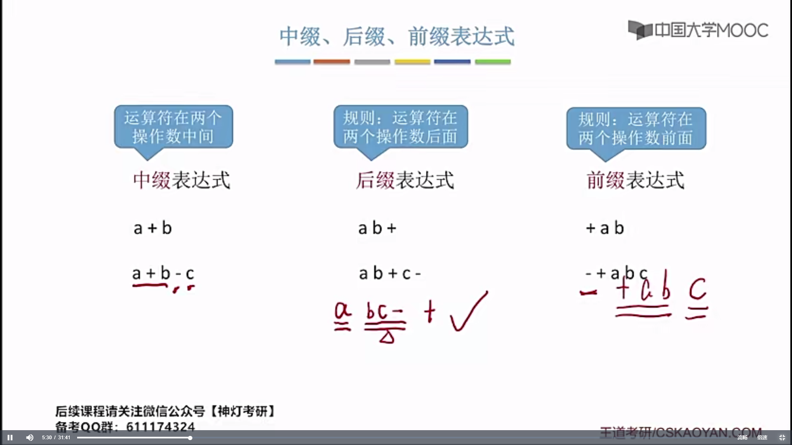
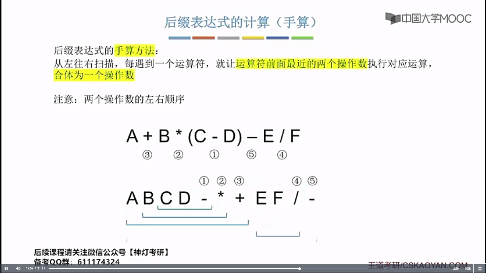
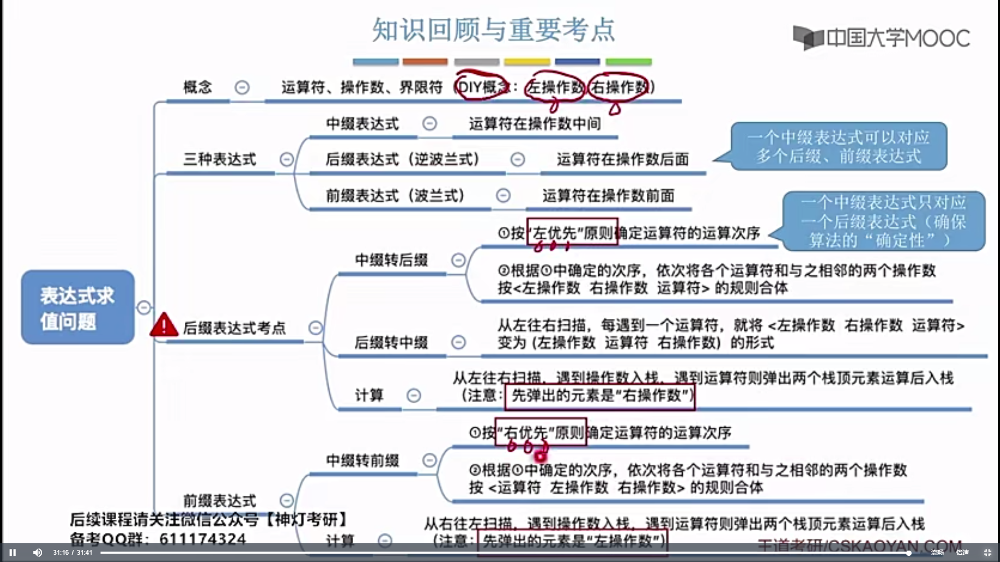
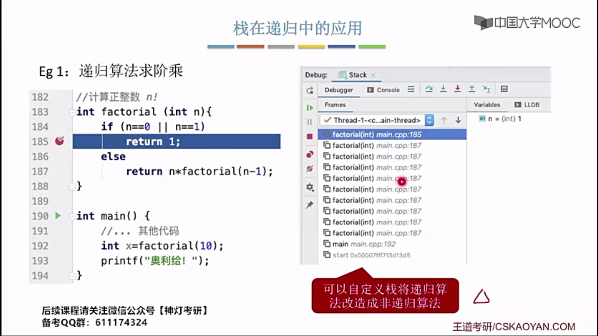
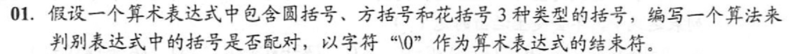

# <span style="color:red">408不能用STL</span>

#  栈、队列和数组

## 栈

### 3.1.4 综合应用题

3. 2）判定所给的操作序列是否合法

    ```cpp
    bool isLegal(string s) {
        const char* chars =  s.c_str();
        SqStack S;
        S.top = -1;
        for (int i = 0; chars[i] != 0; i++) {
            if (chars[i] == 'I') {
                S.data[++S.top] = 'I';
            }
            else if (chars[i] == 'O') {
                if (S.top > -1) S.top--;
            }
        }
        if (S.top == -1) return true;
        else return false;
    }
    ```

4. 设计算法判断该链表的全部n个字符是否中心对称

   ```cpp
   bool isSymmetrical(LinkNode L) {
       LinkNode p = L;
       SqStack S;
       S.top == -1;
       while (p) {
           S.data[++S.top] = p->data;
           p = p->next;
       }
       p = L;
       while (p && S.top != -1) {
           if (p->data != S.data[S.top]) return false;
           p = p->next;
           S.top--;
       }
       return true;
   }
   ```

5. 设有两个栈s1, s2都采用顺序栈的方式，并共享一个存储区`[0,...,maxsize-1]`为了尽量利用空间，减少溢出的可能，可采用栈顶相向，迎面增长的存储方式。试设计s1、s2有关入栈和出栈的操作算法

   ```cpp
   typedef struct
   {
       ElemType data[MaxSize];
       int top[2] = {-1, MaxSize};
   } Stack;
   
   void push(Stack &S, int seq, ElemType x)
   {
       if (seq > 1 || seq < 0)
       {
           cout << "the index of stack is wrong" << endl;
           return;
       }
       if (S.top[1] - S.top[0] == 1)
       {
           cout << "the stack is full" << endl;
           return;
       }
       switch (seq)
       {
       case 0:
           S.data[++S.top[0]] = x;
           break;
       case 1:
           S.data[--S.top[1]] = x;
           break;
       }
   }
   
   ElemType pop(Stack &S, int seq)
   {
       if (seq > 1 || seq < 0) {
           cout << "the index of stack is wrong" << endl;
           return 0;
       }
       switch (seq)
       {
           case 0:
               if (S.top[0] == -1) {
                   cout << "the stack is empty" << endl;
                   return 0;
               }
               break;
           case 1:
               if (S.top[0] == MaxSize) {
                   cout << "the stack is empty" << endl;
                   return 0;
               }
               break;
       }
       int x;
       switch (seq)
       {
           case 0: 
               x = S.data[S.top[0]--];
               break;
           case 1:
               x = S.data[S.top[1]++];
               break;
       }
       return x;
   }
   ```


## 队列

### 定义

队列（Queue）是只允许在一端进行插入，在另一端进行删除的==线性表==

### 顺序队列

#### 基本操作

##### 顺序队列数据结构

```cpp
#define MaxSize 50      // 定义队列中元素最大的个数
typedef int ElemType;   
typedef struct {
    ElemType data[MaxSize]; // 存放队列元素
    int front, rear;    // 队头指针和队尾指针
} SqQueue;
```


##### InitQueue(&Q)：初始化队列。构造一个空队列Q。

```cpp
#include <bits/stdc++.h>
#include "Queue.h"
using namespace std;
void InitQueue(SqQueue& Q) {
    Q.rear = Q.front = 0;
}
```


##### DestroyQueue(&Q)：销毁队列。销毁队列并==释放==队列Q所占内存空间。

##### Enqueue(&Q x)：入队，若队列Q未满

```cpp
#include <bits/stdc++.h>
#include "Queue.h"
using namespace std;

bool EnQueue(SqQueue &Q, ElemType x) {
    if ((Q.rear + 1) % MaxSize == Q.front) return false;
    Q.data[Q.rear] = x;
    Q.rear = (Q.rear + 1) % MaxSize; 
    return true; 
}
```

> - 模运算将无限的整数域映射到有限的整数集合{0，1，2，...，b - 1}上
>
> - {0，1，2，...，MaxSize - 1}将存储空间在逻辑上变成了环形状


队列已满的条件：队尾指针的再下一个位置是队头，即`(Q.rear + 1) % MAXSIZE == Q.front`


##### Dequeue(&Q, &x)：==出队==，若队列Q非空，删除队头元素，并用x返回

```cpp
#include <bits/stdc++.h>
#include "Queue.h"
using namespace std;
bool DeQueue(SqQueue &Q, ElemType &x) {
    if (Q.rear == Q.front) return false;
    x = Q.data[Q.front];
    Q.front = (Q.front + 1) % MaxSize;
    return true;
}
```


##### GetHead(Q, &x)：读队头元素，若队列Q非空，则将队头元素赋值给x

```cpp
#include <bits/stdc++.h>
#include "Queue.h"
using namespace std;

bool GetHead(SqQueue& Q, ElemType &x) {
    if (Q.rear == Q.front) return false;
    x = Q.data[Q.front];
    return true;
}
```


##### QueueEmpty(Q)：判队列空，若队列Q为空返回true, 否则返回false

```cpp
#include <bits/stdc++.h>
#include "Queue.h"
using namespace std;
bool isEmpty(SqQueue Q) {
    int res;
    if (Q.rear == Q.front) res = true;
    else res = false;
    return res;
}
```


##### 方案二：判断队列已空/已满

```cpp
#define MaxSize 10
typedef struct {
    ElemType data[MaxSize];
    int front, rear;
    int size; // 队列当前长度
} SqQueue;
```


##### 方案三：判断队列队列已满/已空

```cpp
typedef struct {
    ElementType data[MaxSize];
    int front, rear;
    int tag; // 最近进行的是删除/插入
} SqQueue;
```


##### 其他出题方法


### 链式队列

#### 基本操作

##### 链式队列数据结构


```cpp
typedef struct LinkNode { // 链式队列结点
    ElemType data;
    struct LinkNode *next;
} LinkNode;

typedef struct {            // 链式队列
    LinkNode *front, *rear; // 链式队列的队头和队尾指针
} LinkQueue;
```


##### InitQueue(&Q)：初始化队列。构造一个空队列Q。

###### 带头结点

```cpp
void InitQueue(LinkQueue &Q) {
    // 初始时 front、rear 都指向头结点
    Q.front = Q.rear = new LinkNode;
    Q.front->next = NULL;
}
```

###### 不带头结点

```cpp
void InitQueue(LinkQueue &Q) {
    Q.front = NULL;
    Q.rear = NULL;
} 
```


##### Enqueue(&Q x)：入队，若队列Q未满

###### 带头结点

```cpp
void Enqueue(LinkQueue &Q, ElemType x) {
    LinkNode* s = new LinkNode;
    s->data = x;
    s->next = NULL;
    Q.rear->next = s;       // 新结点插入到rear后
    Q.rear = Q.rear->next;  // 修改表尾指针
}
```

###### 不带头结点

```cpp
void Enqueue(LinkQueue &Q, ElemType x) {
    LinkNode* s = new LinkNode;
    s->data = x;
    s->next = NULL;
    if (Q.front == NULL) {  // 在空队列中插入第一个元素
        Q.front = s;        // 修改队头队尾指针
        Q.rear = s;
    } else {
        Q.rear->next = s;   // 当新结点插入到rear结点之后
        Q.rear = s;         // 修改rear指针
    }
}
```


##### Dequeue(&Q, &x)：==出队==，若队列Q非空，删除队头元素，并用x返回

###### 带头结点

```cpp
bool DeQueue(LinkQueue &Q, ElemType &x) {
    if (Q.front == Q.rear) return false; // 空队
    LinkNode *p = Q.front->next;
    x = p->data;                          
    Q.front->next = p->next;
    if (p == Q.rear) {
        Q.rear = Q.front;
    }
    delete p;
    return true;
}
```

###### 不带头结点

```cpp
bool DeQueue(LinkQueue &Q, ElemType &x) {
    if (Q.front == NULL) 
        return false;
    LinkNode *p = Q.front;
    x = p->data;
    Q.front = p->next;
    if (Q.rear == p) {
        Q.rear = NULL;
    }
    delete p;
    return true;
}
```


##### QueueEmpty(Q)：判队列空，若队列Q为空返回true, 否则返回false

###### 带头节点

```cpp
bool IsEmpty(LinkQueue Q) {
    if (Q.front == Q.rear) return true;
    else return false;
}
```

###### 不带头结点

```cpp
bool IsEmpty(LinkQueue Q) {
    if (Q.front == NULL) return true;
    else return false;
}
```


### 双端队列


##### n个元素一共有多少种合法的出栈序列


## 课后习题


## 括号匹配问题

### 分析


### 代码


#### 栈的数据定义

```cpp
#define MaxSize 50               // 定义栈中元素的最大个数
typedef char ElemType;
typedef struct {
    ElemType data[MaxSize];     // 存放栈中的元素
    int top;                    // 栈顶指针
} SqStack;
```


#### 1. 调用API

```cpp
#include <bits/stdc++.h>
#include "Stack.h"
using namespace std;

bool bracketCheck(char str[], int length) {
    SqStack S;
    InitStack(S); // 初始化一个栈
    for (int i = 0; i < length; i++) {
        if (str[i] == '(' || str[i] == '[' || str[i] == '{') {
            Push(S, str[i]); // 扫描到左括号，入栈
        } else if (str[i] == ')' || str[i] == ']' || str[i] == '}') {
            if (StackEmpty(S)) // 扫描到右括号，且当前栈空
                return false;

            char topElem;
            Pop(S, topElem); // 栈顶元素出栈
            if (str[i] == ')' && topElem != '(') 
                return false;
            if (str[i] == ']' && topElem != '[') 
                return false;
            if (str[i] == '}' && topElem != '{') 
                return false;
        }
    }
    return StackEmpty(S);
}
```


#### 2. 不调用API

```cpp
#include <bits/stdc++.h>
using namespace std;
const int MAX_SIZE = 1e2 + 1;

bool bracketCheck(char str[], int length) {
    char stack[MAX_SIZE] = { 0 };
    int top = -1;

    for (int i = 0; i < length; i++) {
        if (str[i] == '(' || str[i] == '[' || str[i] == '{') {
            stack[++top] = str[i];
        } else if(str[i] == ')' || str[i] == ']' || str[i] == '}') {
            if (top == -1) 
                return false;
            
            char topElem = stack[top--];
            if (str[i] == ')' && topElem != '(') 
                return false;
            if (str[i] == ']' && topElem != '[')
                return false;
            if (str[i] == '}' && topElem != '{') 
                return false;
        }
    }
    return top == -1;
}
```

> 考试时，如需调用函数，需要注释函数接口对应函数的功能


##  栈在表达式求值中的应用

### 手算





> 这里修正一个错误：
>
> 15 7 1 1 + - % 3 *  2 1 1 + + -  


> 转化为后缀表达式
>
> A B C D - * + E F / -  


```plain
转化为后缀表达式：
A B C D - * E F / - + 
```


```plain
转后缀表达式：
A B + C D * E / - F + 
```





```plain
(15  / (7 - (1 + 1)) * 3) / (2 + (1 + 1))
```


```text
转化为前缀表达式：
- + A * B - C D / E F 
```


```plain
-  * / 15 - 7 + 1 1 3 + 2 + 1 1 
```

 

```plain
(15 / (7 - (1 + 1)) * 3) - (2 + (1 + 1)) = 5
```




> 注意：
>
> 圈红的地方考试时不能用。

### 机算


## 栈在递归中的应用





## 队列的应用


## 课后习题


```plain
A.
使用栈可以模拟递归过程，以此来消除递归。但是对于单项递归和尾递归而言，可以用迭代的方式消除递归，A对。
```




```cpp
#include <bits/stdc++.h>
#define MAX_SIZE (int)1e3 + 10

using namespace std;

bool bracketMatch(char* str);

int main(int argc, char const *argv[])
{
    char str[MAX_SIZE] = { 0 };
    cin >> str;
    bool isSuccess = bracketMatch(str);
    if (isSuccess) {
        cout << "match" << endl;
    } else {
        cout << "don't match" << endl;
    }
    return 0;
}

bool bracketMatch(char* str) {
    stack<char> s;
    for (int i = 0; str[i] != 0; i++) {
        if (str[i] == ')' || str[i] == ']' || str[i] == '}') {
            if (s.empty()) return false;
            char left = s.top();
            if (str[i] == ')' && left != '(') return false;
            if (str[i] == ']' && left != '[') return false;
            if (str[i] == '}' && left != '{') return false;
            s.pop();
        } else if (str[i] == '(' || str[i] == '[' || str[i] == '{') {
            s.push(str[i]);
        }
    }
    return s.empty();
}
```


```cpp
#include <bits/stdc++.h>
using namespace std;
#define MAX_SIZE int(1e2 + 10)

/*
算法思想：
    设置一个栈用于保存n和对应的Pn(x)的值，栈中相邻元素的Pn(x)有题中关系。然后边出栈边计算Pn(x), 栈空后该值就计算出来了。
    类似于函数在内存中的调用。
*/
double func(int n, double x) {
    struct stack {
        int no;
        double val;
    } st[MAX_SIZE];
    int top = -1;
    double fv1 = 1, fv2 = 2 * x;
    if (n == 0) {
        return fv1;
    }
    for (int i = n; i >= 2; i--) {
        top++;
        st[top].no = i;
    }
    while (top >= 0) {
        st[top].val = 2 * x * fv2 - 2 * (st[top].no - 1) * fv1;
        fv1 = fv2;  
        fv2 = st[top].val;
        top--;
    }
    return fv2;
}
```


```cpp
#include <iostream>
#include "Stack.h"
using namespace std;

void arrange_train(char* train) {
    SqStack S;
    InitStack(S);
    char *p = train, *q = train;
    while (*p != 0) {
        if (*p == 'H') {
            Push(S, *p);
        } else {
            *(q++) = *p;
        }
        p++;
    }
    while (!StackEmpty(S)) {
        Pop(S, *(q++));
    }
}
```


## 矩阵的压缩存储


### 普通矩阵的存储


### 对称矩阵的压缩存储


### 三角矩阵的压缩存储


### 带状矩阵的压缩存储


### 稀疏矩阵的压缩存储


#### 三元表存储稀疏矩阵


#### 十字链表存储压缩矩阵

十字链表存储压缩矩阵：http://data.biancheng.net/view/186.html

该存储方式采用的是 "链表+数组" 结构，如图所示：


可以看到，使用十字链表压缩存储稀疏矩阵时，矩阵中的各行各列都各用一各链表存储，与此同时，所有行链表的表头存储到一个数组（rhead），所有列链表的表头存储到另一个数组（chead）中。

因此，各个链表中节点的结构应如图所示：


两个指针域分别用于链接所在行的下一个元素以及所在列的下一个元素。

```c
typedef struct OLNode{
    int i,j;//元素的行标和列标
    int data;//元素的值
    struct OLNode * right,*down;//两个指针域
}OLNode;
```

同时，表示十字链表结构的 C 语言代码应为：

```c
#include<stdio.h>
#include<stdlib.h>
typedef struct OLNode
{
    int i, j, e; //矩阵三元组i代表行 j代表列 e代表当前位置的数据
    struct OLNode *right, *down; //指针域 右指针 下指针
}OLNode, *OLink;
typedef struct
{
    OLink *rhead, *chead; //行和列链表头指针
    int mu, nu, tu;  //矩阵的行数,列数和非零元的个数
}CrossList;
CrossList CreateMatrix_OL(CrossList M);
void display(CrossList M);
int main()
{
    CrossList M;
    M.rhead = NULL;
    M.chead = NULL;
    M = CreateMatrix_OL(M);
    printf("输出矩阵M:\n");
    display(M);
    return 0;
}
CrossList CreateMatrix_OL(CrossList M)
{
    int m, n, t;
    int i, j, e;
    OLNode *p, *q;
    printf("输入矩阵的行数、列数和非0元素个数：");
    scanf("%d%d%d", &m, &n, &t);
    M.mu = m;
    M.nu = n;
    M.tu = t;
    if (!(M.rhead = (OLink*)malloc((m + 1) * sizeof(OLink))) || !(M.chead = (OLink*)malloc((n + 1) * sizeof(OLink))))
    {
        printf("初始化矩阵失败");
        exit(0);
    }
    for (i = 1; i <= m; i++)
    {
        M.rhead[i] = NULL;
    }
    for (j = 1; j <= n; j++)
    {
        M.chead[j] = NULL;
    }
    for (scanf("%d%d%d", &i, &j, &e); 0 != i; scanf("%d%d%d", &i, &j, &e)) {
        if (!(p = (OLNode*)malloc(sizeof(OLNode))))
        {
            printf("初始化三元组失败");
            exit(0);
        }
        p->i = i;
        p->j = j;
        p->e = e;
        //链接到行的指定位置
        if (NULL == M.rhead[i] || M.rhead[i]->j > j)
        {
            p->right = M.rhead[i];
            M.rhead[i] = p;
        }
        else
        {
            for (q = M.rhead[i]; (q->right) && q->right->j < j; q = q->right);
            p->right = q->right;
            q->right = p;
        }
        //链接到列的指定位置
        if (NULL == M.chead[j] || M.chead[j]->i > i)
        {
            p->down = M.chead[j];
            M.chead[j] = p;
        }
        else
        {
            for (q = M.chead[j]; (q->down) && q->down->i < i; q = q->down);
            p->down = q->down;
            q->down = p;
        }
    }
    return M;
}
void display(CrossList M) {
    for (int i = 1; i <= M.nu; i++)
    {
        if (NULL != M.chead[i])
        {
            OLink p = M.chead[i];
            while (NULL != p)
            {
                printf("%d\t%d\t%d\n", p->i, p->j, p->e);
                p = p->down;
            }
        }
    }
}
```

运行结果：

```cpp
输入矩阵的行数、列数和非0元素个数：3 3 3
2 2 3
2 3 4
3 2 5
0 0 0
输出矩阵M:
2       2       3
3       2       5
2       3       4
```
