# 树与二叉树

## 树的定义和基本术语


> 有的教材把层次（深度）从0开始计算，要看具体题目的要求。


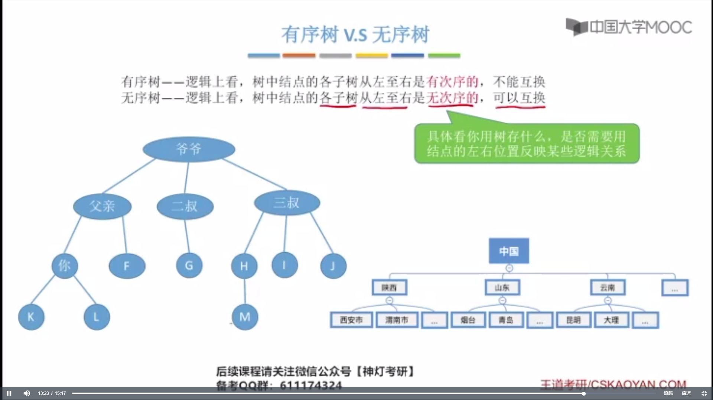


## 树的性质


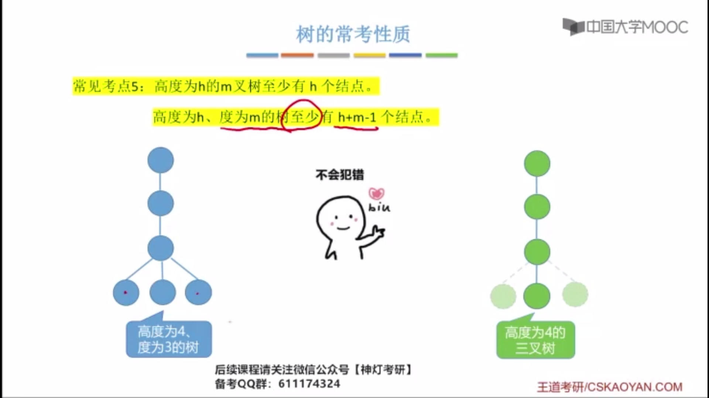


> 注意：向上取整

## 二叉树


## 二叉树的性质


## 二叉树的存储结构

### 二叉树的顺序存储


```cpp
/*
    二叉树的顺序存储
    二叉树的结点（顺序存储）
*/
struct TreeNode {
    ElemType value; // 结点中的数据元素
    bool isEmpty; // 结点是否为空
};

TreeNode t[MaxSize];
```


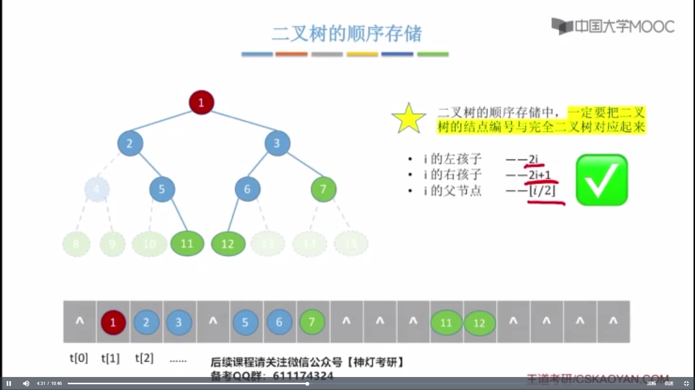


###　二叉树的链式存储


```cpp
/*
    二叉树的链式存储
*/
struct ElemType {
    int value;
};

/*
    二叉链表
*/
typedef struct BitNode {
    ElemType data;
    struct BitNode *lchild, *rchild;
} BitNode, *biTree;
```


```cpp
/*
    三叉链表
*/
typedef struct BitNode {
    ElemType data;                     // 数据域
    struct BitNode *lchild, *rchild;   // 左右孩子指针
    struct BitNode *parent;            // 父节点指针
} BitNode, *biTree;
```


## 课后习题


```cpp
// 顺序存储，查找两个节点的最近的公共祖先，i, j表示两个结点的下标
TreeNode sameAncient(TreeNode t[], int i, int j) {
    if (t[i].isEmpty == 0 && t[j].isEmpty == 0) {
        while (i != j) {
            if (i < j) {
                j /= 2;
            }
            if (i > j) {
                i /= 2;
            }
        }
        return t[i];
    }
}
```


## 二叉树的先中后序遍历


```plain
先序：
A B D G E C F

中序：
D G B E A F C

后序：
G D E B F C A
```


```plain
先序：
- + a * b - c d / e f 

中序：
a + b * c - d - e / f

后序：
a b c d - * + e f / -
```


 

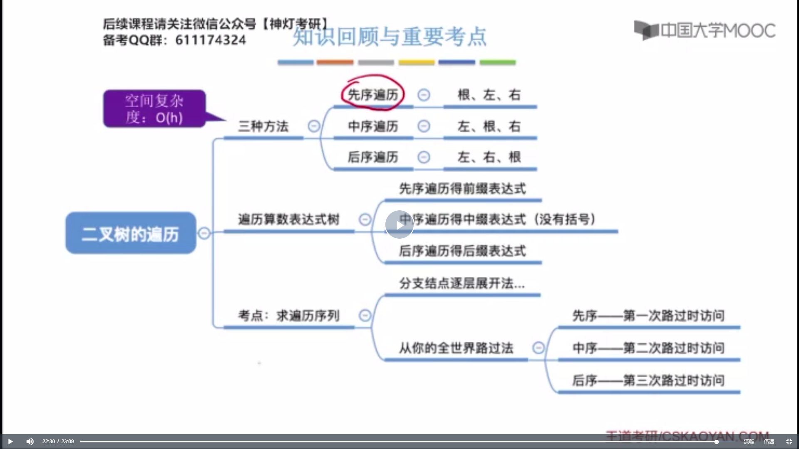


### 代码

**预备**

```cpp
// 访问结点
void visit(biTree T) {
    cout << T->data << " ";
}
```

**测试代码**

```cpp
#include <bits/stdc++.h>
#include "Tree.h"

int main(int, char**) {
    // 初始化树
    BitNode* n1 = new BitNode();
    BitNode* n2 = new BitNode();
    BitNode* n3 = new BitNode();
    BitNode* n4 = new BitNode();
    BitNode* n5 = new BitNode();
    BitNode* n6 = new BitNode();

    BitNode* nodes[] = {n1, n2, n3, n4, n5, n6};

    // 给树赋值
    for (int i = 0; i < 6; i++) {
        nodes[i]->data = i + 1;
    }

    // 连接树
    n1->lchild = n2;
    n1->rchild = n3;

    n2->rchild = n4;
    
    n3->rchild = n5;
    
    n4->lchild = n6;

    // 递归先序遍历
    preOrder(n1);
    
    // 释放
    delete[] nodes;
}
```

**测试数据**


#### 先序

**递归**

```cpp
void preOrder(biTree T) {
    if (T != NULL) {
        visit(T);            // 访问根结点
        preOrder(T->lchild); // 递归遍历左子树
        preOrder(T->rchild); // 递归遍历右子树
    }
} 
```


**非递归**

```cpp
void PreOrder2(biTree T) {
    stack<biTree> s;
    biTree p = T;
    while (p || !s.empty()) {
        if (p) {
            visit(p);
            s.push(p);
            p = p->lchild;
        }
        else {
            p = s.top();
            s.pop();
            p = p->rchild;
        }
    }
}
```


#### 中序

**递归**

```cpp
void InOrder(biTree T) {
    if (T != NULL) {
        InOrder(T->lchild);
        visit(T);
        InOrder(T->rchild);
    }
}
```


**非递归**

```cpp
void InOrder2(biTree T) {
    stack<biTree> s;                // 初始化一个栈
    biTree p = T;                   // p为遍历指针
    while (p || !s.empty()) {
        if (p) {                    // 一路向左
            s.push(p);              // 当前结点入栈
            p = p->lchild;
        } else {    
            p = s.top();            // 出栈，转向出栈结点的右子树
            s.pop();                // 栈顶元素出栈            
            visit(p);               // 访问该结点
            p = p->rchild;          // 向右子树走，p赋值为当前的结点的右孩子
        }                           // 返回while循环继续进入if-else语句
    }
}
```


#### 后序

**递归**

```cpp
void PostOrder(biTree T) {
    if (T != NULL) {
        PostOrder(T->lchild);
        PostOrder(T->rchild);
        visit(T);
    }
}
```


**非递归**

```cpp
#include <bits/stdc++.h>
#include "Tree.h"
using namespace std;

void PostOrder2(biTree T) {
    stack<biTree> s;
    set<biTree> isVisit; // 来标志结点是否被访问
    biTree p = T;
    if (T)
        s.push(p);
    while (!s.empty()) {
        if (p->lchild && isVisit.count(p->lchild) == 0) {
            p = p->lchild;
            s.push(p);
            continue;
        }
        if (p->rchild && isVisit.count(p->rchild) == 0) {
            p = p->rchild;
            s.push(p);
            continue;
        }
        visit(p);
        if (p == s.top())
            s.pop();
        isVisit.insert(p);
        if (!s.empty())
            p = s.top();
    }
}
```


## 二叉树的层次遍历


### 代码

```cpp
#include <bits/stdc++.h>
#include <queue>
#include "Tree.h"

void LevelOrder(biTree T) {
    queue<biTree> q;
    q.push(T);
    while (!q.empty()) {
        biTree p = q.front();
        q.pop();
        visit(p);
        if (p->lchild)
            q.push(p->lchild);
        if (p->rchild)
            q.push(p->rchild);
    }
}
```


## 由遍历序列构造二叉树


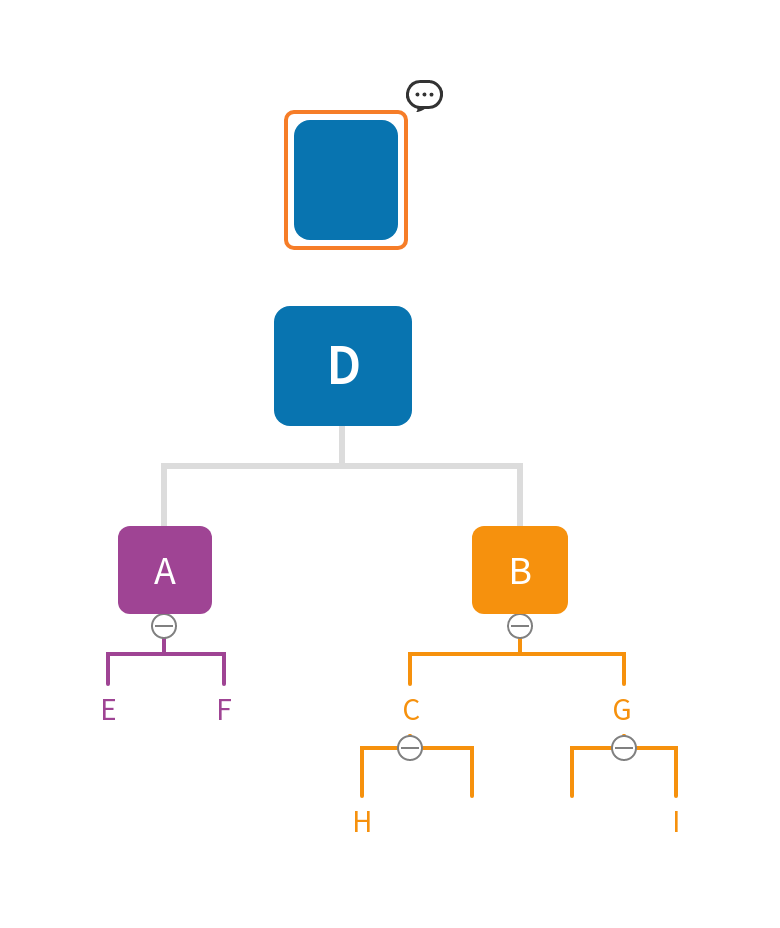


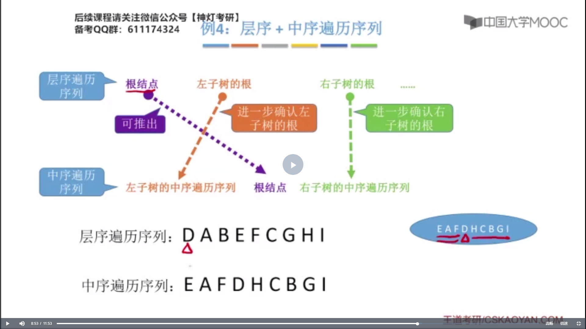


## 线索二叉树的概念


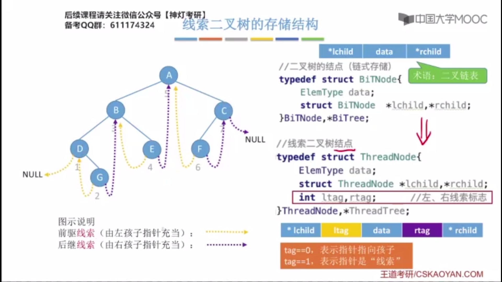


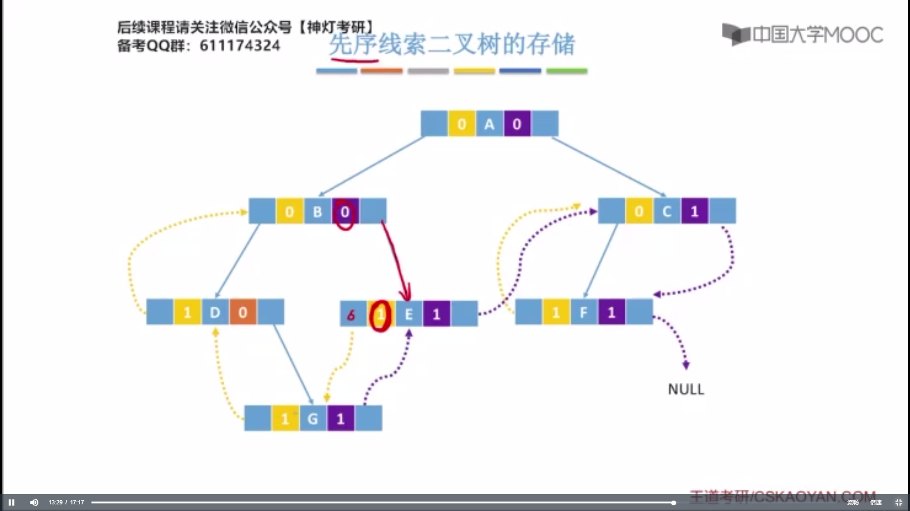


## 二叉树的线索化


### 查找结点的中序前驱（暴力）

```cpp
#include <bits/stdc++.h>
#include "Tree.h"

using namespace std;

void InOrderPrecursor(biTree T, biTree &pre, biTree &q, biTree &final) {
    if (T != NULL) {
        InOrderPrecursor(T->lchild, pre, q, final);
        if (q == T) {
            final = pre; 
        } else {
            pre = T;
        }
        InOrderPrecursor(T->rchild, pre, q, final);
    }
}
```


### 存储结构

```cpp
typedef int ElemType;
typedef struct ThreadNode {
    ElemType data;
    struct ThreadNode *lchild, *rchild;
    int ltag, rtag;
} ThreadNode, *ThreadTree;
```

### 中序线索化


*inThread.cpp*

```cpp
#include <bits/stdc++.h>
#include "ThreadTree.h"

using namespace std;

/**
 * @brief 中序遍历（建立中序线索二叉树）
 * 
 * @param p 当前结点
 * @param pre 当前结点的前一个结点
 */
void InThread(ThreadTree &p, ThreadTree &pre) {
    InThread(p->lchild, pre);
    if (p->lchild == NULL) {
        p->lchild = pre;
        p->ltag = 1;
    }
    if (pre != NULL && pre->rchild == NULL) {
        pre->rchild = p;
        pre->rtag = 1;
    }
    pre = p;
    InThread(p->rchild, pre);
}
```

*createInThread.cpp*

```cpp
#include <bits/stdc++.h>
#include "ThreadTree.h"

using namespace std;

/**
 * @brief 建立中序线索二叉树
 * 
 * @param T 需要建立中序线索二叉树的根结点
 */
void CreateInThread(ThreadTree T) {
    ThreadTree pre = NULL;
    if (T != NULL) {
        InThread(T, pre);
        pre->rchild = NULL;
        pre->rtag = 1;     
    }
}
```

### 先序线索化


*preThread.cpp*

```cpp
#include <bits/stdc++.h>
#include "ThreadTree.h"

using namespace std;

void PreThread(ThreadTree &p, ThreadTree &pre) {
    if (p->lchild == NULL) {
        p->lchild = pre;
        p->ltag = 1;
    }
    if (pre != NULL && pre->rchild == NULL) {
        pre->rchild = p;
        pre->rtag = 1;
    }
    pre = p;
    if (p->ltag == 0) // 只有p的左指针指向的是左孩子是时，才递归遍历左子树
        preThread(p->lchild, pre); 
    preThread(p->rchild, pre);
}
```

*createPreThread.cpp*

```cpp
void CreatePreThread(ThreadTree T) {
    ThreadTree pre = NULL;
    if (T != NULL) {
        PreThread(T, pre);
        pre->rchild = NULL;
        pre->rtag = 1;
    }
}
```

> [!NOTE]
>
> 先序线索化时，当根结点被线索化之后，才会去遍历左子树。
>
> 因此，可能导致在遍历左子树时遍历的是它的前驱结点，这就会导致死循环。
>
> 解决方案：在遍历左子树时，判断左指针指向的是左结点，再遍历。判断的方法是 `ltag==0?`

### 后序线索化


*postThread.cpp*

```cpp
#include <bits/stdc++.h>
#include "ThreadTree.h"
using namespace std;

void PostThread(ThreadTree &p, ThreadTree &pre) {
    if (p->lchild == NULL) {
        p->lchild = pre;
        p->ltag = 1;
    }
    if (pre != NULL && pre->rchild == NULL) {
        pre->rchild = p;
        pre->rtag = 1;
    }
    pre = p;
    PostThread(p->lchild, pre);
    PostThread(p->rchild, pre);
}
```

*createPostThread.cpp*

```cpp
#include <bits/stdc++.h>
#include "ThreadTree.h"

using namespace std;

void CreatePreThread(ThreadTree T) {
    ThreadTree pre = NULL;
    if (T != NULL) {
        PreThread(T, pre);
        pre->rchild = NULL;
        pre->rtag = 1;
    }
}
```


## 线索二叉树中找前驱/后继

###　中序


*inorderNext.cpp*

```cpp
#include <bits/stdc++.h>
#include "ThreadTree.h"
using namespace std;

ThreadNode *FirstNode(ThreadNode* p) {
    // 循环找到最左下结点（不一定是叶结点）
    while (p->ltag == 0) p = p->lchild;
    return p;
}

ThreadNode *Nextnode(ThreadNode* p) {
    // 右子树最左下结点
    if (p->rtag == 0) return FirstNode(p->rchild);
    else return p->rchild;
}

void Inorder(ThreadNode *T) {
    for (ThreadNode* p = FirstNode(T); p != NULL; p = Nextnode(p))
        visit(p);
}
```

*inOrderPre.cpp*

```cpp
#include <bits/stdc++.h>
#include "ThreadTree.h"
using namespace std;

ThreadNode* Lastnode(ThreadNode* p) {
    // 循环找到最右下结点（不一定是叶结点）
    while (p->rtag == 0) p = p->rchild;
    return p;
}

// 在中序线索二叉树中找到结点p的前驱结点
ThreadNode* Prenode(ThreadNode* p) {
    // 左子树中最右下结点
    if (p->ltag == 0) return Lastnode(p->lchild);
    else return p->lchild; // ltag == 1 直接返回前驱线索
}

// 对中序线索二叉树进行逆向的中序遍历
void RevInorder(ThreadNode* T) {
    for (ThreadNode *p = Lastnode(T); p != NULL; p = Prenode(p)) {
        visit(p);               
    }
}
```


### 先序


*preOrderNext.cpp*

```cpp
#include <bits/stdc++.h>
#include "ThreadTree.h"

using namespace std;

ThreadNode *FirstNode(ThreadNode* p) {
    // 先序遍历，根节点即为第一个结点
    return p;
}

ThreadNode *Nextnode(ThreadNode* p) {
    // 如果右结点为线索，则直接返回右结点
    if (p->rtag == 1) return p->rchild;
    else {
        if (p->ltag == 0) // 如果左孩子不为空
            return p->lchild; // 下一个结点即为左孩子
        else              // 如果左孩子为空
            return p->rchild;  // 下一个结点即为右孩子
    }
}

void PreOrder(ThreadNode* T) {
    for (ThreadNode* p = FirstNode(T); p != NULL; p = Nextnode(p))
        visit(p);
}
```


### 后序


## 课后习题


**解法1**

```cpp
#include <bits/stdc++.h>
#include "Tree.h"
using namespace std;

void PostOrder2(biTree T) {
    stack<biTree> s;
    set<biTree> isVisit; // 来标志结点是否被访问
    biTree p = T;
    if (T)
        s.push(p);
    while (!s.empty()) {
        if (p->lchild && isVisit.count(p->lchild) == 0) {
            p = p->lchild;
            s.push(p);
            continue;
        }
        if (p->rchild && isVisit.count(p->rchild) == 0) {
            p = p->rchild;
            s.push(p);
            continue;
        }
        visit(p);
        if (p == s.top())
            s.pop();
        isVisit.insert(p);
        if (!s.empty())
            p = s.top();
    }
}
```


**解法2**


## 树、森林

### 树的存储结构


### 树和森林的遍历


## 课后习题 


```cpp
#include <bits/stdc++.h>

#include "TreeAndForest.h"

  

using namespace std;

  

void CountLeaves(CSTree T, int& h, int num) {

    if (num > h) h = num;

    if (T != NULL) {  

        CountLeaves(T->firstChild, h, num + 1);

        CountLeaves(T->nextsibling, h, num);

    }

}
```


```cpp
#include <bits/stdc++.h>

#include "TreeAndForest.h"

  

using namespace std;

  

int CountLeaf(CSTree T) {

    int cnt = 0;

    stack<CSTree> S;

    CSTree p = T;

    while (p || !S.empty()) {

        if (p) {

            if (p->firstChild == NULL) cnt++;

            S.push(p);

            p = p->firstChild;

        } else {

            p = S.top();

            S.pop();

            p = p->nextsibling;

        }

    }

    return cnt;

}
```


```cpp
#include <bits/stdc++.h>

#include "TreeAndForest.h"

#define maxNodes 15

  

using namespace std;

  

void createCSTree_Degree(CSTree &T, ElemType e[], int degree[], int n) {

    // 根据树的层次序列e[]和各结点的度degree[]构造树的孩子-兄弟链表

    // 参数n是树结点个数

    CSTree *pointer = new CSTree[maxNodes]; // 判断pointer[i]为空的语句未写

    int i, j, d, k = 0;

    for (i = 0; i < n; i++) {

        pointer[i]->data = e[i];

        pointer[i]->firstChild = pointer[i]->nextsibling = NULL;

    }

    for (i = 0; i < n; i++) {

        if (degree[i]) {

            k++;

            pointer[i]->firstChild = pointer[k];

            for (j = 2; j <= degree[i]; j++) {

                k++;

                pointer[k - 1]->nextsibling = pointer[k];

            }

        }

    }

    T = pointer[0];

    delete [] pointer;

}
```


## 树与二叉树的应用

### 哈夫曼树

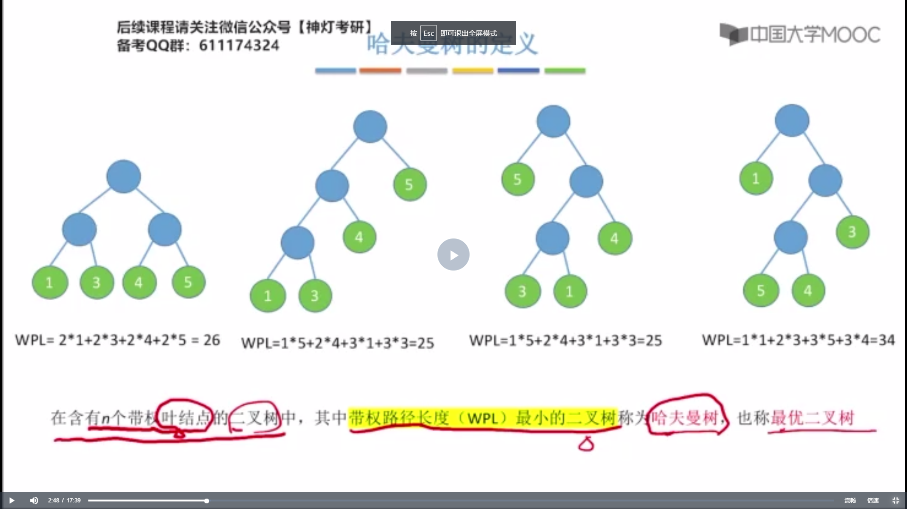


### 哈夫曼编码


### 并查集（Disjoint Set）


#### 查


、


#### 并


#### 存储结构


```cpp
typedef int ElemType;

/*
    双亲表示法：每个结点中保存指向双亲的“指针”
*/
#define MAX_TREE_SIZE 100       // 树中最多结点数
typedef struct {                // 树的结点定义
    ElemType data;              // 数据元素
    int parent;                 // 双亲位置域      
} PTNode;                  

typedef struct {                // 树的类型定义
    PTNode nodes[MAX_TREE_SIZE];// 双亲表示
    int n;                      // 结点数
} PTree;  
```


#### 代码

**存储结构**

```cpp
#define MAX_TREE_SIZE 100

int UFSets[MAX_TREE_SIZE];
```

**初始化**

```cpp
void initial(int S[]) {
    for (int i = 0; i < MAX_TREE_SIZE; i++) {
        S[i] = -1;
    }
}
```

**查找**

```cpp
int Find(int S[], int x) {
    if (S[x] >= 0) 
        x = S[x];
    return x;
}
```

**合并**

```cpp
void Union(int S[], int Root1, int Root2) {
    if (Root1 == Root2) return ;
    S[Root2] = Root1;
}
```


#### 时间复杂度


#### 优化


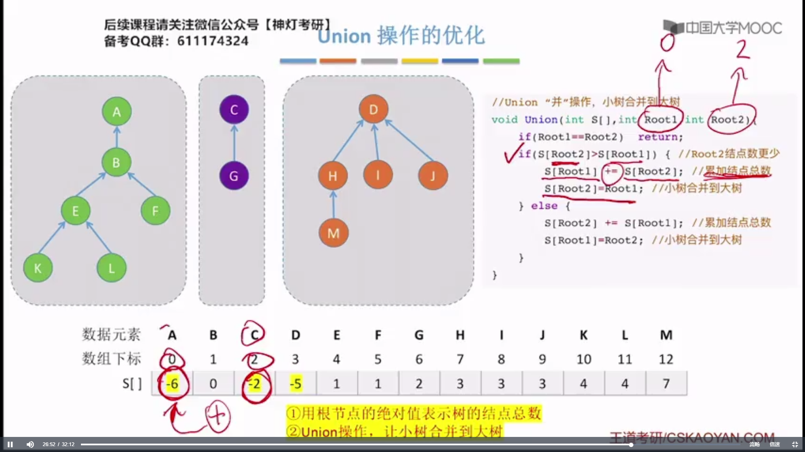

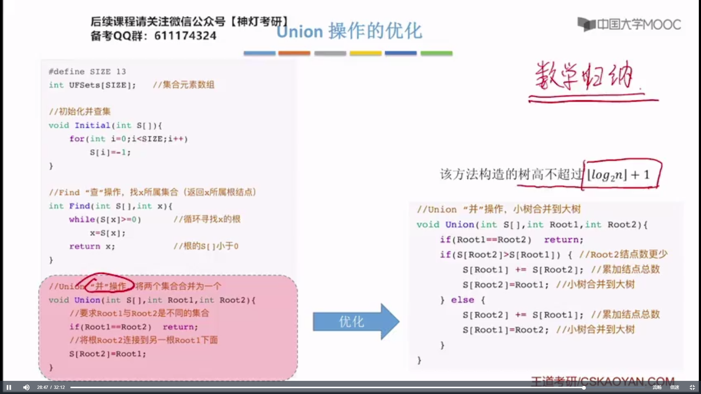


#### 代码
```cpp
void UnionP(int S[], int Root1, int Root2) {

    if (Root1 == Root2) return ;

    if (S[Root1] > S[Root2]) {

        S[Root2] += S[Root1];

        S[Root1] = Root2;

    } else {

        S[Root1] += S[Root2];

        S[Root2] = Root1;

    }

}
```

#### 终极优化


#### 代码

```cpp
int FindP(int S[], int x) {

    int root = x;

    if (S[x] > 0) root = S[root];

    while (x != root) {

        int t = S[x];

        S[x] = root;

        x = t;

    }

    return root;

}
```

### 二叉排序树


#### 查找


**递归**

```cpp
BSTNode *BST_Search2(BSTree T, ElemType key) {

    if (T == NULL) return NULL;

    if (T->key == key) return T;

    else if (T->key > key) return BST_Search2(T->lchild, key);

    else return BST_Search2(T->rchild, key);

}
```

**非递归**

```cpp
BSTNode *BST_Search(BSTree T, ElemType key) {

    while (T != NULL && T->key != key) {

        if (T->key > key) T = T->lchild;

        if (T->key < key) T = T->rchild;

    }

    return T;

}
```


#### 插入


**递归**

```cpp
int BST_Insert(BSTree &T, KeyType k) {

    if (T == NULL) {

        T = new BSTNode(k, NULL, NULL);

        T->key = k;

        return 1;

    } else if (k == T->key)

        return 0;

    else if(k < T->key)

        return BST_Insert(T->lchild, k);

    else

        return BST_Insert(T->rchild, k);

}
```

**非递归**

```cpp
int BST_Insert2(BSTree &T, KeyType k) {

    while (T != NULL && T->key != k) {

        if (T->key > k) T = T->lchild;

        else T = T->rchild;

    }

    if (T == NULL) {

        T = new BSTNode(k, NULL, NULL);

        return 1;

    }

    else

        return 0;

}
```


```cpp
void Creat_BST(BSTree &T, KeyType str[], int n) {
    T = NULL;
    int i = 0;
    while (i < n) {
        BST_Insert(T, str[i]);
        i++;
    }
}
```

#### 删除


####  查找效率


### 平衡二叉树


#### LL


==拎B挂BR==

#### RR


#### LR


#### RL


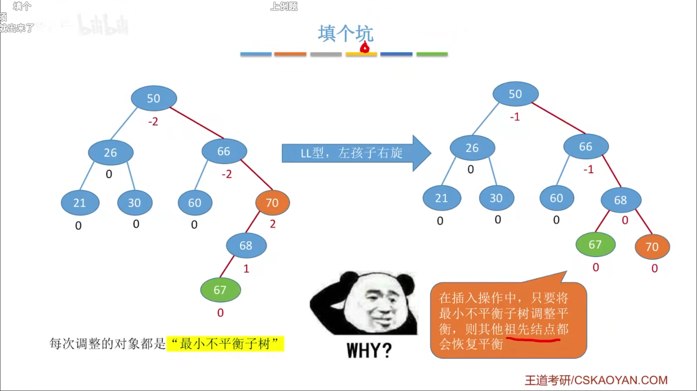

#### 插入结点时保持平衡


  


#### 平衡二叉树的删除


#### 查找效率


### 课后习题 


```cpp
// 测试函数
void testIsBST(BSTree T) {

    int flag = 0;

    IsBST(T, flag);

    if (flag == -1) {

        cout << "is not binary search tree" << endl;

    } else {

        cout << "is binary search tree" << endl;

    }

}

/*
	判断一个树是不是二叉排序树
	如果不是，标志位flag的值为-1 
*/
void IsBST(BSTree T, int& flag) {

    if (T != NULL) {

        IsBST(T->lchild, flag);

        if(T->lchild != NULL && T->lchild->key >= T->key) flag = -1;

        if (T->rchild != NULL && T->rchild->key <= T->key) flag = -1;

        IsBST(T->rchild, flag);

    }

}
```


```cpp
int GetDepth(BSTree T, KeyType k) {

    int depth = 0;

    while (T != NULL && T->key != k) {

        depth += 1;

        if (k > T->key) T = T->rchild;

        else T = T->lchild;

    }

    if (T->key == k) return depth + 1;

    else return -1;

}
```


```cpp
void Judge_AVL(biTree bt, int &balance, int &h) {

    int bl = 0, br = 0, hl = 0, hr = 0;

    if (bt == NULL) {

        h = 0;

        balance = 1;

    } else if (bt->lchild == NULL && bt->rchild == NULL) {

        h = 1;

        balance = 1;

    } else {

        Judge_AVL(bt->lchild, bl, hl);

        Judge_AVL(bt->rchild, br, hr);

        h = max(hl, hr) + 1;

        if (abs(hl - hr) < 2) {

            balance = bl && br;

        } else {

            balance = 0;

        }

    }

}
```