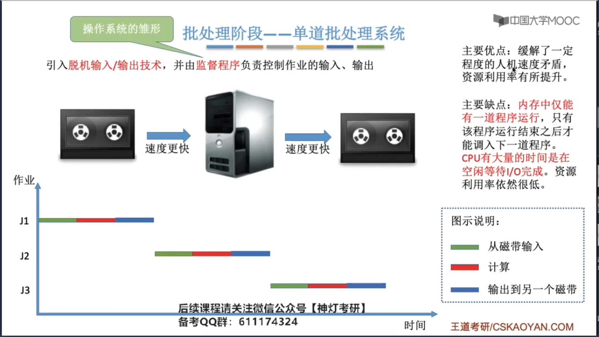
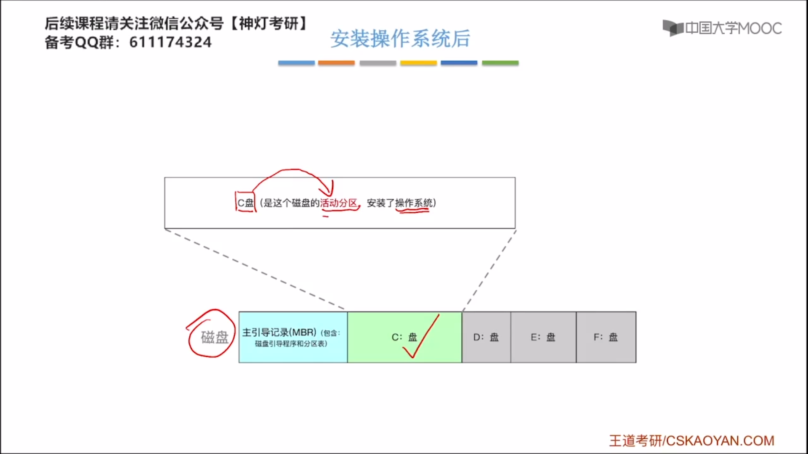

# 第一章 计算机系统概述

## 1.1 操作系统的基本概念

### 1.1.1 操作系统的概念

### 1.1.3 操作系统的目标和功能

#### 1.1.3.1 操作系统作为计算机资源的管理者

#### 1.1.3.2 操作系统作为用户与计算机硬件系统之间的接口

1. 命令接口

2. 程序接口

用户通过==GUI和命令接口==来和操作系统进行交互，而应用程序通过==系统调用==来和操作系统进行交互。

有的教材中，会把命令接口和程序接口，统称为用户接口，也就是说狭义的用户接口，不包含GUI。

#### 1.1.3.3 操作系统用作扩充机器

### 1.1.2 操作系统的特征

有时候，同时共享确实是微观上在同时共享这个资源，比如说在玩游戏的时候，一边听歌，扬声器这个声音输出设备一边在播放游戏的声效，同时还在播放音乐，所以在这种情况下，扬声器这个声音输出设备，==在微观上==，是在被音乐播放器和游戏同时使用。

失去了并发性，共享性就失去了存在的意义；失去了共享性，并发性就不可能被实现。并发性和共享互为存在条件。

## 1.2 操作系统的发展与分类

### 1.2.1 手工操作阶段

### 1.2.2 批处理阶段——单道批处理系统 

### 1.2.3 批处理阶段——多道批处理系统

### 1.2.4 分时操作系统

### 1.2.5 实时操作系统

### 1.2.6 其他几种操作系统

## 1.3 操作系统的运行环境

### 1.3.1 操作系统的运行机制

操作系统内核是系统资源的管理者。

CPU能判断出指令类型，但是它怎么区分此时正在运行的是内核程序or应用程序？

答：CPU有两种状态，“内核态”和“用户态”。

处于内核态时，说明此时正在运行的是内核程序，此时可以执行特权指令。

处于用户态时，说明此时正在运行的是应用程序，此时只能执行非特权指令。

### 1.3.2 中断和异常的概念

#### 1.3.2.1 内中断

#### 1.3.2.2 外中断

### 1.3.3 系统调用

## 1.4 操作系统的体系结构

考试的时候，不要使用“变态”这个词，这个词只是为了方便描述，使用的一种描述方式，考试时应该说成是“CPU状态的转换”。

### 1.4.1 分层结构

每层只能调用==相邻的低一层==的接口。

自底向上调试。

### 1.4.2 模块化

 ### 1.4.3 微内核与大内核

### 1.4.4 外核

## 1.5 操作系统的引导

下图为启动管理器：

## 1.6 虚拟机

