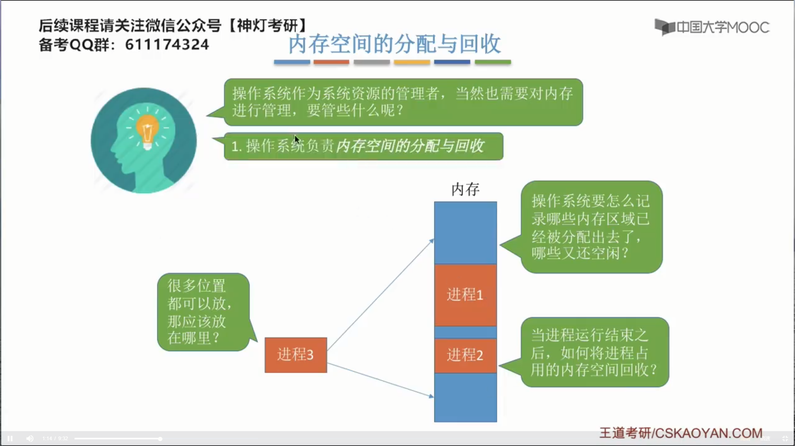
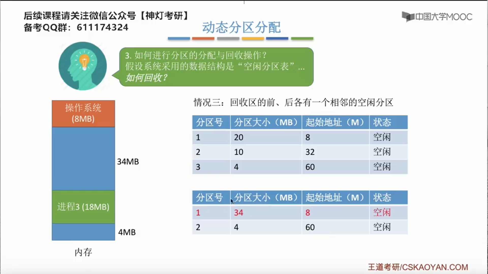
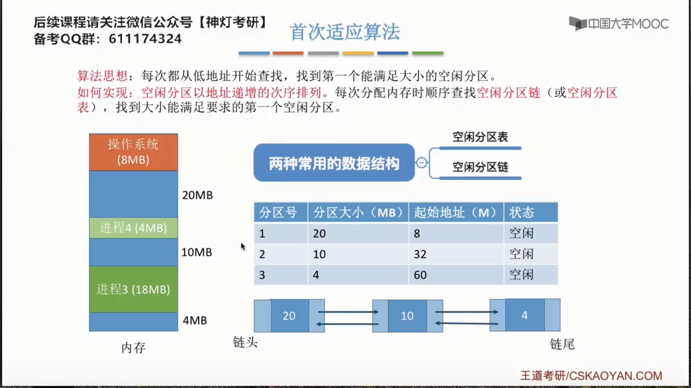
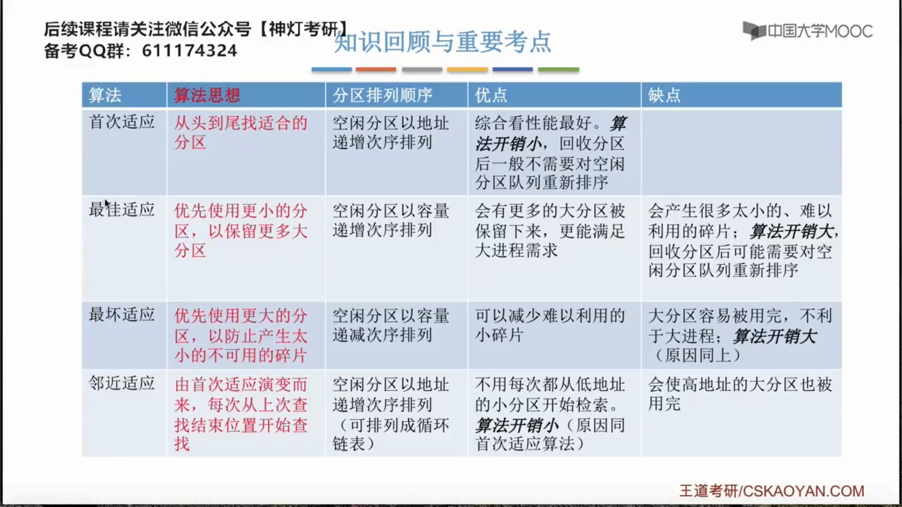
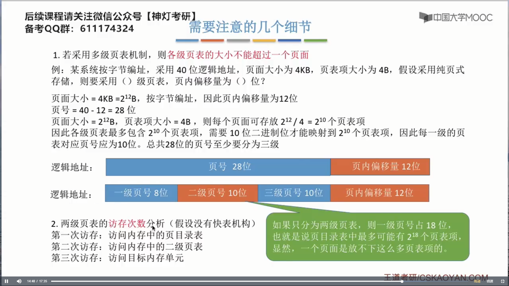
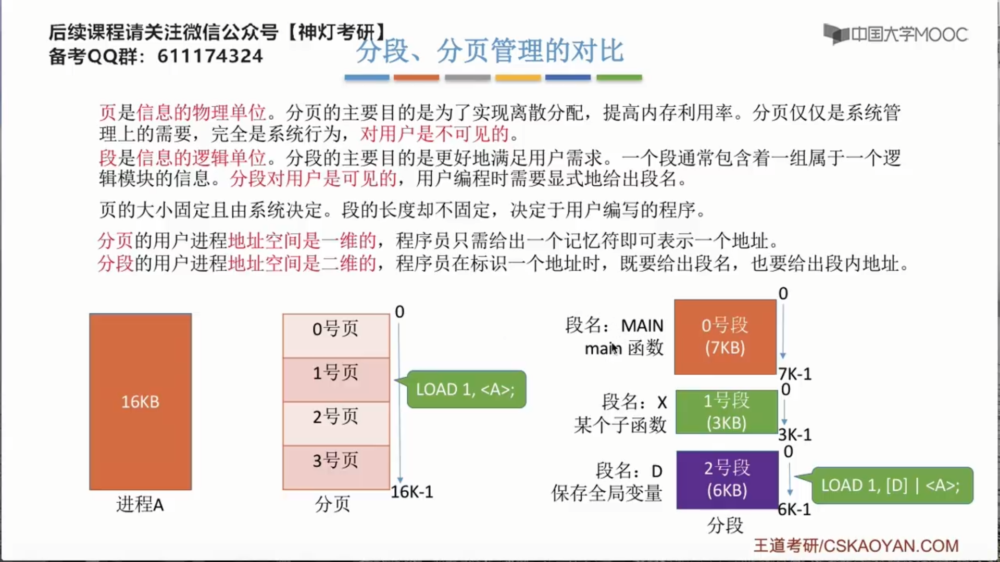
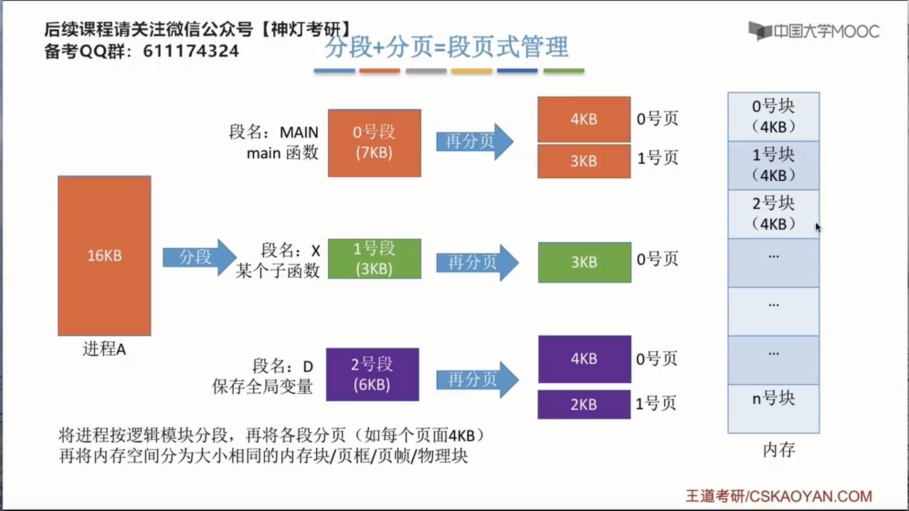
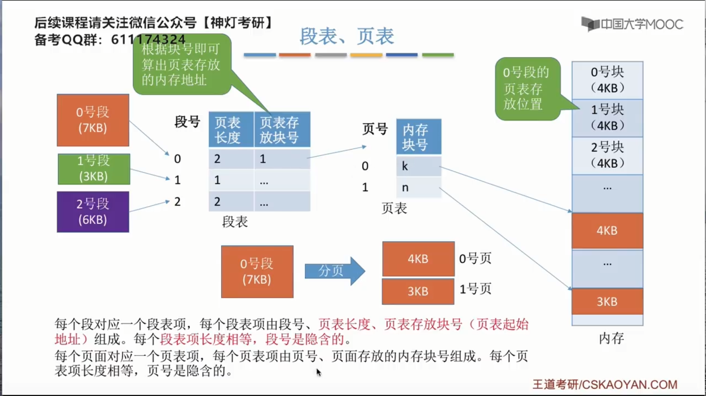
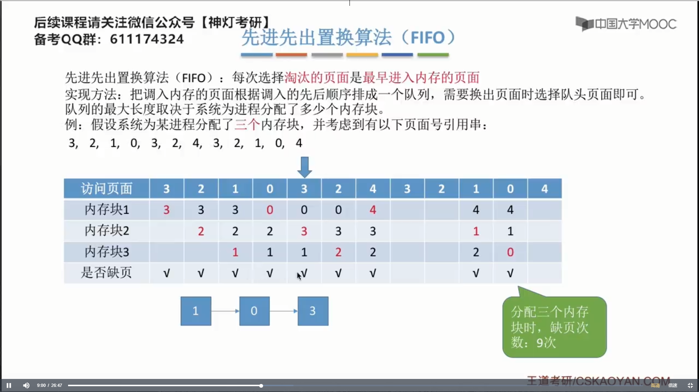

# 第三章-内存管理

## 3.1 内存管理的概念

### 3.1.1 内存的基础知识

 

==可执行文件==又可以称为装入模块。

程序编译，链接...之后所形成的地址一般来说，使用的是逻辑地址。物理地址是无法确定的，那么如何将逻辑地址转换为正确的物理地址呢?

灵活性低，可移植性差。

### 3.1.2 内存管理的概念

### 3.1.3 覆盖与交换技术

对换区的I/O速度比文件区更快。

PCB会常驻内存，不会被换出外存。

覆盖技术与交换技术的区别：

- 覆盖技术是根据覆盖结构，让同一个进程中的，在同一调用级别的程序段，在不同的时期，共用同一块内存空间。

- 交换技术是内存紧张时，换出某些进程以腾出内存空间，在换入某些进程。

### 3.1.4 连续分配管理方式

在进行内存分区回收的时候，如果发现，回收了之后，发现有一些空闲分区是相邻的，那么我们就需要把这些相邻的空闲分区全部给合并。

### 3.1.5 动态分区分配算法

最佳适应算法的缺点：会产生很多的外部碎片。

==最佳适应算法和最坏适应算法算法开销大==是因为这两个算法每次分配内存空间后，空闲分区表或者空闲分区链都要重新排列；而==首次适应算法和邻居适应算法==则不用重新排列，因此它们的==算法开销较小==。

### 3.1.6 基本分页存储管理的概念

页框（page frame）。

 

### 3.1.7 基本地址变换机构

$\text{物理块号} \times \text{物理快长度} = \text{物理块起始地址}$

==注意==对页号进行越界检查。

进程页表通常是装在连续的内存块中的。

页式管理中地址是一维的，知道==逻辑地址==，就可以求出==物理地址==

### 3.1.8 具有块表的地址变换机构

快表（TLB）和我们狭义上的高速缓存也是有区别的。

### 3.1.9 两级页表

没有块表机构的话，`n`级页表在访问一个逻辑地址的时候，访存次数应该为`n+1`次。

### 3.1.10 基本分段存储管理

###3.1.11 段页式管理方式

“分段”对用户是可见的，程序员编程时需要显式地给出段号，段内地址。而将各段“分页”对用户是不可见的。系统会根据段内地址自动划分页号和页内偏移量。

## 3.2 虚拟内存管理

### 3.2.1 虚拟内存的基本概念

使用了虚拟内存技术后，对内存的利用率，系统的性能，都是有所提升的。

### 3.2.2 请求分页管理方式

### 3.2.3 页面置换算法

### 3.2.4 页面分配策略，抖动，工作集

调入页面的时机问题

 

### 3.2.5 内存映射文件

