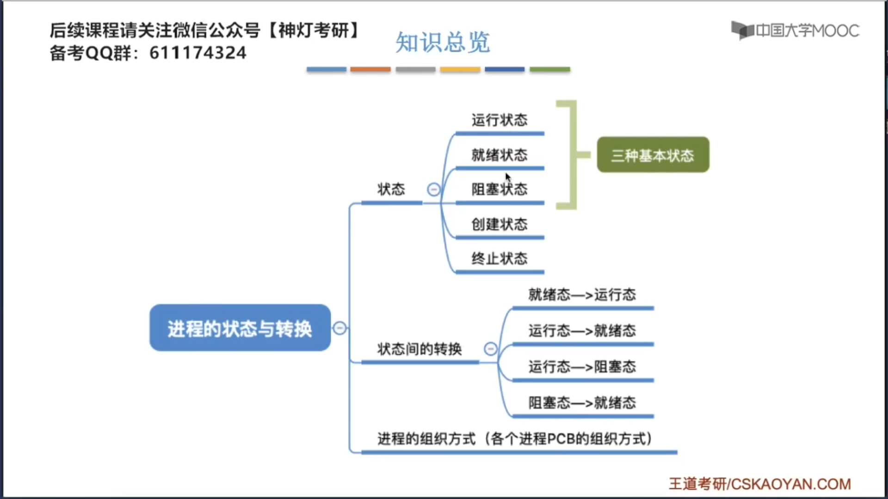
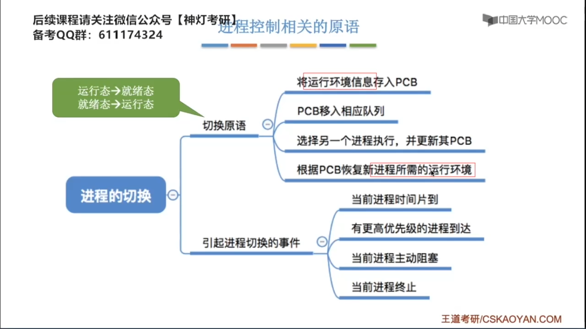
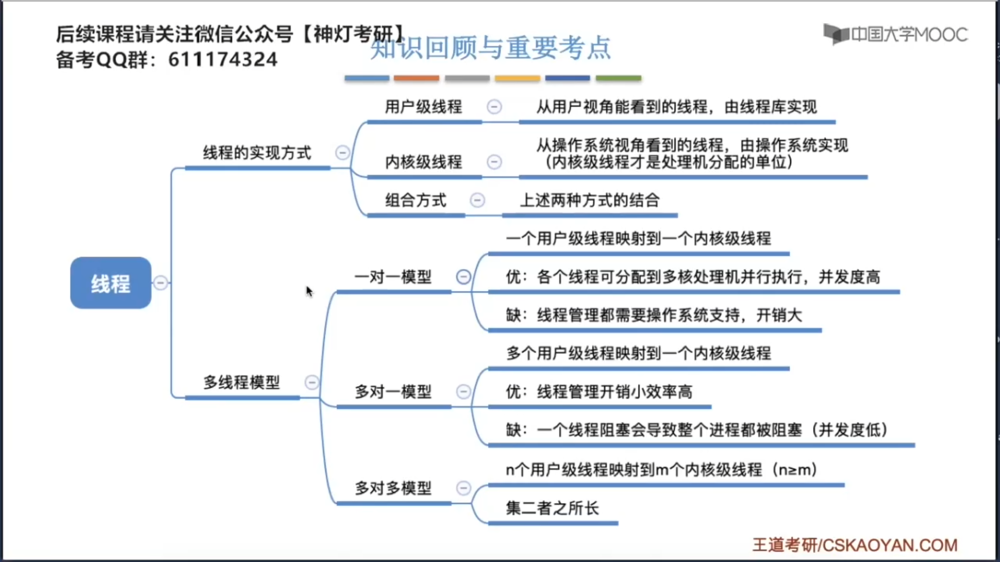
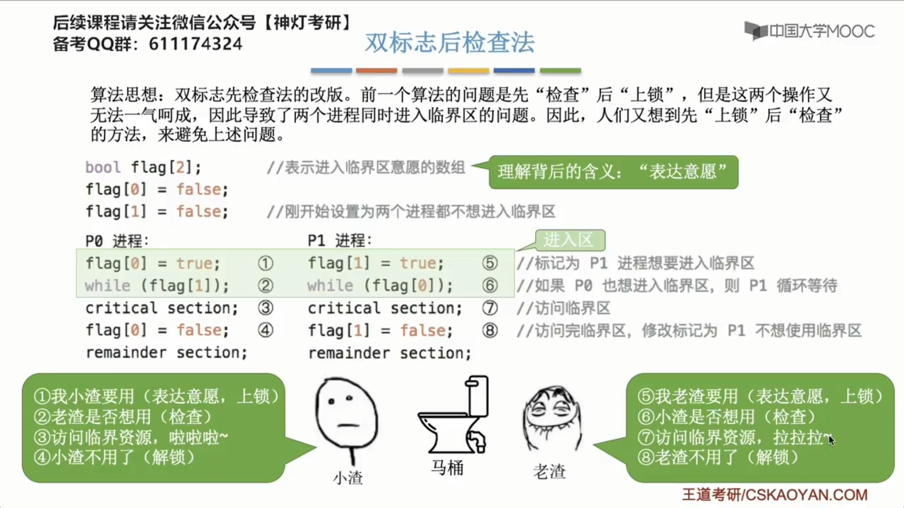
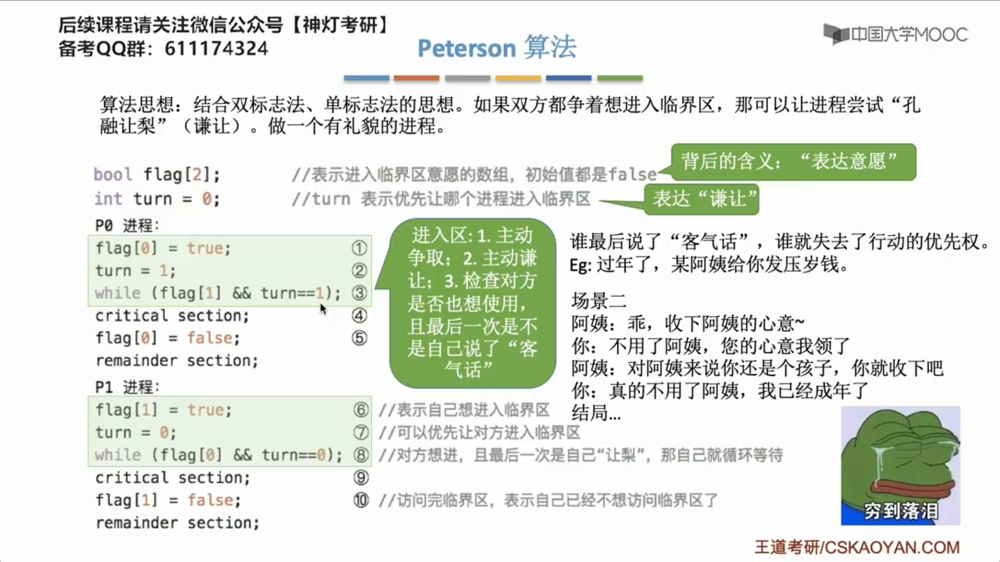
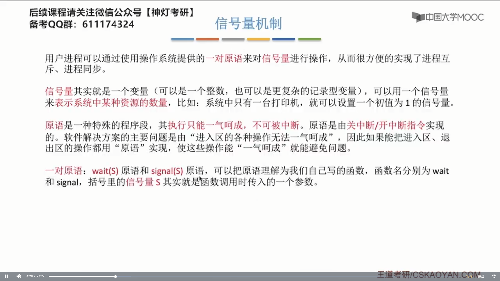
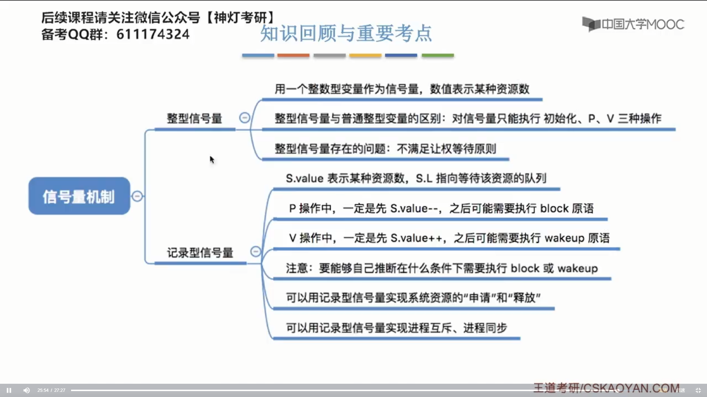
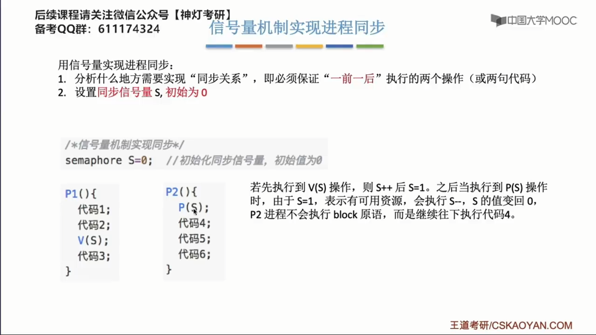
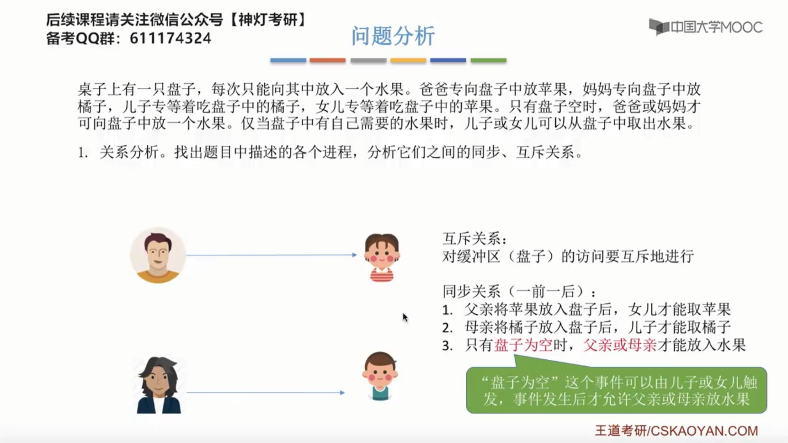
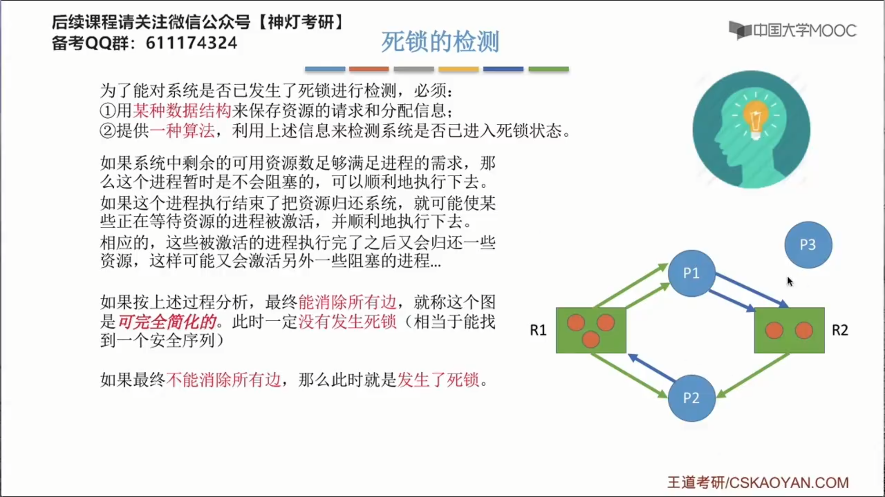

# 第二章-进程管理

## 2.1 进程与线程

### 2.1.1 进程的概念、组成、特征

进程实体是进程在某一时刻的快照。

在引入了==线程==之后，进程就不再是接受调度的基本单位了，但是进程依然是获得资源的基本单位。

## 2.2 进程的状态与转换、转换的组织

 

 

### 2.1.3 进程控制

### 2.1.4 进程通信

为了保证数据安全，各个进程只能访问自己的地址空间。

#### 2.1.4.1 共享存储

#### 2.1.4.2 消息传递

 

在各个进程的PCB中，包含了一个队列，叫做消息队列，其他进程发送给自己的消息，都挂在这个消息队列上。

向操作系统申请邮箱

管道中数据的流向只能是==单向==的。

在共享存储的基础上遵循“队列”的特性，就是==管道==通信。

管道可以理解为一个==循环队列==，写进程写数据和读进程读数据都要遵循==先进先出==的特性。

### 2.1.5 线程的概念

### 2.1.6 线程的实现方式和多线程模型

1. 线程的管理工作由谁来完成？

   答：由应用程序的线程库

2. 线程切换是否需要CPU变态？

   答：不需要，在用户态下就能完成线程的切换工作，不需要操作系统的干涉。

3. 操作系统是否能意识到用户级线程的存在？

   答：不能，用户才能感知到用户级线程的存在，操作系统感知不到用户级线程的存在。

内核级线程

1. 线程的管理工作由谁来完成？

   答：线程的管理工作由操作系统来完成。

2. 线程的切换是否需要CPU变态？

   答：在进行线程的切换的时候，需要从用户态转换为内核态

3. 操作系统能否意识到内核进线程的存在？

   答：能

### 2.1.7 线程的状态与转换

## 2.3 处理机调度

### 2.3.1 调度的概念、层次

有的时候切换进程，会发现进程切换得很快，有的时候，那个进程又切换得很慢，当进程切换得很快的时候，这个进程里的数据是放在内存中的，而切换进程很卡很慢的时候，有可能是因为你那个进程的数据不在内存中了，而是被系统调到了外存中。

### 2.3.2 调度的时机、切换与过程

### 2.3.3 调度器和闲逛程序

### 2.3.4 调度算法的评价指标

### 2.3.5 调度算法

#### 2.3.5.1 先来先服务

后备队列位于外存中；就绪队列在内存中。

#### 2.3.5.2 短作业优先

#### 2.3.5.3 高响应比优先

​	

#### 2.3.5.4 时间片轮转

#### 2.3.5.5 优先级调度算法

#### 2.3.5.6 多级反馈队列调度算法

##2.4 进程同步

### 2.4.1 进程同步的概念

### 2.4.2 进程互斥的软件实现方法

### 2.4.3 进程互斥的硬件实现方法

关中断指令只对执行关中断的那台处理机有用。

### 2.4.4 互斥锁

### 2.4.5 信号量机制

### 2.4.6 用信号量实现进程互斥、同步、前驱关系

### 2.4.7 生产者-消费者问题

生产者生产一个产品和消费者使用一个产品是否能放到P、V操作之间？

答：可以放到P、V操作里面，但是，如果我们把这两部分的处理都放到P、V操作里面，就会导致临界区代码变得更长，也就是一个进程对临界区上锁的时间会增长，这样的话，肯定不利于各个进程交替的来使用临界区资源，所以，我们要使得临界区代码尽可能短。

### 2.4.8 多生产者-消费者问题

### 2.4.9 吸烟者问题

### 2.4.10 读者写者问题

### 2.4.11 哲学家进餐问题

### 2.4.12 管程

管程的定义类似于Java中类的定义。

### 2.4.13 习题

## 2.5 死锁

### 2.5.1 死锁的概念 

死锁和饥饿都是由于资源分配不合理导致的，而死循环是由于代码逻辑的错误导致的。

死锁和饥饿是操作系统需要关系，需要尝试解决的问题，而死循环是写程序的那个程序员来关心的问题。

### 2.5.2 预防死锁

### 2.5.3 避免死锁（银行家算法）

### 2.5.4 死锁的检测和解除

2. 优先牺牲已执行时间较短的进程

3. 优先牺牲还需要更长时间才完成的进程

4. 优先剥夺获取较多资源的进程

5. 优先牺牲批处理式的进程

### 2.5.5 习题

