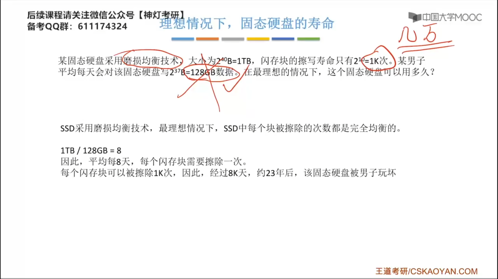

### 3.3.3 主存储器的基本组成

#### 存储器芯片的基本原理

控制电路：让MAR稳定之后，才会打开这个控制开关，通过译码器选择存储单元。

>[!NOTE]
>头上划线表示该信号低电平有效

$\overline{\text{CS}}$ （chips select）芯片选择信号
$\overline{\text{CE}}$  (chips enable)

驱动器：把电信号放大，保证译码器的电信号稳定有效。

现代计算机通常按字节寻址（每个字节），即每个字节对应一个地址。

#### DRAM和SRAM

**DRAM和SRAM**核心区别，存储元件不一样。

- DRAM是破坏性读出，读出后需要重写，而SRAM是非破坏性读出，因此SRAM读出的速度更快（比DRAM少一个重写的时间）。
- DRAM复杂度比SRAM要低，因此DRAM的集成密度会更高。 
- DRAM和SRAM都是易失性的存储器。

#### DRAM的刷新

#### 只读存储器ROM

## 3.4 主存储器与CPU的连接

$\overline{WE}$ 或 $\overline{WR}$：低电平表示写，高电平表示读。

### 增加主存的存储字长-位扩展

### 增加主存的存储字长-字扩展

#### 线选法

**1-2译码器**表示输入一位的地址信息会呈现两种不同的状态。

>[!NOTE]
>给译码器输出线的编号也可以<mark style="background: #FF5582A6;">逆过来</mark>。

#### 译码片选法

|          线选法          |              译码片选法              |
| :----------------------: | :----------------------------------: |
| n条线 $\to$  n个选片信号 | n条线 $\to$ 2n 个选片信号 |
|         电路简单         |               电路复杂               |
|      地址空间不连续      |             地址空间连续             |
### 增加主存的存储字长-字位同时扩展

### 译码器

等电信号稳定之后，才会发出这个**主存请求信号（MREQ）**。

## 3.5 双端口RAM和多模块存储器

### 双端口RAM

### 多体并行存储器

‌‌‌　　即使是单核是CPU，CPU的读写速度也要比内存快得多，而DRAM每次读写之后，又需要一段时间的恢复时间，解决这个问题，可以使用到多体并行存储器。
‌‌‌　　对于**高位交叉编址**，我们会采用**最高**的两个比特位来区分我们要访问哪根内存条，对于**低位交叉编址**，我们会采用**最低**的两个比特位来区分要访问哪根内存条。
‌‌‌　　对于**低位交叉编址**，相当于纵向编码，对于**高位交叉编址**，相当于横向编码。

$\text{连续取n个存储字}\to\text{耗时}T+(n-1)r$
$\text{前n-1个存储字耗时}(n-1)r\text{，最后一个存储字耗时}T$

思考：给定一个地址x，如何确定它属于第几个存储体？
方法1：找**体号**
方法2：$\text{地址x }\%\text{ 存储体个数}$

**多体并行存储器**和**单体多字存储器**对读取速度的提示**差不多，都接近r**.
‌‌‌

两根内存条，颜色相同的两根卡槽，组成的是低位交叉多体存储器，插入颜色不同的两根卡槽，组成高位交叉多体存储器。

为什么要选择两根频率相同的内存条？
如果两根内存条不一致，主频较高的内存条，就会进行**降频**处理。

为什么要选择两根容量相同的内存条？
为了所有的存储单元都能组成双通道，如果不相同，电脑性能会不稳定。

## 3.6 磁盘存储器

机械部分

电子部分

**柱面号**其实就是**磁道号**
IDE：其实就是ATA
SATA：串行的ATA，现在比较常用

两个磁头

格式化：留下一些扇区防止磁盘的某一部分损坏而导致整个磁盘无法使用。

如果题目没有给**旋转延迟时间**，我们可以用磁头**转半圈**的时间来算。

## 3.7 固态硬盘

逻辑块号，实际的物理位置，是会变的，闪存翻译层会把映射关系修改正确。
固态硬盘，读的速度很快，但是写的操作会比读的操作速度慢得多，因为写会有一个数据迁移和擦除的过程。
对于机械硬盘而言，要访问不同的位置，需要是时间也可能各不相同。
**静态磨损均衡技术**：会将**读多写少**的数据存放到被**写入次数较多**的块上。

## 3.8 高速缓冲存储器

### 3.8.1 Cache的基本概念和原理

**Cache**的作用是缓和cpu和内存之间的速度矛盾。

| 空间局部性                                                   | 时间局部性                                                   |
| ------------------------------------------------------------ | ------------------------------------------------------------ |
| 在最近的未来要用到的信息（指令和数据）。很可能与现在正在使用的信息在存储空间上是邻近的。 Eg：数组元素、顺序执行的指令代码 | 在最新的未来要用到的信息，很可能是现在正在使用到的信息。 Eg：循环结构的指令代码 |

按“**列优先**”访问二维数组，空间局部性更差。

先访问Cache，若Cache未命中再范围主存
$$
t = Ht_c + (1 - H)(t_c + t_m)
$$
同时访问Cache和主存，若Cache命中则立即停止访问主存
$$
t_c = Ht_c + (1 - H)t_m
$$

### 3.8.2 Cache和主存的映射关系

**Cache的行有效位**

系统启动时，每个 cache 行都为空，其中的信息无效，只有 cache 行中装入了主存块之后才效。为了说明 cache 行中的信息是否有效，某一个行都有一个有效位。通过将一行的有效位清零来淘汰这一行中所存储的主存快的操作称为冲刷，也就是我们常说的刷 cache。

直接映射：虽然其他地方有空闲的Cache块，但是8号主存块不能使用。

若Cache总块数=2n 则主存块号末尾n位直接反映它在Cache中的位置，将主存号的其余位作为标记即可。

n路组相联映射——每n个Cache行为一组。

### 3.8.3 Cache替换算法

#### 随机算法（RAND）

随机算法：实现简单，但完全没考虑局部性原理，命中率低，实际效果很不稳定

#### 先进先出算法（FIFO）

先进先出算法：没有考虑局部性原理，最先被调入Cache的块可能是被频繁访问的。

==抖动==现象：频繁的换如换出现象（刚被替换的块很快又被调入）。

#### 最近最少使用算法 （LRU）

#### 最不经常使用算法（LFU）

计算器的位数可能为：$1\sim\text{很大}$   

### 3.8.4 Cache写策略

#### 写命中

CPU发生阻塞的时候，CPU必须等待，等缓存有空位的时候，再往里面写。

#### 写不命中

## 3.9 虚拟存储器

### 3.9.1 页式存储

分页是**逻辑层面**的划分，而分块是**物理层面**的划分。

 

**主存块号** 拼接上 **页内地址** 得到 **物理地址**  

页表中的一行我们称为==页表项==，每个页表项就对应了某一个物理页号和逻辑块号之间的一一映射的关系。

通过**页表基地址**和**逻辑页号**，我们很快就能在页表中找到逻辑页号对应的那一项。

将==近期访问的页表项放入更高速的存储器==，可加快地址变换的速度，这个存储器就是==快表==。

快表和Cache的区别：快表中存储的是页表项的副本；Cache中存储的 主存块的副本。

### 3.9.2 虚拟存储器 

用户感知到的存储系统的容量要比他物理上的真实容量要更大，这是操作系统==虚拟性==的提现。

虚拟存储是把辅存里的数据部分调入到主存中。

思考：打游戏的时候的“Loading”页面背后是在干嘛？

答：将游戏地图相关数据调入内存。

**脏位**是为了标记主存中的某个页面是否被更改过。

#### 段式虚拟存储器

>[!timeline] 页式虚拟存储和段式虚拟存储
>>页式虚拟存储器，每个页的大小是相等的。
>---
>段式虚拟存储器，因为每个段是按功能划分的，因此每个段的段长是不相等的。

主存不会再分块。

