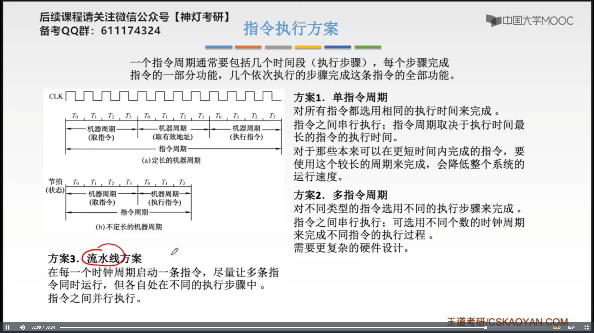
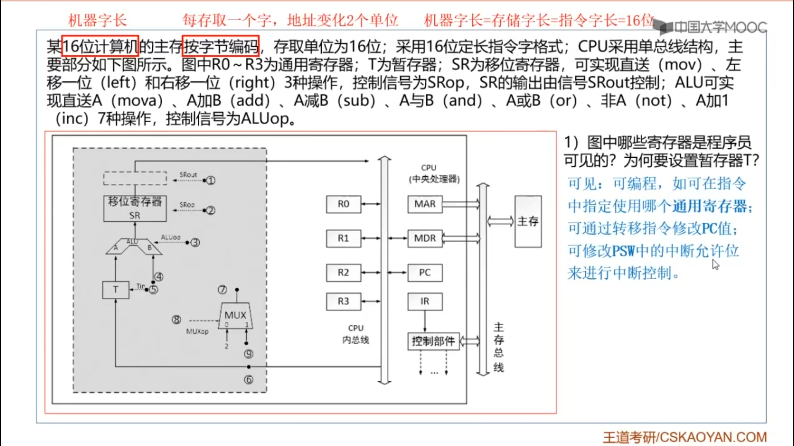
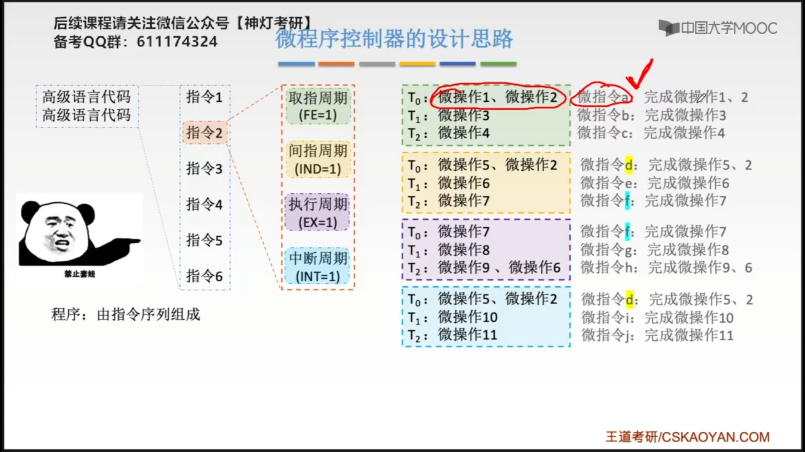
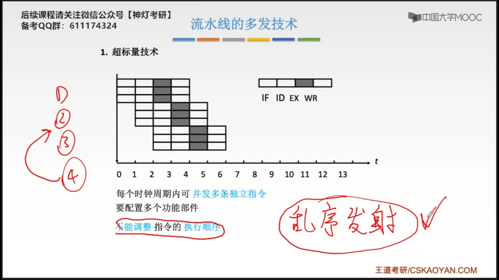
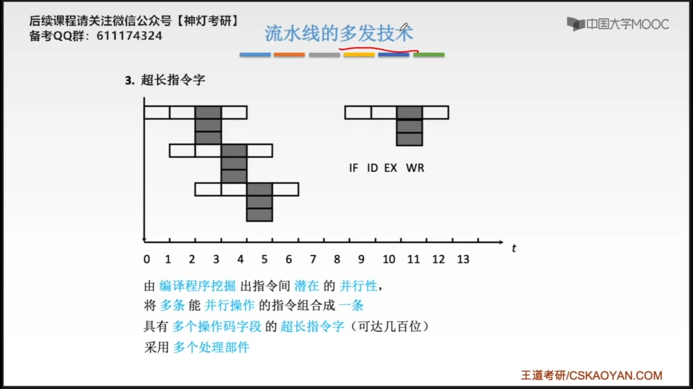
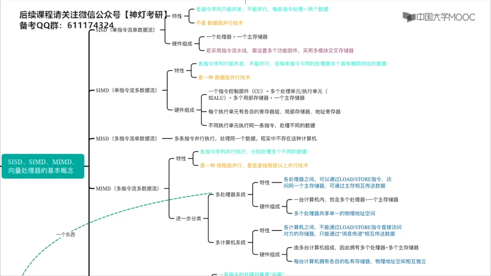

# 第五章-中央处理器

## 5.0 回忆过去


## 5.1 CPU的功能和基本结构


**中断处理**

​		在计算机运行的过程当中，可能需要处理一些突发情况，比如鼠标的单击操作。这次单击操作也需要CPU进行处理，当CPU执行到这的第4条指令的时候，如果说收到来自鼠标的一个中断信号，那么CPU暂时会中断前面程序的运行。CPU需要记录下来，当前这个程序，运行到了哪一句，记录了当前程序的运行状况之后，CPU会转向执行一个中断处理程序，中断处理程序也是由指定的指令序列组成的，比如用来处理鼠标单击事件的处理程序。当CPU运行完这个中断处理程序之后，又会回到刚刚处理的那个程序，继续的往后执行。

​		如果没有中断处理，点击鼠标、敲击键盘这些操作，都不会被CPU所响应。


王道中将堆栈寄存器（SP）归为了通用寄存器，而有的教材中，将堆栈寄存器（SP）归为一类特殊的寄存器。


正常情况下，三态门是不导电的。


CPU要进行哪些微操作，除了要判断当前执行的指令它的==操作码==到底是什么之外，也需要根据==PSW中的这些标志信息==来具体的决定。


## 5.2 指令执行过程


### 5.2.1 指令周期


​		因为取指令要访问内存，而对指令的分析，对指令的译码其实就是CPU内部的一个很快速的运算，因此分析指令（对指令进行译码）的这个过程，速度是很快的。比起访存来说，我们只需要花很短的时间，就可以完成指令的译码，这也就为什么我们分析指令的过程，划分为取址周期其中的一小部分时间，因为分析指令所需要的时间很短，很快的。

		如果完成一个子工作所需要的==时钟周期==数是相同的，那么完成这个这个子工作的机器周期就是相同的，即==机器周期==是相同的，也就是==定长的机器周期==。

​		因为取指令需要访问内存，而执行指令可能不访问内存，因此执行指令所需要的==时钟周期==更少，即执行指令的==机器周期==更短。因此，不同的子工作，机器周期的长度可能不同。

​		同样的，每个==指令周期==内机器周期数可以不等，每个机器周期内的节拍数也可以不等。


==间址周期==是获取操作数的真实地址，而根据操作数的真实地址去取操作数是==执行周期==需要做的。

一个机器周期内要完成一个完整的子操作。


通过==触发器==，可以判断当前处于哪一个阶段。

四个工作周期都有CPU访存操作，只是访存的目的不同。


### 5.2.2 指令周期的数据流

#### 5.2.2.1  取指阶段


M(MAR) $\to$ MDR

M 表示 Mem 主存，这条指令是将主存中，MAR所存的地址的内容，送到MDR中。

#### 5.2.2.2 间指周期


Ad(IR) $\to$ MAR

把当前这条指令的==地址码==送到地址寄存器中。

(MDR) $\to$ Ad(IR)

用MDR中的==真实地址==，覆盖指令中原本的==形式地址==

#### 5.2.2.3 执行周期


#### 5.2.2.4 中断周期


​		指令执行结束之后，会进行中断检查，如果此时有中断信号需要处理，如：键盘输入。在执行完指令之后，暂停执行当前的程序，转而去执行处理这个中断信号的==中断处理程序==（由一定的指令序列组成）。执行完一系列中断处理的程序之后，又应该回到之前的程序，让它进行往后执行。为了保证，在中断处理执行结束之后，我们还能找到接下来应该要执行的位置，因此，我们需要把当前执行的这个程序，它的==中断点==给保存下来，本质上，就是保存下来PC的值。

​		事实上，堆栈的地址是从高到低，即栈顶指向低地址部分。


中断处理程序的存放地址，我们也可以把它称为==向量地址==。 

### 5.2.3 指令执行方案




​		为了区分，指令处于哪个阶段，可以使用不同的标准触发器来标准指令处于哪个阶段。 

​		通常，王超一条指令可以分为取指令阶段和执行阶段，在取指令阶段通过访问存储器可以将指令取出；在执行阶段可以访问存储器可以将操作数取出。因此，虽然指令和数据都以二进制代码的形式存放在存储器中，但==CPU可根据指令周期的不同阶段判断从存储器取出二进制代码是指令还是数据==。

## 5.3 数据通路的功能和基本结构

### 5.3.1 数据通路的功能


三种数据流动：

寄存器 $\Longleftrightarrow$ 寄存器

寄存器 $\Longleftrightarrow$ 主存

寄存器 $\Longleftrightarrow$ ALU


​		**单总线方式**，同一时刻，只允许两个部件之间，进行数据交换，它们对总线的使用，是独占式的，当这两个部件之间数据交换的时候，就不允许，另外两个部件之间，进行数据交换。

​		为了解决这个问题，在有点CPU中，会设计多个总线，**多总线方式**，比如3个总线，这也就意味着，在同一时刻，可以有三个部件之间，进行数据交换，而各个部件， 都要同时连上这个三个总线。

​		除了用总线的方式作为公共的信息通路之外，也有的CPU内部，会采用**专用数据通路**的方式，也就是只要两个寄存器之间，需要有数据流动，那么就会单独的在这两个寄存器之间，专门的建立一个数据通路，专门的设计一个连线。


### 5.3.2 数据通路的基本结构

 #### 5.3.2.1 数据通路-CPU内部单总线方式


单总线的方式可以使硬件的设计成本更低，多总线的设计方式，成本更高，但是可以使得数据的传输，更有效率。

```markdown
1. 寄存器之间的数据传送
	(PC)->Bus 			  PCout有效
	Bus->MAR			  MARin有效
2. 主存和CPU之间的数据传送
	(PC)->Bus			  PCout有效
	Bus->MAR			  MARin有效
	1->R				  CU发出读信号
	MEM(MAR)->MDR		  MARout有效 ,MDRinE有效 # 数据从外部总线读到MDR
	MDR->Bus			  MDRout有效
	Bus->IR				  IRin有效
3. 执行算术或逻辑运算
	Ad(IR)->Bus			  IRout有效
	Bus->MAR			  MARin有效
	1->R				  CU发出读信号
	MEM(MAR)->数据线->MDRI Rout有效, MDRinE有效 # 数据从外部线读到MDR
	MDR->Bus			  MDRout有效
	Bus->Y				  Yin有效
	(ACC) + (Y)-> Z		  ACCout有效，Yout有效，Zin有效 # Y和ACC, Z和ACC之间，有专门的数据通路
	Z->Bus			      Zout有效
	Bus->ACC			  ACCin有效
```

每一个微操作的执行，都要耗费一个时钟周期。指令的执行本质上就是通过这样一个一个的==微操作==，一组一组的控制信号，来完成的。


**例题**


`(R0)` 表示进行了一次寄存器间接寻址


```markdown
# 取指周期
(PC)->Bus					PCout有效
Bus->MAR					MARin有效
1->MemR						MemR有效 
MEM(MAR)->数据总线->MDR		 MARout有效，MDRinE有效
(PC)+1->PC
MDR->Bus					MDRout有效
Bus->IR						IRin有效
指令译码
```


```markdown
# 间指周期
(RO)->MAR			ROout有效，MARin有效
MEM(MAR)->MDR		MARout有效 ,MemR有效，MDRinE有效
(MDR)->Y			MDRout, Yin有效
```


#### 5.3.2.2 数据通路-专用数据通路方式


##### 5.3.2.2.1 专用数据通路方式-取址周期

```markdown
# 取址周期
(PC)->MAR				C0有效
(PC)+1->PC
MAR->MEM				C1有效
1->R					读信号
MEM(MAR)->MDR			C2有效
(MDR)->IR				C3有效
Op(IR)->CU				C4有效

# 执行阶段
PC->MAR					C0有效
(PC)+1->PC				
MAR->M					C1有效
1->R					读信号
M(MAR)->MDR				C2有效
(MDR)+(AC)->ALU		    C6有效，C7有效
ALU->AC					C8有效
(AC)->MDR				C11有效
MAR->M					C1有效
1->W					写信号
(MDR)->M(MAR)			C13有效
```


##### 5.3.2.2.2 专用数据通路方式-例题


(2)

```markdown
(PC)->MAR
M(MAR)->MDR
(MDR)->IR
OP(IR)->微操作信号发生器
(PC)+1->PC
```


&emsp;&emsp;打不打括号要看给的标识表示的是不是一个寄存器，如果是寄存器，就需要打括号，否则就不打括号。


### 5.3.3 习题




三态门的三种状态：连接、断开、高阻。


## 5.4 控制器的功能和工作原理

### 5.4.0 内容回顾


&emsp;&emsp;**微操作**更多的是在描述我们要做的一个细分的工作，这个工作要完成怎么样的一个功能，而**微命令**指的是要完成这个细分的工作，所需要发出的一些有效的控制信号，所以每发出一条**微命令**就意味着会完成一个与之对应的**微操作**。

&emsp;&emsp;根据**指令操作码**，目前的**机器周期**、**节拍信号**、**机器状态条件**（PSW）,即可确定现在这个节拍下应该发出哪些"微命令"

### 5.4.1 硬布线控制器的基本原理


所有指令的取指周期第一个节拍下一定要完成$(PC) \to MAR$，则可知$C_1= FE \cdot T_0$。

**Tips**：逻辑表达式是电路的<u>数学化描述</u>。


$LDA$：取数指令，把数据从主存取到ACC寄存器中。


ID(Instruction Decoder)：**指令译码器**也就是**操作码译码器**。


对于

```markdown
MDR->IR
OP(IR)->IR
```

这两个微操作的执行时间都很短，虽然他们之间有前后的依赖关系，我们可以把它们安排在一个节拍内完成。

<mark style="background-color:green">MDR，IR，ID这些都是CPU内部的部件，CPU内部的寄存器各个部件之间的数据流通是很快的，所以CPU可以并行的发出这两个微操作所对应的微命令，让这两个微操作同时进行，这也就意味着数据可以快速的从MDR，先流向IR，再从IR流向ID，可以迅速连贯的完成这个动作。</mark>


### 5.4.2 微程序控制器的基本原理




**程序**：由指令序列组成

**微程序**：由微指令序列组成，<font color="red">每一种指令对应一个微程序</font>。微命令是微操作的控制信号，微操作是微命令的执行过程。

<font color="red">指令</font>是对程序执行步骤的描述。

<font color="red">微指令</font>是对指令执行步骤的描述。


引入了软件的思想

<font color=red>微命令</font>与<font color="red">微操作</font>一一对应

<font color="red">微指令</font>中可能包含<font color="red">多个微命令</font>


**微地址形成部件**：根据==机器指令的操作码==来确定它所对应的==微程序的起始地址==到底是什么。 


**说明**

- 每一条微指令会对应一个存放地址。
- **下地址**指明了接下来应该执行微指令存放在什么地址。
- LDA X是Load ACC X的缩写，就是把X这个地址存放到数据放到ACC中。
- 指令的地址码部分会有一些标志位，用来指明这个指令是直接寻址还是间接寻址。


CM中，微程序<font color="red">段</font>的个数至少应该是n+1个，原因见上图。

CM中，微程序的个数只有n个，每一条指令对应一个微程序。


### 5.4.3 微指令的设计


其中1、3是重点


编码是对微操作进行编码，一条微指令可以对应一条微操作。


## 5.5 指令流水线


### 5.5.1 指令流水线的基本概念

#### 5.5.1.1 指令流水线的定义


##### 5.5.1.1.1 顺序执行方式


##### 5.5.1.1.2 一次重叠执行方式


#####　5.5.1.1.3 二次重叠执行方式


这里的总耗时都是==理想==情况下的耗时。


### 5.5.2 流水线的性能指标


理论上最理想的情况，一个机器周期只包含一个时钟周期。

**装入时间**：==第一条指令==从==取指==到==结束==经过的时间。就是使得硬件部件陆续投入工作的这段时间。

**排空时间**：==最后一条指令==从==取指==到==结束==经过的时间。就是让硬件部件逐渐退出工作的时间段。


### 5.5.3 影响指令流水线的因素 


五段式的指令流水线。

MIPS架构所提出来的指令流水线，世界上第一个精简指令集的指令系统。

每个周期完成工作对应的时间花销不一样。


**Instruction Fetch（取指阶段）**：根据pc所指向的位置去Instruction Cache里面找出当前要执行的这一条指令，然后把取出的指令放到功能段的锁存器中。

**CPU内部的Cache会被分为两个独立的模块**：一种Cache是专门用来存储指令的，而另一种Cache是专门用来存储变量之类的数据的，==意味着对这两个模块的访问是可以并行的进行的==。

**Instruction Decode（指令译码）**：除了进行指令译码的工作外，还会进行取数的操作，在RISC精简指令系统下， 我们所需要的操作数一定是直接来至于通用寄存器的，不可能来自于主存；如果来自于主存，一定是把那个数据，先放到==通用寄存器==，再从==通用寄存器==取到==锁存器==。

**Imm**：是存放立即数的锁存器，立即数可以直接从指令中取到**Imm**。

通过执行阶段运算的结果，可能有两种可能去向：

1. 被写到主存中。
2. 跳过内存，先将结构放到锁存器中，到了**写回阶段**将数据写回到寄存器。

#### 5.5.3.1 结构相关（资源冲突）

操作系统中的互斥问题。


**资源重复配置**：**Cache**分为两个模块，一个模块存放**数据**，一个模块存放**地址**，在取值阶段和访存阶段访问不同的**Cache模块**这样就能避免**资源冲突**。

#### 5.5.3.2 数据相关（数据冲突）

操作系统中的同步问题。


 &emsp;&emsp;如果我们生产这些机器指令的时候，编译器发现这条指令和后面的这条指令它们之间有数据冲突的关系，那么我们的编译器会为我们在这两条指令中间插入三条空指令，每一条空指令的执行也会完整的经过五个机器周期。


#### 5.5.3.3 控制相关（控制冲突）


###　5.5.4 指令流水线的分类





空分复用技术


 时分复用技术





### 5.5.5 五段式指令流水线


#### 5.5.5.1 运算类指令的执行过程

\#996 表示996是个立即数


对于RISC指令集来说，运算的两个操作数一定直接来自于某一个寄存器或用立即数来进行运算。


#### 5.5.5.2 LOAD指令的执行过程


> (996+(RS))$\to$Rd
>
> 寻址方式是基址寻址。


####　5.5.5.3 Store指令的执行过程


#### 5.5.5.4 条件转移指令的执行过程


以==下一条指令==地址为基准。

对PC这个寄存器的修改会放到访存阶段。

#### 5.5.5.5 无条件转移指令的执行过程

```assembly
jump #偏移量	（PC）+ 指令字长 + (偏移量×指令字长)->PC
```

这里的偏移量用补码表示


> I3的ID段被阻塞的原因是l1中从地址[a]中取出的数，要到WB阶段才会写到R1中，
>
> 同理，l2中从地址[b]中取出的数，要到WB阶段才会写到R2中，
>
> I3与I1和I2存在数据相关。


## 5.6 多处理器系统

### 5.6.1 多处理器的基本概念


#### SISD 

SISD单指令流，单数据流。

**单指令流**是说同一时间段内只能处理一个指令序列。

**单数据流**是每一条指令只能处理1到2个数据。

**单核处理器**在一个时间段内只能处理一个进程或一个线程的指令序列，各个线程的指令序列只能并发的执行，不能不行的执行，不支持数据级的并行，也就是一个时间段内只能处理1~2个数据，不可能并行的处理很多很多的数据。


#### SIMD 

每一个时刻只会有一条指令在执行，但是每一条指令的执行可以并行的处理多个数据。


#### MIMD

线程级并行：每一个核可以运行各自的线程，多个线程可以并行的执行。

线程级以上并行：进程级的并行，每个核分别处理一个进程。


L1，L2级的Cache专属于特定的核，而L3级的Cache由多级共享。

 





### 5.6.2 硬件多线程的概念


 
