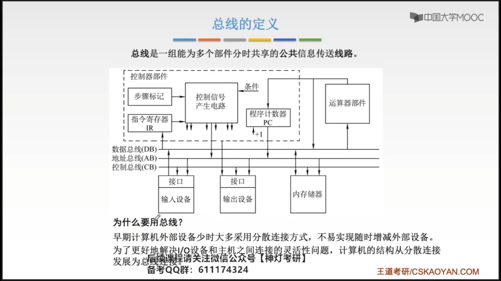
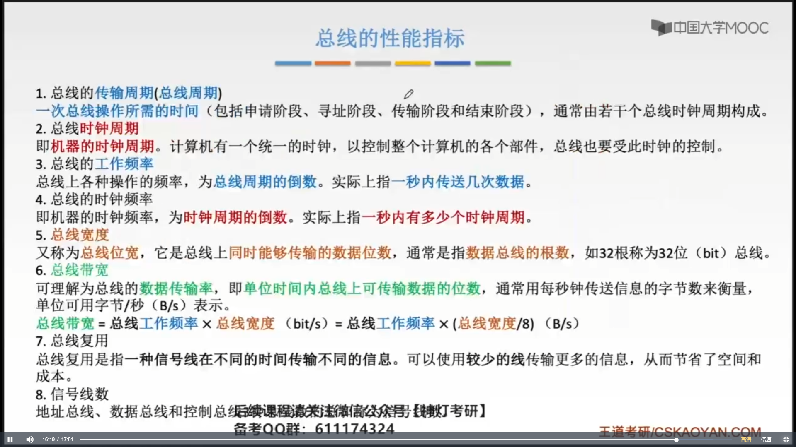
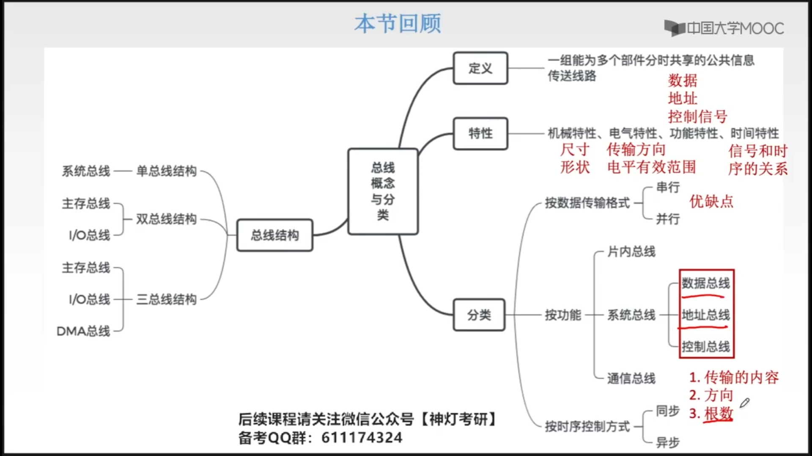

# 第六章 总线

## 6.1 总线概述

数据总线有可能并行的传输很多bit信息

> USB就是一种总线标准
>
> 当我们规定了总线的设计标准之后，各个硬件设备的生产商==遵守这个标准==就会保证自己生产的这个硬件设备可以完美的适配我们的电脑或手机。 

### 6.1.1 总线的定义

为什么要使用总线？

早期计算机外部设备少时大多采用分散连接方式，不易实现随时增减外部设备。为了更好地解决I/O设备和主机之间连接是灵活性问题，计算机的结构从分散连接发展为总线连接。

### 6.1.2 总线的特性

### 6.1.3 总线的性能指标

使用总线服用技术，当我们要传递地址信息或数据信息的时候，至少需要两个总线周期。

**信号线**：最小的物理的导线，即只能传输一个bit的线，就是信号线。

**信号线数**：地址总线、数据总线和控制总线3种总线数的总和称为信号线数，如：

地址总线：64根，数据总线：32根，控制总线：100根

信号线数：$64+32+100$。

### 6.1.4 总线的分类

#### 6.1.4.1 串行总线与并行总线

|      |                           串行总线                           |                           并行总线                           |
| :--: | :----------------------------------------------------------: | :----------------------------------------------------------: |
| 优点 | 只需要一条传输线，成本低廉，广泛应用于长距离传输；应用于计算机内部时，可以节省布线空间。 |        总线的逻辑时序比较简单，电路实现起来比较容易。        |
| 缺点 | 在数据发送和接收的时候要进行拆卸和装配，要考虑串行-并行转换的问题。 | 信号线数量多，占用更多的布线空间；远距离传输陈本高昂；由于工作频率较高时，并行的信号线之间会产生严重干扰，对每条信号线等长的要求也会变高，所以无法继续提升工作效率 |

> 并行总线==不一定==比串行总线传输地快。

#### 6.1.4.2 系统总线

##### 6.1.4.2.1 单总线结构

缺点2：

CPU和主存是比较快速的，很多外部设备（键盘、鼠标、打印机）这些外设，它们对数据的传输速度很慢，快速的系统总线速度会被浪费。

##### 6.1.4.2.2 双总线结构

##### 6.1.4.2.3 三总线结构

这三个总线，同一时刻，只能有一个总线在工作，这就导致系统的工作效率较低。

## 6.2 总线仲裁

### 6.2.1 总线总裁的基本概念

==总线控制器==可能被集成在CPU内部，也有可能被集成在桥接器。

### 6.2.2 集中仲裁方式

#### 6.2.2.1 链式查询方式

**流程**：

- 当有一个或多个设备想要占有总线的控制权的时候，会想BR发送一个请求信号
- 总线控制部件发现BR信号为1是，会通过BG发送一个总线允许信号
- 这个总线允许信号会经过一个个的设备接口
  - 当这个设备不想占用总线控制权的时候，会让这个请求允许信号流过
  - 当这个设备想占有总线控制器的时候，会将请求允许信号截断, 并向BS发送一个总线忙信号
- 当总线控制器发现总线慢信号后，就会撤销总线允许信号

缺点：对故障敏感，当有一个设备出故障时，后面的设备将用于无法接受到总线控制部件发送的信号。

#### 6.2.2.2 计数器查询方式

#### 6.2.2.3 独立请求方式

## 6.3  总线操作和定时

## 6.4 总线标准

