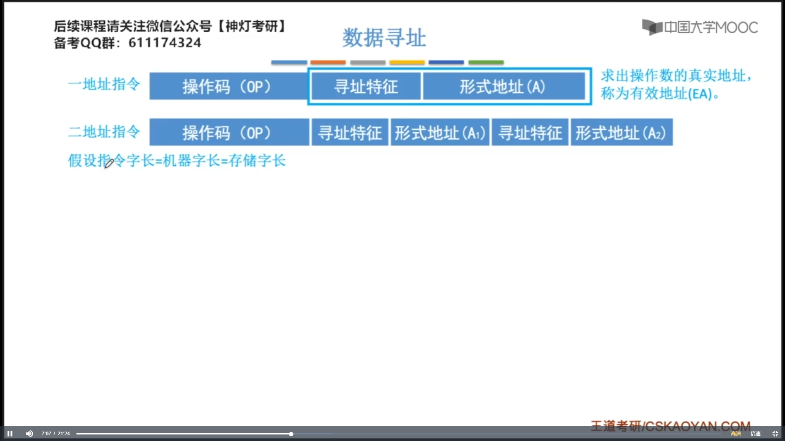
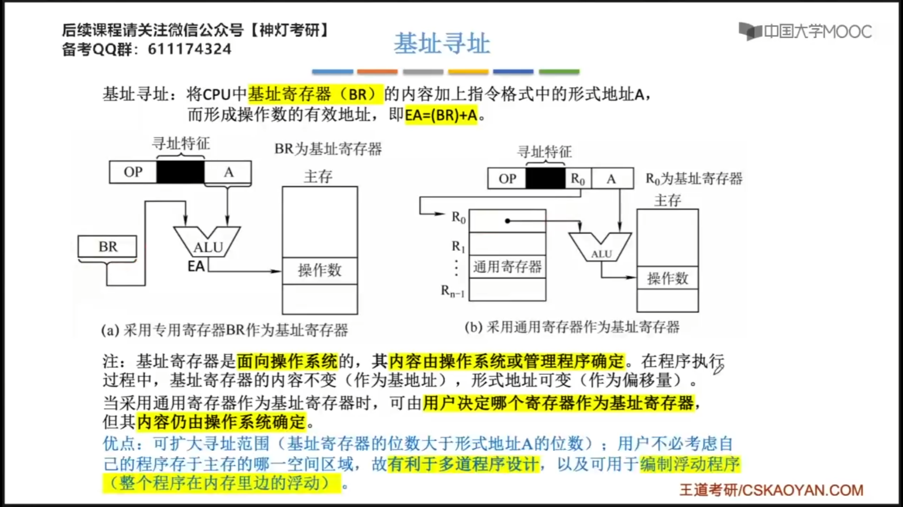
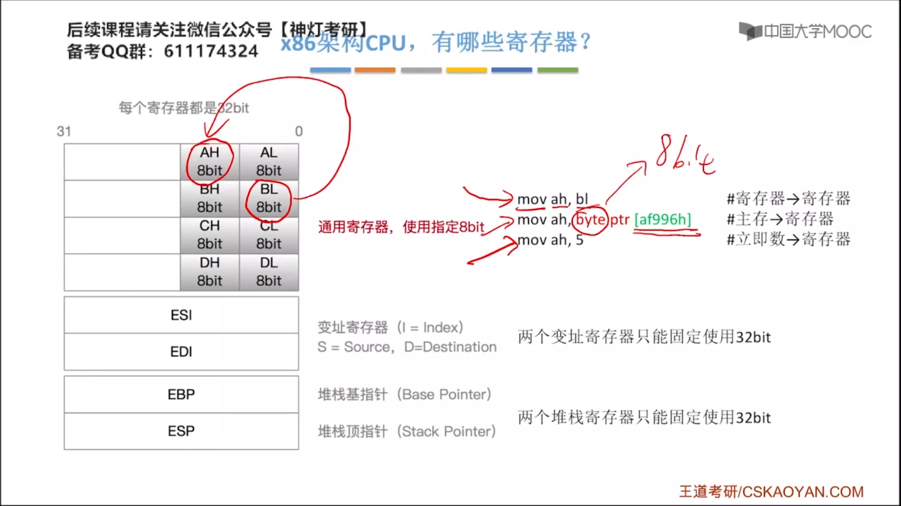
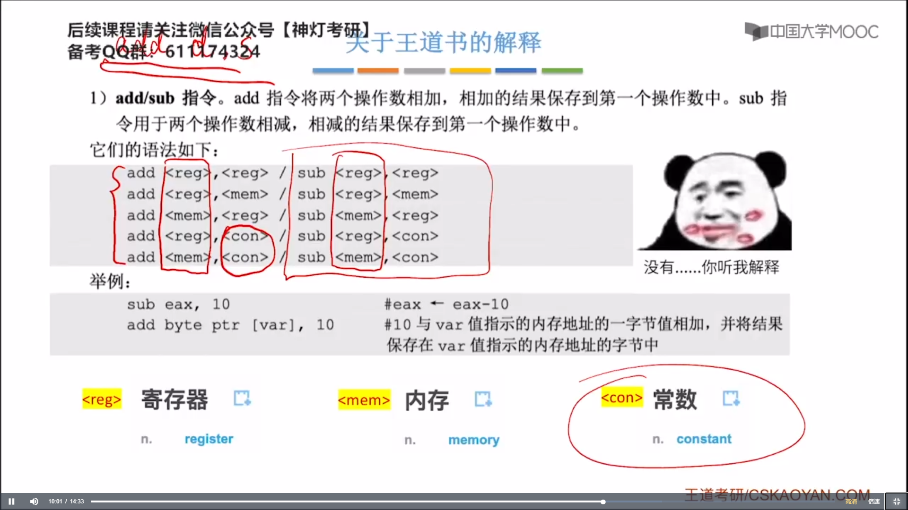
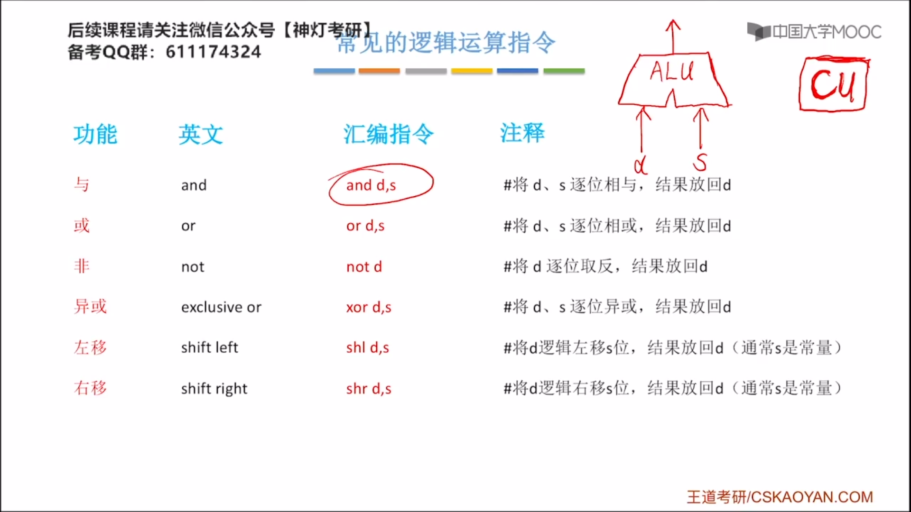

# 第四章 指令系统

## 4.1 指令格式


操作码：说明了“做什么”

地址码：说明了“对谁动手”

停机子指令的地址码无效。


不同体系结构的计算机支持的指令集是不同的。

Eg：x86架构（Intel）、ARM架构（手机）


**转移类的指令**就是为了实现程序执行流的改变，会导致程序计算器PC的改变。


## 4.2 指令寻址的方式

### 4.2.1 指令寻址


当一条指令被取出之后，PC的值会自动+1。


> 主存的==编址方式==发生改变，我们==对PC的处理==也会发生改变。


对于变长指令字结构，我们可以先读入第一个字节（操作码）判断这条指令的总字节数n（指令的总字节数）,修改PC的值。


> (PC) + "1" $\to$PC，这里的 + 1表示1个指令字长，具体为多少应该具体来看。


JMP：无条件转移指令。

顺序寻址：每次PC+1。

跳跃寻址：通过转移类的指令改变了程序的执行流，也就是该边了PC的值。


### 4.2.2 数据寻址


中：基于程序的起始地址往后偏移多少个地址。

右：基于PC往后偏移多少个地址。




为了确定地址码到底使用什么样的寻址方式，在地址码的前面加上**寻址方式位**。

对于多地址指令，我们会在没个地址码前面给他加上寻址特征。


#### 直接寻址


#### 间接寻址


**间接寻址**，在执行一条指令的过程中，会进行多次访存。

#### 寄存器寻址


#### 寄存器间接寻址


#### 隐含寻址


#### 立即寻址


|寻址方式|有效地址|访存次数（指令）执行期间|
| :------------: | :---------: | :----------------------: |
|    隐含寻址    |程序制定|0|
|    立即寻址    | A即是操作数 |0|
|    直接寻址    |EA=A|1|
|  一次间接寻址  |EA=(A)|2|
|   寄存器寻址   |EA=R<sub>i</sub>|            0             |
| 寄存器间接寻址 |EA=(R<sub>i</sub>)|            1             |
| (==转移指令==）相对寻址 |EA=(PC)+A| 1 |
| （==多道程序==）基址寻址 |EA=(BR)+A| 1 |
| （==循环程序==）变址寻址 |EA=(IX)+A| 1 |
| 堆栈寻址 | 入栈/出栈时EA的确定方式不同 | 硬堆栈不访存，软堆栈访存1次 |

注意：取出当前指令后，PC会指向下一条指令，相对寻址是相对下一条指令的偏移。


### 4.2.3 偏移寻址

#### 偏移寻址：基址寻址


> IX：变址寄存器。
>
> 基址寻址中：真实地址 = 基地址 + 偏移量。


==注意==：基址寻址**不一定**要使用专用的基址寄存器，可以使用**通用寄存器**（如图中的R~0~）作为**基址寄存器**，但是指令中要给出**作为基址寄存器**的通用寄存器的编号。




**基址寻址的优点**：便于程序的“浮动”，方便实现多道程序并发运行。

**拓展**：每个程序运行前：CPU的基址寄存器的值都会修改为当前运行的这个==程序的一个起始存放地址==（存放在操作系统PCB中）

**注意**：

- 基址寄存器是==面向操作系统==的，其==内容由操作系统或管理程序确定==。
- 一个通用寄存器如果被制定为基址寄存器，那么它其中的内容是==无法被程序员修改==的，会由操作系统负责管理。


#### 偏移寻址：变址寻址


```cpp
int sum = 0;
for (int i = 0; i < 10; i++) {
    sum += a[i];
}
```

**变址寄存器的意义**：在数组处理的过程中，可设定A为数组的首地址，不断改变变址寄存器IX的内容，便可以很容易形成数组中任一数据的地址，特别适合编制==循环程序==。

**与基址寄存器的不同之处**：变址寄存器中的值，我们普通程序员可以进行修改。


#### 偏移寻址：基址&变址复合寻址


先进行基址寻址，把形式地址加上基址寄存器BR中的基址；然后在基址的基础上再进行一次变址寻址，加上变址寄存器IX中的内容2，得到了最终的有效地址。

==可以将每一种寻址方式理解为一种函数，将形式地址A映射为有效地址EA。==


####偏移寻址：相对寻址


==注意==：

A是相对于==当前指令的下一条地址==的偏移量，因为在取出当前指令后，PC的值会马上“+1”，A = 当前PC的值 + 偏移量。


优点：这段代码在程序的内部浮动时不用更改转跳指令的地址码。

拓展：ACC加法指令的地址码，可采用“分段”方式解决，即程序段、数据段分开。


 **基址寻址**可以方便**整段程序在内存中的浮动**。


### 4.2.4 堆栈寻址


**说明**

- 硬堆栈是通过寄存器实现的，而软堆栈是内存中的一段空间。

- 使用内存实现的软堆栈push和pop操作都会进行一次访存。

- 在程序运行的过程当中一般是采用软堆栈来实现的。

- 在程序运行过程中、函数调用、局部变量相关的信息，都会保存在这个程序对应的软堆栈当中。


## 4.3 机器级代码

### 4.3.1 高级语言与机器代码之间的对应


汇编语言指令和汇编语言指令是一一对应是关系，一条汇编语言指令对应一条汇编语言的程序。


<font color='red'>要求：根据C语言程序看懂与之对应的汇编语言程序。</font>


```plain
[] 表示这是一个内存地址，地址的最后一个字母h,表示这个地址是用16进制表示的
```


```plainb
mov eax, ebx # 寄存器->寄存器 两个操作数都是寄存器寻址
mov eax, dword ptr [af996h] # 主存->寄存器 前面一个操作室是寄存器寻址，后面一个操作数是直接寻址
mov eax, 5 # 立即数->寄存器 前面一个操作数是寄存器寻址，后面一个操作数是立即寻址

另外：
EBP：指向栈底
ESP：指向栈顶
```





### 4.3.2 常用的x86汇编指令


最终运算的结果，会被返回到d中。


```markdown
除 div s 这个里面的s表示的除数
被除数会存放到 edx:eax 中

除法运算中：被除数需要扩展为64位，因此需要两个寄存器 edx:eax 更高的32位存放在edx, 更低的32位存放在eax 
```



在x86汇编语言中，==不允许两个操作数同时来自于主存==，为了保证一条指令不要访问太多次主存，因为访问主存的次数越多，速度会越慢。




### 4.3.3 ATu0026T格式和Intel格式


### 4.3.4 选择语句的机器级表示


如果只能用上面的三种方式书写jump指令，那么程序员必须知道自己想要跳转到那条指令存在内存的什么地方，这对程序员来说是==不现实==的。


在使用==条件转移指令==时，先要用`cmp`比较两个操作数，然后再使用`jxxx`（条件转移指令），如：

```assembly
cmp eax, ebx # 比较两个寄存器的值, 其中， eax是两个比较数中的a, ebx是两个比较数中的b
jg NEXT      # 若eax > ebx，则转跳到 NEXT:
```


```assembly
jmp END # 跳过后面的语言
```


在写汇编语言代码时，一般会<span style="background-color:yellow">以函数名作为“标号”</span>，标注该函数指令的起始地址。

**f1:**函数的起始地址。


### 4.3.5 循环语句的机器表示


寄存器ecx默认作为循环的计数器，不能用其他寄存器替代，如果要使用loop指令，需要exc这个寄存器配合着使用。


loopx$\to$loop when x


## 4.4 CISC和RISC


RISC中，只提供最基本的，最简单的那些指令，因此这些指令的电路设计也会相对简单，功耗更低。由于这些指令都很简单，都是一些基本的指令，因此，所有的这些指令执行时间，都差不多，这个特性可以很方便的让我们实现==并行技术==和==流水线技术==。


Load：主存单元 $\Rightarrow$ 寄存器

Store：主存单元 $\Leftarrow$ 寄存器


